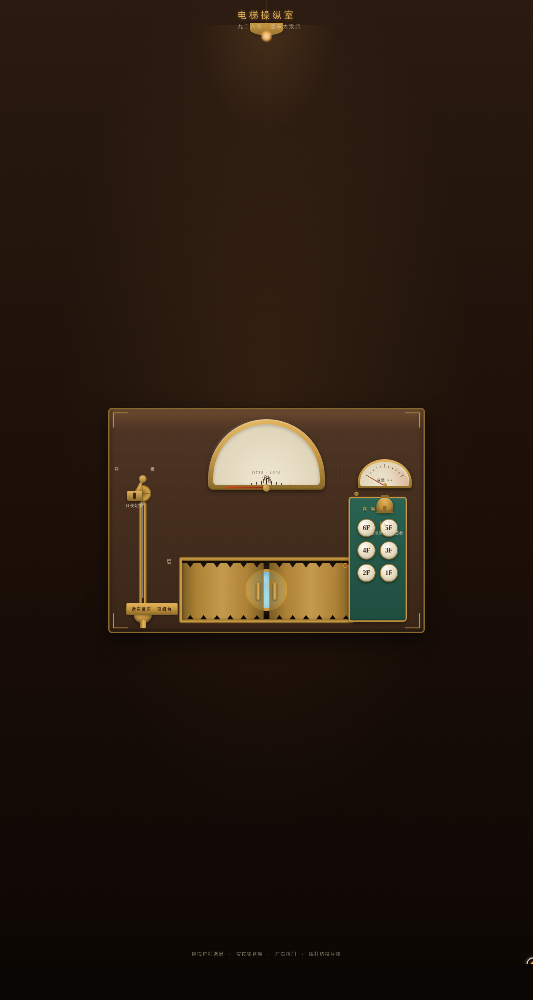

# 老式电梯操纵室 · 拟物化组件实验室

- **日期**：2026-08-18
- **方向**：V3 UX 交互设计
- **主题**：1920 年代酒店黄铜电梯操纵间——光标驱动的拟物化微交互实验室

## 简介

一个可把玩的拟物化微交互实验室，参观者扮演电梯司机完成一趟从大堂到顶楼的运行。6 个独立展区装置全部由鼠标光标悬停/点击/拖拽驱动（非键盘按键）。胡桃木 + 黄铜 + 墨玉搪瓷 + 钨丝灯色系，禁止蓝紫渐变。

## 截图

## 展区与动效亮点

- **选层手拉杆**：拖拽黄铜把手，阻尼+惯性+档位吸附，联动缆绳与滑轮
- **指针楼层表盘**：红色指针弹簧物理摆动（过冲+回稳），到达闪光
- **召唤按钮盘**：两段式按压回弹 + 涟漪光圈 + 常亮
- **格栅拉门**：拖拽惯性 + 端点回弹；门未关好时拉杆被锁（叙事联动）
- **昼夜切换拨杆**：钨丝灯渐亮、舷窗日月交替 + 繁星
- **载重仪表与警铃**：点击加行李指针偏转，超重警铃震动闪烁
- 自定义光标：开页居中，白环 + 钨丝灯内点 + 多层发光，悬停三态切换，点击涟漪

15+ 组件级特效，全部基于 Hooke 弹簧物理与 RAF 积分器，周期各异。

## 在线预览

[老式电梯操纵室 · 妙搭在线预览](https://dcniaqwtmoca.feishu.cn/page/YOuJmZaJSd6ZZSaggepcpgDpn3e)

## 文件说明

| 文件 | 说明 |
|---|---|
| index.html | 完整可运行源码（纯 vanilla HTML/CSS/JS 单文件） |
| 设计规范.md | 色彩 / 字体 / 展区装置 / 动效 / 健壮性规范 |
| preview.png | 页面截图 |
| README.md | 本说明文件 |

## 技术栈

纯 vanilla HTML/CSS/JS 单文件，无 React / Babel / 外部 CDN 依赖。
