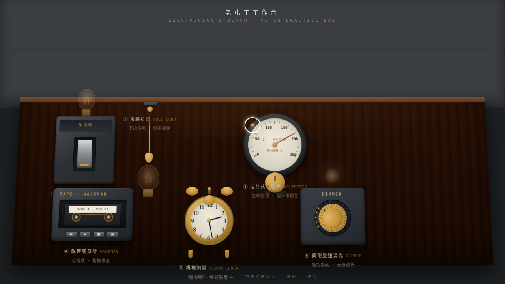

# 老电工工作台 · V3 UX 交互设计

> 日期：2026-08-18 · 方向：V3 UX 交互设计 · 主题：光标驱动的拟物化小组件动画实验室

## 简介

「老电工工作台」是一张 1970 年代老电工的木工作台，台上摆着 6 件可上手把玩的拟物化装置：配电箱拨杆开关、吊绳拉灯、指针电压表、磁带随身听、机械闹钟、黄铜旋钮调光器。每件展区以鼠标光标悬停 / 点击 / 拖拽驱动，交互反馈细腻、有物理质感与场景叙事——拨动合闸灯泡渐亮、下拉拉绳回弹点亮、旋转旋钮无级调光色温连续变化。

## 动效亮点

- 统一 RAF + 弹簧积分器（stiffness / damping / mass 可配）
- 表针惯性过冲 + 弹簧归位、拉绳下垂回弹、磁带双轮不同速
- 钨丝灯渐亮 + 墙面光影扩散、电流波纹、灯丝辉光
- 自定义光标开页居中，悬停变黄铜色，拖拽收束，点击涟漪

## 文件说明

| 文件 | 说明 |
|---|---|
| index.html | 完整可运行源码（纯 vanilla HTML/CSS/JS 单文件，无框架/CDN） |
| 设计规范.md | 色彩 / 字体 / 组件 / 动效 / 展区结构 |
| preview.png | 工作台截图 |

## 在线预览

https://dcniaqwtmoca.feishu.cn/page/W7LImpPGudSscmaA8sWcl319nCh

## 技术栈

纯 vanilla HTML/CSS/JS 单文件，零外部依赖，RAF 物理积分器，prefers-reduced-motion 支持。
