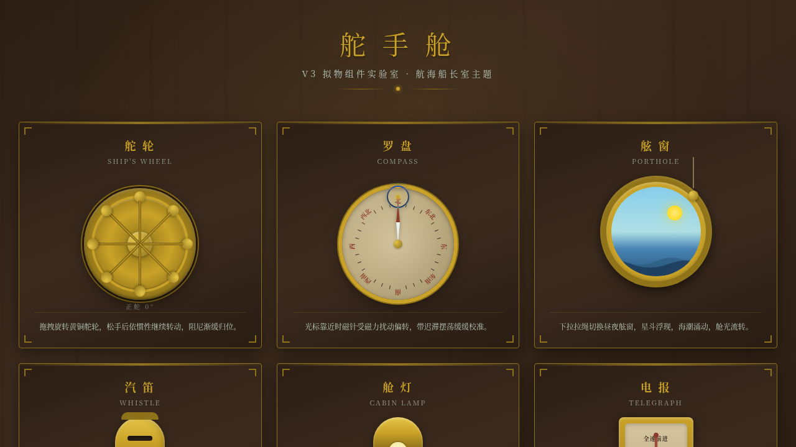

# 舵手舱 · 航海船长室拟物组件实验室

> 日期：2026-08-18 · 方向：V3 UX 交互设计 · 主题：航海船长室光标驱动拟物化小组件动画

## 简介

「舵手舱」是一座以航海船长室为场景叙事的拟物化小组件实验室。9 个展区均为鼠标光标上手操作（悬停/点击/拖拽）的实体隐喻微交互装置：可拖拽旋转的舵轮（惯性+阻尼回弹）、随光标磁力偏转的罗盘、拉绳切换昼夜的舷窗、拉绳触发的汽笛声波、黄铜拨杆舱灯、七档电报机、拖拽测角的六分仪、光标感应的气压计、可惯性滑动的海图。配色取胡桃木深棕+黄铜金+海泡沫白的航海复古船舱色系。

## 截图

## 动效亮点

- 舵轮拖拽旋转 + 惯性动量 + 阻尼回弹 + 弹簧归位
- 罗盘光标磁力反平方扰动 + 迟滞摆荡 + 磁针微颤
- 舷窗拉绳切换昼夜 + 海浪起伏 + 星辰闪烁 + 舱光流转
- 汽笛拉绳触发黄铜共鸣震动 + 三波声波涟漪
- 舱灯黄铜拨杆按压回弹 + 暖光辐射 + 光锥扩散
- 电报机七档磁吸定位、六分仪拖拽测角、气压计弹簧阻尼、海图惯性滑动
- 自定义光标：白环 + 黄铜内点 + 多层发光，开页即显示在屏幕中央

## 妙搭在线预览

https://dcniaqwtmoca.feishu.cn/page/OJurm5UzSdPAtIaNVVrcLT9Jnrf

## 文件说明

| 文件 | 说明 |
|------|------|
| index.html | 完整可运行源码（纯 vanilla HTML/CSS/JS 单文件） |
| 设计规范.md | 色彩系统、字体、展区结构、动效系统、健壮性 |
| thumbnail.png | 实验室截图 |

## 技术栈

纯 vanilla HTML/CSS/JS 单文件，无 React / 无 Babel / 无外部 CDN 依赖。
