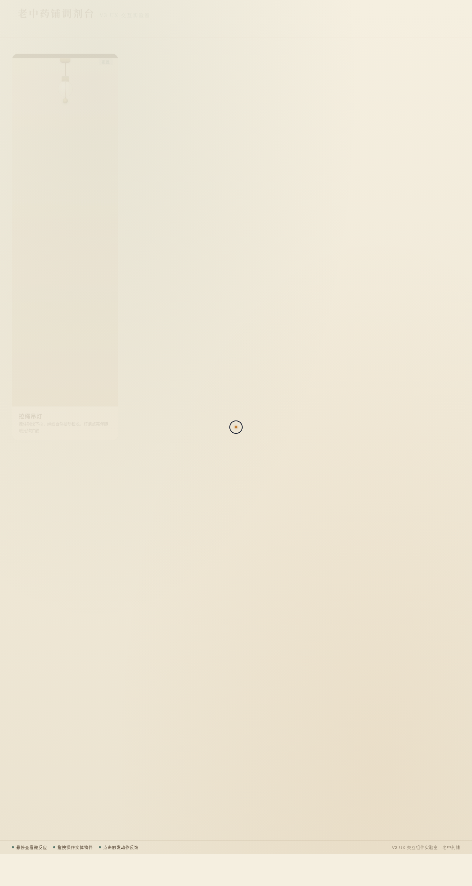

# 老中药铺调剂台 · V3 UX 交互组件实验室

> 日期：2026-08-18 · 方向：V3 UX 交互设计 · 主题：老中药铺调剂台

## 简介

「老中药铺调剂台」是一座光标驱动的拟物化小组件动画实验室。七件中药铺实体器物——拉绳吊灯、铜秤戥子、药柜抽屉、铜捣药臼、柜面铜铃、瓷药罐、铜制小香炉——各自成为有场景叙事的微交互装置。鼠标光标悬停、点击、拖拽即可亲手操弄，反馈细腻、有物理质感。

## 截图预览

## 七件展品

1. **拉绳吊灯** — 拖拽铜球下拉点亮灯泡，暖光锥扩散
2. **铜秤戥子** — 拖动铜砣，秤杆力矩倾斜，指针阻尼振荡
3. **药柜抽屉** — 拉开见草药，松手磁吸回弹
4. **铜捣药臼** — 点击舂捣，研杵弹簧回弹，药粉涟漪
5. **柜面铜铃** — 按下回弹振荡，声波圈层扩散
6. **瓷药罐** — 悬停 3D 倾斜，提起罐盖气雾升腾
7. **铜制小香炉** — 点击点燃，青烟扶摇而上

## 动效亮点

- 自定义光标开页即显示在屏幕中央，悬停放大、点击涟漪
- 全部基于物理模型：弹簧 Hooke 定律、阻尼振荡、摩擦、RAF 积分器
- 暖光扩散 / 声波圈层 / 气雾粒子 / 尘末飞散，周期各不相同
- 12+ 组件级特效，符合主题语义

## 配色体系

| 角色 | 色值 |
|------|------|
| 主色 · 铜青铜 | `#7a6540` |
| 辅助 · 药柜褐 | `#5a4828` |
| 点缀 · 赭石黄 | `#c17a2f` |
| 表面 · 象牙白 | `#e8dcc4` |
| 暖光 | `#ffd060` |

## 文件说明

| 文件 | 说明 |
|------|------|
| `index.html` | 完整可运行源码（纯 vanilla 单文件，含内联 CSS/JS） |
| `设计规范.md` | 色彩 / 字体 / 展品 / 动效 / 健壮性规范 |
| `preview.png` | 页面截图 |
| `thumbnail.png` | 缩略图 |

## 妙搭在线预览

https://dcniaqwtmoca.feishu.cn/page/ReJEmryTWd7O3pagrV7civstnmb

## 技术栈

纯 HTML / CSS / JavaScript（vanilla），无 React / Babel / 外部 CDN 依赖；Canvas / DOM 物理动画 + RAF 积分器。
