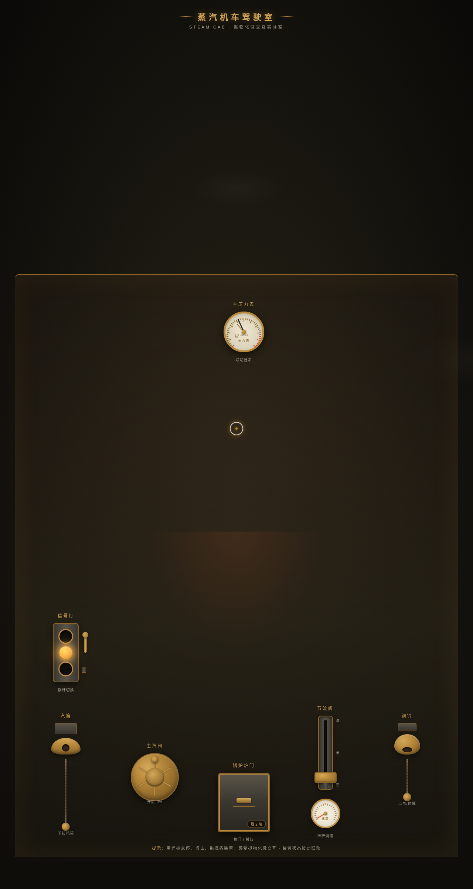
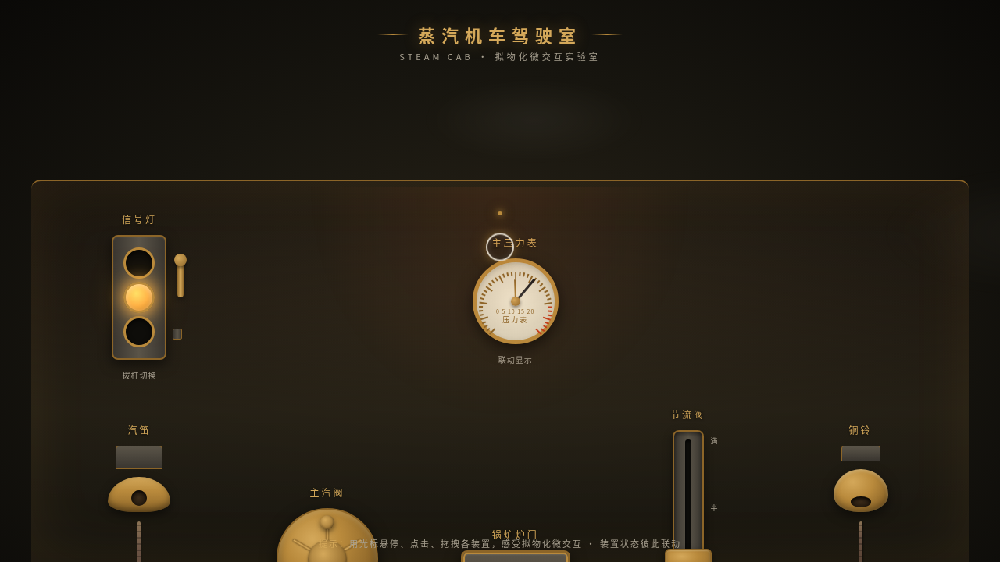

# 蒸汽机车驾驶室 Steam Cab · 拟物化微交互实验室

- 日期：2026-08-18
- 方向：V3 UX 交互设计（光标驱动的拟物化小组件动画）
- 主题：一座可把玩的老式蒸汽机车驾驶台

## 设计说明

煤黑面板 + 黄铜器件 + 炉膛橙红 + 蒸汽米白，7 个拟物化装置全部用鼠标上手：汽笛拉绳、主蒸汽阀铜转轮、锅炉炉门（可投煤）、节流阀推杆、铜铃、双针压力表、信号灯切换杆。装置间状态联动——火力推动压力，压力驱动汽笛与速度，构成一台"活的"驾驶台。

## 动效亮点

- 汽笛拉绳：拖拽触发 WebAudio 合成汽笛 + 蒸汽粒子 + 弹性回缩
- 铜转轮惯性旋转，联动压力表与蒸汽浓度
- 炉门拖拽开合，火光呼吸照亮面板，投煤增强火力
- 节流推杆带阻尼超调的速度表指针、驾驶室震感、风声联动
- 铜铃衰减振荡 + 铃音 + 三层声波涟漪；压力表红区抖动警示；信号灯磁吸归位
- 自定义光标：白色粗环+黄铜内点开页居中，悬停/拖拽/点击三态变化
- 12+ 组件级特效全物理建模，周期各异，prefers-reduced-motion 降级

## 文件说明

| 文件 | 说明 |
|---|---|
| index.html | 完整源码（纯 vanilla HTML/CSS/JS 单文件，零外部依赖，可直接打开预览） |
| 设计规范.md | 色彩/字体/装置/联动/动效/光标设计令牌 |
| preview.png | 本地渲染长截图（1280×2400） |
| thumbnail.png | 平台生成缩略图 |

## 在线预览

妙搭应用：https://dcniaqwtmoca.feishu.cn/page/VLrMm3bkldQ82taget6c0WLDnah

## 技术栈

纯 vanilla HTML/CSS/JS 单文件（无 React / 无 Babel / 无 CDN），RAF 物理积分器、WebAudio 合成音效、DOM transform 直驱高频交互。
