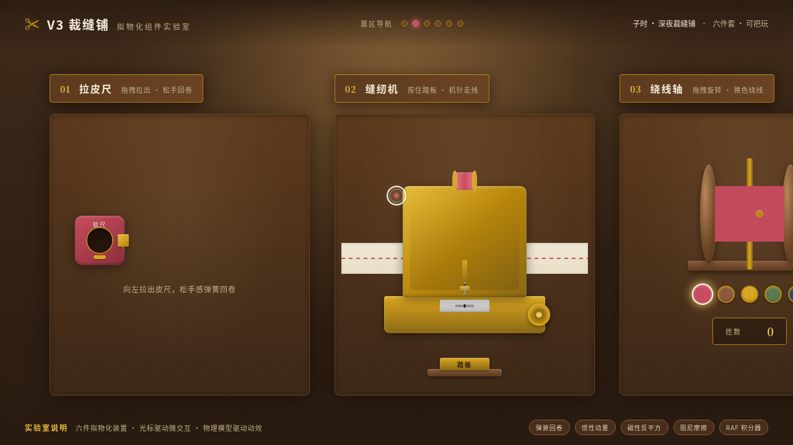

# 裁缝铺工作台 Tailor Bench

> 方向：V3 UX 交互设计 · 日期：2026-08-18
> 主题：光标驱动的拟物化小组件动画实验室——深夜裁缝铺

## 简介

「裁缝铺工作台」是一座深夜裁缝铺里的拟物化微交互装置实验室。六个展区都是鼠标光标上手操作（悬停/点击/拖拽）才有意义的实体隐喻装置：拉皮尺、踩缝纫机踏板、绕线轴、划粉片划线、蒸汽熨斗、顶针纽扣盒。每个展区有物理质感与场景叙事，交互反馈细腻。

## 动效亮点

- 顶针造型自定义光标（白环 + 胭脂内点 + 暖光外晕），开页即居中显示
- 皮尺弹簧回卷（Hooke 定律 + 阻尼）
- 缝纫机踏板按住加速、机针正弦运动、针迹生成
- 线轴惯性衰减旋转、5 色可切换
- 划粉颗粒拖拽生成 + 缓慢消散
- 蒸汽熨斗粒子扩散 + 褶皱熨平
- 纽扣反平方磁性吸附 + 倾倒碰撞
- 12+ 组件级特效，基于物理模型

## 文件说明

| 文件 | 说明 |
|------|------|
| index.html | 入口 HTML |
| main.css | 样式（34K） |
| main.js | 交互逻辑（31K，纯 vanilla） |
| thumbnail.png | 页面截图 |
| 设计规范.md | 色彩/字体/展区/动效规范 |

## 在线预览

[裁缝铺工作台 · 妙搭在线预览](https://dcniaqwtmoca.feishu.cn/page/SEzvmPcUUdxTBNaVEp2cRDmynv6)

## 技术栈

纯 vanilla HTML/CSS/JS 单文件，无 React / 无 Babel / 无外部 CDN 依赖。
