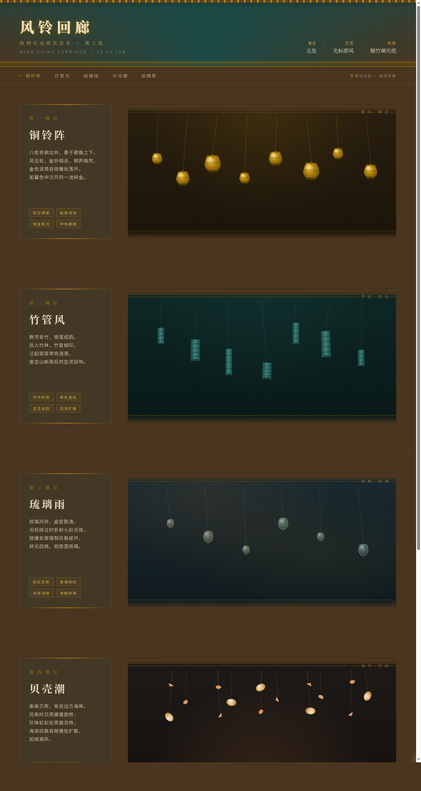

# 风铃回廊 · V3 UX 交互设计

> 日期：2026-08-18 · 方向：V3 UX 交互设计 · 主题：风铃回廊（光标驱动的拟物化风铃交互实验室）

## 概述

一个古风回廊，悬挂着各种材质的风铃（铜铃、竹管、玻璃风铃、贝壳风铃、纸鹤风铃）。鼠标光标作为"风"，移动时产生风力场，吹动附近的风铃摇摆，风铃碰撞时发出清脆的视觉涟漪和音色振动。5 个展区各有不同的场景叙事。

## 配色

古风回廊色：铜金 #B8860B / 深青墨 #1A4A47 / 暖铜橙 #CF7D3A / 宣纸米 #E8DCC0 / 暮色棕 #4A3520。禁止蓝紫渐变。

## 物理模型

阻尼弹簧摆动 + 光标风力场（距离反平方衰减）+ 相邻碰撞检测 + 弹性速度交换。光标移动速度和方向决定风力强度与方向。

## 五大展区

1. **铜铃阵** — 八枚青铜古铃，铜金涟漪 + 钟鸣震颤辉光
2. **竹管风** — 青竹管错落，翠色波纹 + 竹节质感
3. **琉璃雨** — 玻璃风铃，彩虹折射光斑 + 碰撞裂纹 + 七彩粒子
4. **贝壳潮** — 三种贝壳造型自转，珍珠虹彩流光 + 海浪纹路扩散
5. **纸鹤影** — 折纸鹤翻转飘动，宣纸折痕 + 墨点飘散

## 动效亮点

- 风铃物理摆动（阻尼弹簧模型，光标风力推动）
- 碰撞涟漪扩散（不同材质不同颜色波纹）
- 风尾粒子（光标移动轨迹）
- 彩虹折射光斑（玻璃风铃）
- 贝壳自转 + 珍珠虹彩
- 纸鹤翻转飘动 + 墨点飘散
- 自定义光标（三环 + 铜金内点 + 多层发光）

## 文件说明

| 文件 | 说明 |
|------|------|
| index.html | 完整单文件源码（HTML + CSS + JS 内联） |
| preview.png | 页面截图 1280×2400 |
| 设计规范.md | 色彩系统、字体、物理引擎、展区结构、动效规范 |

## 妙搭在线预览

https://dcniaqwtmoca.feishu.cn/page/JM3zm7lU7dWdXgaocqecQTP5nAd

## 技术栈

纯 vanilla HTML/CSS/JS 单文件实现，Canvas 绘制物理动画，无 React / 无 Babel / 无外部 CDN 依赖。
