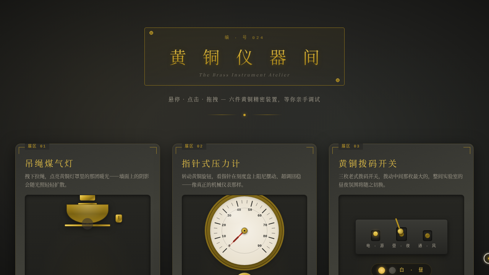

# 黄铜仪器间 Brass Instruments

> 日期：2026-08-18 · 方向：V3 UX 交互设计 · 主题：黄铜精密仪器实验室（光标驱动的拟物化小组件动画）

## 简介

「黄铜仪器间」是一间摆满黄铜精密仪器的旧实验室：六台独立装置——吊绳煤气灯、指针式压力计、拨码开关、发条钥匙、节流拉杆、磁吸图钉板——每一台都必须用鼠标光标亲手操作才有意义。拉绳会下垂回弹、指针会超调回稳、齿轮带惯性缓转、蒸汽随拉杆开度升腾，拨动主开关还能切换整间实验室的昼夜氛围。全站中文文案，每台装置配一段场景叙事。

## 截图

## 动效亮点

- 拖拽拉绳点灯：光锥扩散 + 桌面光斑 + 弹簧阻尼回弹
- 指针式仪表：二阶阻尼超调物理（弹簧 K + 阻尼 C + 速度积分）
- 拨码主开关：一键切换整页昼夜氛围，全局联动过渡
- 发条钥匙上弦：松手后齿轮摩擦惯性缓转
- 节流拉杆：蒸汽粒子频率 / 大小随开度连续变化
- 磁吸图钉：反平方磁吸 + 弹簧归位微反馈
- 开屏即居中的自定义光标（白环 + 黄铜内点 + 朱红拖拽态 + 点击涟漪）

## 文件说明

| 文件 | 说明 |
|---|---|
| `index.html` | 展区结构（纯 HTML，可直接浏览器打开预览） |
| `styles.css` | 黄铜金属质感与场景样式 |
| `script.js` | 全部交互与物理积分逻辑（vanilla JS） |
| `preview.png` / `thumbnail.png` | 页面截图 |
| `设计规范.md` | 色彩 / 字体 / 展区 / 动效设计令牌 |
| `README.md` | 本文件 |

## 在线预览

https://dcniaqwtmoca.feishu.cn/page/D51SmgLCGd2pYJakVglcFQYynBd

## 技术栈

纯 vanilla HTML/CSS/JS 单页（无 React / Babel / 外部 CDN）· 原生 RAF 物理积分 · 支持 prefers-reduced-motion 降级
