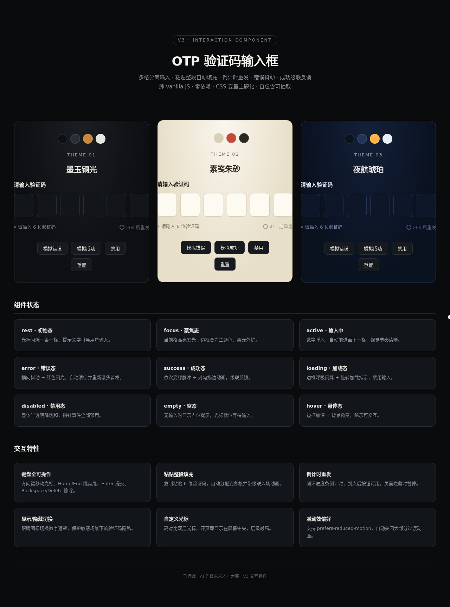

# OTP 验证码输入框 · V3 交互组件

> 生产级可复用 UI 组件 · 多格分离输入 · 粘贴整段 · 倒计时重发 · 9 态状态机 · CSS 变量主题化

## 简介

OTP 验证码输入框是面向真实项目开发的可复用 UI 组件。6 格分离输入，支持键盘全程操作、粘贴整段自动填充、倒计时重发、错误抖动、成功级联反馈。三套主题（墨玉铜光 / 素笺朱砂 / 夜航琥珀）通过 CSS 变量切换，复制两个文件即可接入任意项目。

## 妙搭预览

https://dcniaqwtmoca.feishu.cn/page/KkUPmSiEAdUpTKacPT8crqHrnRc

## 截图



## 签名交互

键盘流——Tab 聚焦第一格，盲打 6 位数字，每格弹跳入场自动前进；填满后自动提交，触发异步验证 loading → 成功级联变绿 + 对勾描边 / 错误逐格抖动 + 自动清空重试。粘贴整段验证码时 6 格依次下落弹跳级联填充。

## 组件状态（9 态）

rest · hover · focus · active · error · success · loading · disabled · empty

## 动效（14 个组件级特效）

光标闪烁 / 数字弹入 / 聚焦发光 / 悬停加深 / 删除波纹 / 粘贴级联 / 错误抖动 / 成功级联 / 对勾描边 / 加载呼吸 / 倒计时环 / 禁用降饱和 / 遮罩切换 / 自定义光标

## 文件说明

```
2026-08-19_OTP验证码输入框_otp-input/
├── index.html                      # 三主题演示页（展示页）
├── preview.png                     # 截图
├── 设计规范.md                      # 设计规范（色彩/字体/状态机/动效系统）
├── README.md                       # 本文档
└── 组件/otp-input/
    ├── otp-input.css               # 组件样式（CSS 变量主题化，30+ 变量）
    ├── otp-input.js                # 组件逻辑（纯 vanilla JS，~800 行）
    ├── index.html                  # 组件独立演示页
    └── README.md                   # 组件用法文档（API/配置/快速开始）
```

## 技术栈

- 纯 vanilla HTML + CSS + JS，零依赖零构建
- 无 React / Babel / CDN，从根本上规避白屏
- CSS 自定义属性主题化
- requestAnimationFrame 节流 + visibilitychange 暂停
- SVG 圆环/对勾动画
- 支持 prefers-reduced-motion

## 设计自查

- [x] 删动画后组件仍完整可用（输入/粘贴/键盘/提交均不受影响）
- [x] 灰度下层级成立（边框/背景/文字对比足够）
- [x] 状态机 ≥ 5 态（实际 9 态）
- [x] 键盘全程可操作
- [x] CSS 变量改主题 ≤ 3 处生效
- [x] 自包含可抽取（复制 2 文件即用）
- [x] 附用法文档
- [x] 非拟物化物理演示装置
- [x] 配色与 V1（深空黑+琥珀银）/ V2（暖棕木+安全橙）互不雷同
- [x] 零未定义引用，零 console error
