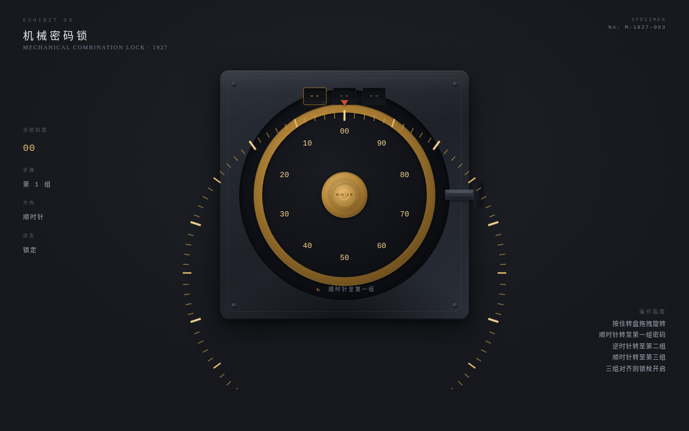

# 保险柜 · 机械密码转盘锁

**类别**：交互组件（V3）　**日期**：2026-08-19

## 简介

1920 年代银行金库保险柜机械密码转盘锁——光标抓住黄铜转盘，顺时针/逆时针交替旋转输入三组密码。每经过一个整数刻度棘轮咔哒（WebAudio 合成），三组密码全部正确时锁栓连杆机械缩回，柜门微弹。可重置重玩。

## 主题

光标驱动的拟物化转盘装置——双向旋转是核心交互机制，棘轮 detent + 惯性余转 + 锁栓缩回构成完整操作闭环。

## 截图

## 妙搭预览链接

https://dcniaqwtmoca.feishu.cn/page/OKS9m7r3zdq994aI6HfcjiiPnAe

## 文件说明

| 文件 | 说明 |
|------|------|
| index.html | 单文件 vanilla HTML/CSS/JS，含转盘渲染、旋转物理、棘轮音效、锁栓动画 |
| preview.png | 桌面端 1440×900 截图 |
| 设计规范.md | 从源码提取的真实色值、字体、物理模型 |

## 技术栈

- 纯 vanilla 单文件 HTML + CSS + JS（42KB），无 React/Babel/CDN
- WebAudio API 合成棘轮咔哒声（prefers-reduced-motion 降级）
- requestAnimationFrame 驱动旋转物理
- CSS transform rotate 驱动转盘旋转
- atan2 计算拖拽角度
- visibilitychange 暂停 RAF + cancelAnimationFrame 清理
- prefers-reduced-motion 支持

## 五层反馈

1. **Pre-contact**：光标悬停转盘时放大 + 「按住拖拽」提示
2. **Contact**：按下时光标变 grab 态
3. **Continuous**：拖拽驱动转盘旋转，每刻度 detent 微震 + 指针跳动
4. **Threshold**：每组密码命中时弹簧回弹 + snapPulse 脉冲
5. **Release/Decay**：松手后惯性旋转 + 摩擦衰减（0.92）+ 最终吸附到刻度

## 物理模型

- 角动量惯性：松手后按当前角速度继续旋转
- 摩擦衰减：每帧 ×0.92 衰减系数
- 棘轮 detent 吸附：每整数刻度阻力峰 + 弹簧回弹
- 锁栓缩回：三组密码正确时连杆动画 + 双声金属 clunk

## 自定义光标

五态：idle（默认）→ hover（悬停转盘放大）→ grab（按下抓握）→ detent（经过刻度）→ success（解锁成功）。z-index: 9999，开页居中。

## 设计观点

双向旋转是全新交互机制（历史 component 全为单向拖拽/旋转）。圈数计数 + 棘轮 detent + 锁栓缩回的完整闭环可玩性极高。配色取自 1920 年代银行金库：深钢灰铸铁 + 黄铜转盘 + 铁锈红 + 珐琅黑。
