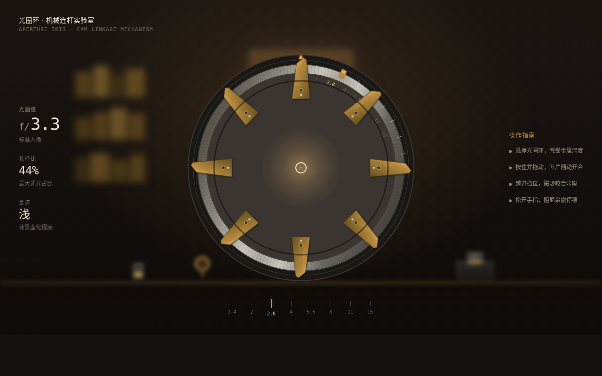

# 光圈环 · 镜头光圈叶片

**类别**：交互组件　**日期**：2026-08-19

## 简介

一枚老式相机镜头的光圈环。拖动钢环旋转，凸轮连杆驱动 8 片黄铜叶片开合，中央通光孔径随之缩放，f/1.4→f/16 八档磁吸咬合伴随咔哒，镜头后方实景的景深随孔径实时变化（大光圈=前景清晰背景虚化，小光圈=全清晰）。松手阻尼余震微振荡后停稳。

母题：「机械连杆传动的精密手感」——叶片既旋转又向心平移，是相机里最优雅的小型机械。

## 在线预览

> [光圈环 · 镜头光圈叶片](https://dcniaqwtmoca.feishu.cn/page/JSW8m9x4xd74ySaq1e7cyfsVnjh)

## 截图



## 设计要点

- **核心机制**：拖光圈环 → 凸轮连杆驱动 8 叶片（旋转+径向平移联动）→ 孔径连续变化（非简单 scale）
- **f 档磁吸**：f/1.4, f/2, f/2.8, f/4, f/5.6, f/8, f/11, f/16 八档，接近时吸附力增大、过档咔哒
- **五层反馈**：预接触（环高亮待抓）/ 接触（咬合感）/ 持续（叶片每帧跟随）/ 阈值（磁吸+咔哒）/ 释放（阻尼余震振荡）
- **景深响应**：孔径变化时背景虚化连续插值（大光圈奶油虚化 → 小光圈锐利全清）
- **物理模型**：阻尼弹簧释放余震，非线性，非 linear 归零
- **自定义光标**：开页居中，光圈轮廓形态，抓取态开合
- **动效系统**：13 项组件级特效（环旋转 / 叶片连杆开合 / 磁吸阻力 / 过档咔哒 / 阻尼余震 / 通光插值 / 景深 blur / 金属高光 / 拉丝纹理 / f 值滚动 / 刻度高亮 / 预接触呼吸 / 孔径微脉冲）

## 文件说明

```
├── index.html      # 单文件应用（纯 vanilla，无外部依赖）
├── preview.png     # 1280×800 截图
└── 设计规范.md     # 色值 / 字体 / 动效系统规范
```

## 技术栈

- 纯 HTML + CSS + 原生 JavaScript（vanilla），无 React / Babel / CDN
- SVG 绘制叶片（path，transform 旋转+平移）
- pointer 事件直接操作，RAF 阻尼积分
- WebAudio 合成过档咔哒
- RAF 随 visibilitychange 暂停、卸载取消；支持 prefers-reduced-motion
- 系统字体栈

## 把玩提示

从 f/1.4 一路旋到 f/16，叶片如瞳孔般收缩、咔哒连响，背景从奶油虚化渐变到锐利全清；再旋回去，叶片重新展开，虚化回来。
