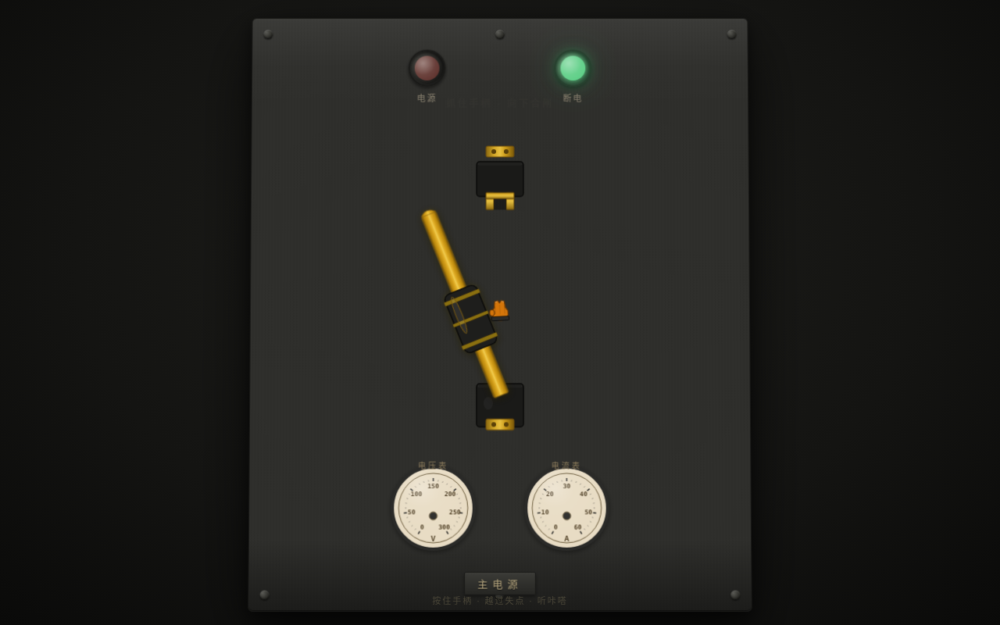

# 机械刀闸开关 V3 · 交互组件

主题：光标驱动的拟物化机械刀闸开关——推拉手柄越过机械死点，双稳态吸合 + 电弧 + 仪表响应。

## 简介
整页聚焦单一组件：老式工厂配电箱上的刀闸开关。光标抓住黄铜手柄向上拉（断电）或向下推（合闸），越过中间机械死点时阻力骤降、手柄被弹簧"吸"到位，合闸瞬间电弧粒子迸发，配电箱指示灯亮、电压表/电流表指针阻尼振荡摆起。松手后手柄稳定，指针有余振衰减。可反复推拉把玩。

## 截图

## 妙搭预览链接
https://dcniaqwtmoca.feishu.cn/page/Qz5PmqdPzd2XEYaK3Oxc3G72n0c

## 文件说明
- `index.html` — 纯 vanilla 单文件源码（SVG + Canvas）
- `设计规范.md` — 色彩/字体/物理模型/反馈层次
- `preview.png` — 1280×800 截图
- `thumbnail.png` — 妙搭缩略图

## 技术栈
纯 vanilla 单文件 HTML，SVG + Canvas 绘制零外部依赖。物理模型为双稳态势能阱 U(x)=0.5k(x²-1)² + RAF 实时积分 + 阻尼弹簧。自定义光标三态形变，支持 prefers-reduced-motion。

## 设计母题
机械双稳态开关——双向双稳态越过死点，区别于历史单向连续拖拽。铸铁灰 + 黄铜金 + 红/绿状态色 + 电弧蓝紫。
