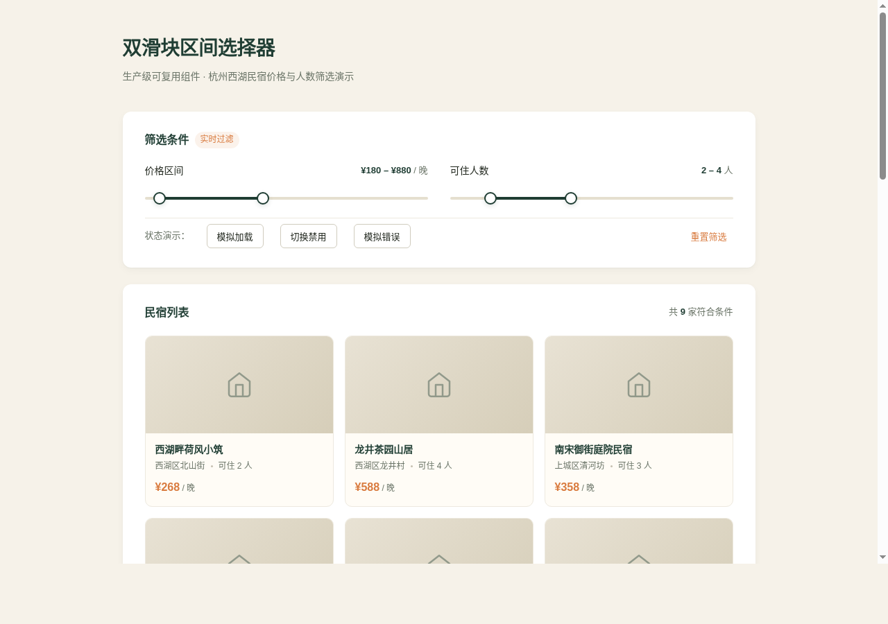

# 区间滑块 Range Slider · 双滑块区间选择器组件

> 实用可复用 UI 组件 · 输入类 · 2026-08-19 · V3 交互组件



## 主题与简介

生产级「双滑块区间选择器」。两个手柄共享一条轨道选取数值区间 `[min, max]`，覆盖价格筛选、人数范围、时间区间等真实场景。设计目标：开发者 copy-paste 进自己项目、改不超过 3 处 CSS 变量即可换肤直接用。

**展示场景**：杭州西湖周边民宿筛选——价格区间 ¥80–¥2000（步进 ¥10）与可住人数 1–8 人（步进 1），16 家真实民宿卡片随区间实时过滤，含空结果、加载、错误、禁用四种状态演示。

妙搭预览：<https://dcniaqwtmoca.feishu.cn/page/AyhCm4npRdwPh1a5svvcLA91nZf>

## 设计观点

不堆拟物化物理装置，只做工程可用的界面积木。组件即主角，展示页克制（民宿筛选卡片只是承载场景）。配色取松烟墨绿 + 宣纸米白 + 赭橙，低饱和、靠明度建立层级，禁用蓝紫渐变。

## 用法文档

### 1. 引入

单文件，零依赖。把 `index.html` 中 `/* ==== RangeSlider component begin ==== */` 到 `/* ==== RangeSlider component end ==== */` 之间的 CSS 与 JS 整段复制到你的项目即可。组件代码与展示页逻辑用注释明确分隔，互不耦合。

### 2. HTML 结构

```html
<div id="price-range"></div>
```

### 3. 初始化

```js
const slider = new RangeSlider(document.getElementById('price-range'), {
  min: 80,
  max: 2000,
  step: 10,
  values: [180, 880],
  unit: '¥',
  allowCross: false,   // 两手柄不可交叉
  minGap: 10,           // 最小间距（同单位）
  label: '价格区间选择', // 容器 aria-label
  onChange: (values) => {
    console.log('当前区间', values); // [180, 880]
  }
});
```

### 4. 实例方法

| 方法 | 说明 |
|------|------|
| `slider.setValues([a, b])` | 外部设值，触发 onChange |
| `slider.setDisabled(bool)` | 切换禁用态 |
| `slider.setLoading(bool)` | 切换加载态（手柄禁用 + 脉冲） |
| `slider.setError(bool)` | 切换错误态 |
| `slider.destroy()` | 卸载：移除监听、清 RAF/定时器、还原 DOM |

### 5. 状态机

`rest` · `hover` · `focus` · `active/dragging` · `disabled` · `loading` · `error` · `empty`（共 8 态）。

### 6. 键盘操作

| 按键 | 行为 |
|------|------|
| Tab | 在两个手柄间聚焦 |
| ← / ↓ · → / ↑ | 单步减 / 增 |
| PageDown · PageUp | 十步减 / 增 |
| Home · End | 跳到最小 / 最大 |
| 点击轨道 | 最近手柄跳转并聚焦 |

## 可配置项 / 定制方法

**换肤**：覆盖 `.rs-slider` 上的 CSS 变量即可，无需改 JS。最少改 3 处即可完成主题切换：

```css
.my-theme .rs-slider {
  --rs-accent: #2563EB;        /* 主色 */
  --rs-fill-bg: #2563EB;       /* 填充 */
  --rs-handle-border: #2563EB; /* 手柄描边 */
}
```

完整变量见 `设计规范.md` 第 3 节（15 个变量：主色 / 轨道 / 手柄 / 焦点环 / 时长 / 圆角 / 错误色等）。

**行为配置**：`min` / `max` / `step` / `values` / `unit` / `allowCross` / `minGap` / `label` / `onChange`，均通过构造参数传入。

## 文件说明

| 文件 | 说明 |
|------|------|
| `index.html` | 单文件实现（组件 CSS/JS + 展示页），零依赖 |
| `设计规范.md` | 配色、字体、动效系统、状态机、变量清单 |
| `preview.png` | 1280×900 渲染截图 |
| `README.md` | 本文件 |

## 技术栈

纯 vanilla（HTML + CSS + JS），无 React / Babel / CDN / 外部字体。pointer 事件 + setPointerCapture + RAF 直写 DOM；`visibilitychange` 暂停 RAF；`destroy()` 完整卸载；支持 `prefers-reduced-motion`。

## 自查结论

- 删掉所有过渡动画后，拖拽 / 点击 / 键盘 / 状态切换功能完整可用 ✓
- 抽到别的项目只改 CSS 变量（≤3 处）即可换肤 ✓
- Console 零 Error，无白屏，无横向溢出 ✓
- 8 态状态机，键盘全可操作，aria 正确，焦点环可见 ✓
- 非蓝紫渐变，与近期作品配色不雷同 ✓

---

*等待协调者检查后提交 GitHub。本任务未执行 git add/commit/push。*
