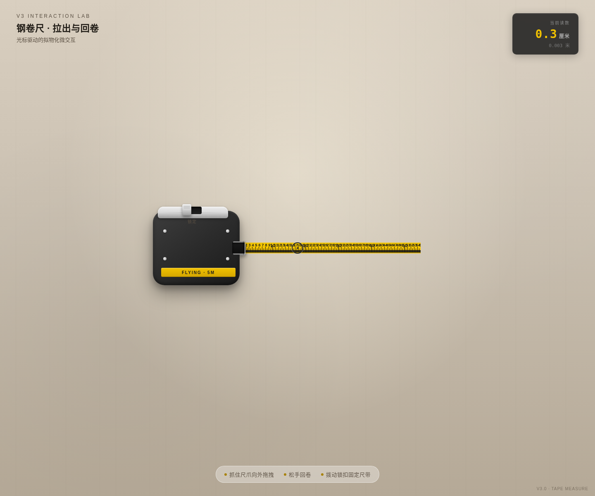

# 卷尺 · 拉出与回卷

**类别**：Component Mock（V3 交互组件）　**日期**：2026-08-19

## 简介
工作台灯光下的一把钢卷尺，是全场唯一主角。光标抓住尺爪向外拉：尺带带着刻度流出、阻力随长度递增；松手瞬间弹簧储能释放，尺带呼啸回卷、刻度倒飞、尺爪撞击尺口弹跳两下定住。侧面锁定开关拨下后松手不回卷——再拨一下才「唰」地收回。玩完想再拉一次。

## 主题
光标驱动的拟物化钢卷尺微交互（拉出 / 锁定 / 回卷）

## 截图

## 妙搭预览
https://dcniaqwtmoca.feishu.cn/page/GVbQm3RsTdP7M4acjIVcHtEBnCb

## 文件说明
- `index.html` — 纯 vanilla 单文件源码（Canvas 刻度 + 物理积分）
- `preview.png` — 浏览器无头渲染截图
- `设计规范.md` — 物理/反馈/色彩/光标系统

## 技术栈
纯 vanilla 单文件，无 React / 无 Babel / 无外部 CDN；自定义三态光标；支持 prefers-reduced-motion；RAF 随可见性暂停且卸载取消。

## 设计要点
- 物理模型：弹簧-阻尼-惯性积分（非 linear/ease）
- 五层反馈：预接触 → 接触 → 持续 → 阈值 → 释放衰减
- 锁定双态：拨下锁住尺带，再拨高速回卷
- 配色：工程黄 + 橡胶黑 + 铬钢银 + 工作台暖灰
