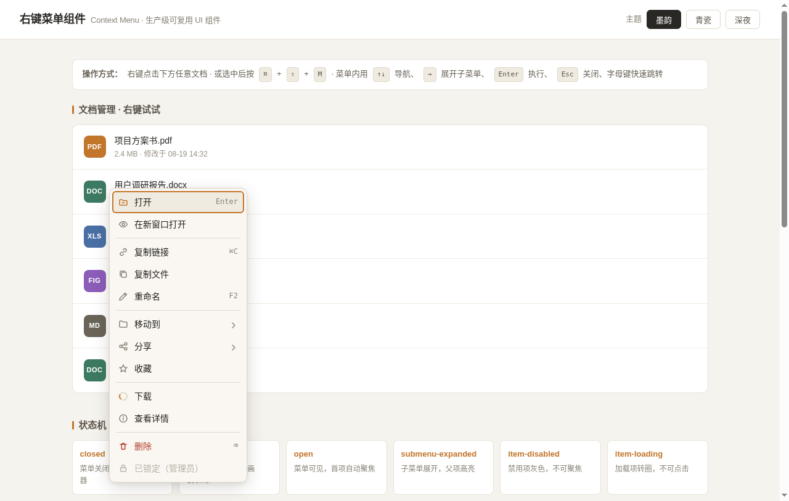

# 右键菜单组件 · Context Menu

> 生产级可复用 UI 组件 —— 智能定位翻转 · 子菜单嵌套 · 全键盘导航 · type-ahead 搜索 · 7 态状态机 · 3 套主题



## 简介

一个可以直接搬到真实项目里使用的右键上下文菜单组件。右键点击触发区域，菜单在光标位置弹出并智能翻转避免被视口裁切。支持子菜单嵌套、分隔线、禁用项、危险项、加载项、图标和快捷键标注。完整的键盘导航和焦点管理，三套预设主题通过 CSS 变量一键切换。

**场景**：文档管理列表、文件浏览器、数据表格行操作、编辑器右键菜单——任何需要上下文操作的场景。

## 妙搭预览

🔗 [在线预览](https://dcniaqwtmoca.feishu.cn/page/AIojmHguhdOBr5aypJZcSzcbnkc)

## 操作方式

- **右键点击**任意文档项 → 弹出菜单
- **⌘ + ⇧ + M**（选中文档项后）→ 键盘触发
- **长按**（触屏）→ 500ms 后触发
- 菜单内：**↑↓** 导航 · **→** 展开子菜单 · **←** 收起 · **Enter** 执行 · **Esc** 逐级关闭 · **Home/End** 跳首尾 · **字母键** type-ahead 搜索

## 用法

### 1. 定义菜单项

```javascript
const items = [
  { label: '打开', icon: 'open', onSelect: openFile },
  { label: '复制链接', shortcut: '⌘C', onSelect: copyLink },
  { separator: true },
  {
    label: '移动到', icon: 'folder', submenu: [
      { label: '项目文件夹', onSelect: moveTo },
      { label: '回收站', danger: true, onSelect: trash }
    ]
  },
  { label: '下载', loading: true },
  { label: '删除', danger: true, shortcut: '⌫', onSelect: deleteFile },
  { label: '已锁定', disabled: true }
];
```

### 2. 绑定到触发元素

```javascript
const api = initContextMenu(triggerEl, items, {
  themeClass: 'cm-theme-ink',   // 墨韵 / 青瓷 / 深夜
  submenuDelay: 120,             // 子菜单展开延迟 ms
  onShow: () => {},
  onClose: () => {}
});
```

### 3. 编程式控制

```javascript
api.show(x, y);   // 在指定坐标打开
api.hide();       // 关闭菜单
api.destroy();    // 解绑销毁
```

## 菜单项配置

| 字段 | 类型 | 说明 |
|------|------|------|
| label | string | 显示文字 |
| icon | string | 图标名（open/link/rename/folder/share/download/trash/copy/info/lock/eye/star） |
| shortcut | string | 快捷键标注（如 ⌘C、F2、⌫） |
| onSelect | function | 点击回调，接收 item 参数 |
| submenu | array | 子菜单项数组（递归） |
| separator | boolean | 分隔线（无其他字段） |
| disabled | boolean | 禁用态 |
| danger | boolean | 危险态（红色） |
| loading | boolean | 加载态（spinner，不可点击） |

## 可配置 CSS 变量

改 `--cm-*` 变量即可自定义主题，共 12+ 个变量：

| 变量 | 说明 | 默认值（墨韵） |
|------|------|----------------|
| --cm-surface | 菜单背景 | #faf7f2 |
| --cm-surface-hover | 悬停背景 | #f0ebe1 |
| --cm-text | 主文字 | #1f1d1a |
| --cm-accent | 强调色 | #c2762b |
| --cm-danger | 危险色 | #b3402e |
| --cm-border | 边框色 | #e0d8ca |
| --cm-radius | 圆角 | 10px |
| --cm-min-width | 最小宽度 | 224px |
| --cm-duration | 动画时长 | 180ms |
| --cm-easing | 缓动曲线 | cubic-bezier(0.16,1,0.3,1) |

完整变量见 [设计规范.md](设计规范.md)。

## 定制方法

1. **换主题色**：在触发元素的父容器或 `:root` 上覆盖 `--cm-accent` 等变量
2. **新增主题**：复制 `.cm-theme-ink` 规则，改名 `.cm-theme-xxx`，改色值，传 `themeClass: 'cm-theme-xxx'`
3. **改图标**：在 `CM_ICONS` 对象中新增 SVG 路径，`item.icon` 引用新名称
4. **改动画**：覆盖 `--cm-duration` 和 `--cm-easing`，或 `prefers-reduced-motion` 自动降级
5. **嵌入项目**：抽取 `<style>` 中 `.cm-*` 部分到组件 CSS，抽取 `<script>` 中 `initContextMenu` 到组件 JS，改不超过 3 处即可用

## 状态机

7 个状态完整覆盖：`closed` → `opening` → `open` → `submenu-expanded`，加上 `item-disabled` / `item-loading` / `item-danger` 三个项级状态。

## 文件说明

| 文件 | 说明 |
|------|------|
| index.html | 组件完整源码（纯 vanilla 单文件，含展示页） |
| 设计规范.md | 色值/字体/动效/状态机/键盘交互完整规范 |
| preview.png | 菜单打开状态截图 |
| showcase.png | 展示页全貌截图 |
| thumbnail.png | 妙搭自动生成的缩略图 |

## 技术栈

- 纯 HTML + CSS + JavaScript（vanilla），无 React / Babel / CDN
- CSS 自定义属性（Custom Properties）主题化
- SVG 内联图标（13 个，无外部依赖）
- Chrome DevTools Protocol 验证通过（0 console error）
- 支持 `prefers-reduced-motion` 降级
- 全局单例管理，事件冒泡隔离
