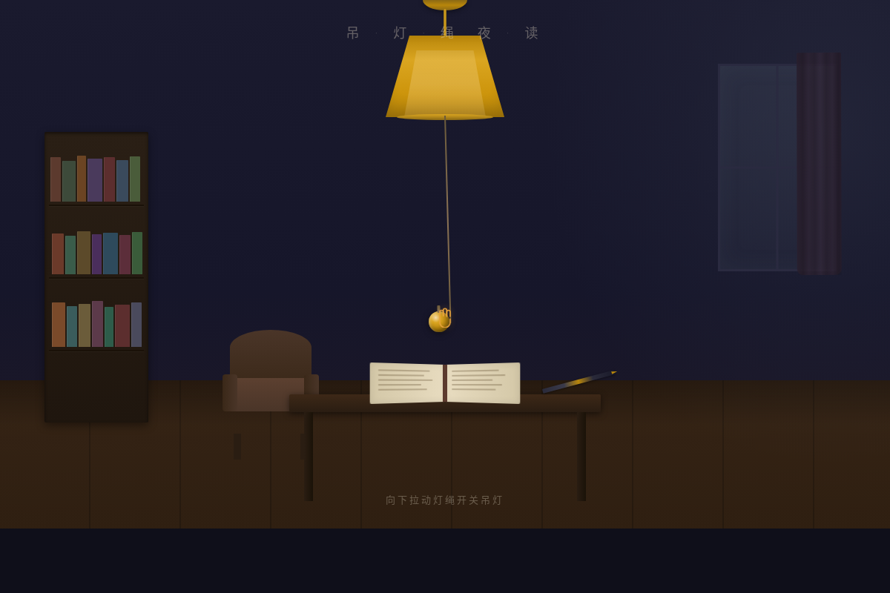

# 吊灯绳 · 夜读 Pendant Lamp Night Read

> 方向：V3 交互组件 · 日期：2026-08-19 · 主题：拟物化拉绳吊灯开关

## 简介

「吊灯绳·夜读」是一个可反复把玩的拟物化交互组件。深夜书房中央悬挂一盏黄铜吊灯，灯罩下垂一根拉绳。抓住拉绳末端的黄铜小球向下拉——感受弹簧阻力逐渐增大，到达阈值时机械开关清脆咬合，白炽灯丝从暗红升温到暖白，房间从月光冷暗变为暖光映照。松手后绳子如弹簧般回弹振荡。再拉一次，灯灭。

物理模型使用真实力学积分（胡克定律弹簧 + 阻尼谐振子），不是 CSS transition。灯亮是白炽灯升温曲线而非瞬间切换。光束中漂浮的尘埃、书架上 21 本不同色脊的书、飘动的窗帘——灯亮时这些细节才从暗影中显现。

## 截图展示

## 妙搭预览链接

https://dcniaqwtmoca.feishu.cn/page/BeD3m3jsfdJeSAa37pdcC0INnOb

## 文件说明

| 文件 | 说明 |
|------|------|
| index.html | 完整源码（纯 vanilla 单文件，40KB） |
| preview.png | 浏览器截图（1200×800） |
| 设计规范.md | 设计系统文档（色值/物理模型/反馈层次/动效） |

## 技术栈

- 纯 HTML + CSS + JavaScript，无 React / Babel / CDN 依赖
- requestAnimationFrame 物理积分循环
- 支持 prefers-reduced-motion（降级为直接开关）
- 桌面 1200px+ 适配

## 设计要点

- **核心组件**：单一拉绳吊灯开关，不是组件库
- **物理模型**：胡克定律弹簧 + 阻尼谐振子，真实力学积分
- **灯亮曲线**：白炽灯丝升温（暗红→橙红→暖黄→暖白，800ms）
- **反馈层次**：pre-contact → contact → continuous → threshold → completion → release → decay
- **配色**：深夜书房双色调（冷暗月光蓝灰 vs 暖光琥珀黄铜），禁蓝紫渐变
- **自定义光标**：发光圆点+十字线，接近拉绳变抓取手势，抓住变握紧
- **可玩性**：反复拉动开关灯，每次都有完整的物理反馈和视觉变换
