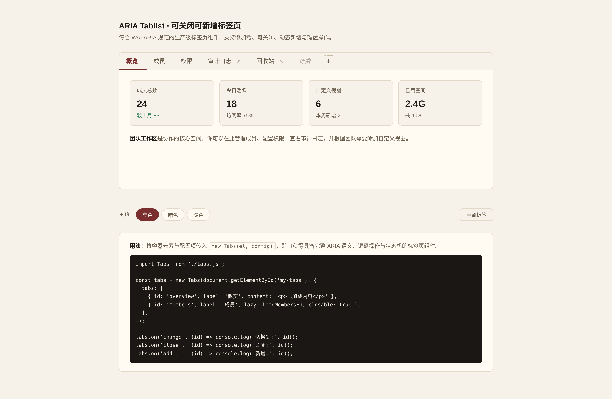

# 墨签标签页 · ARIA Tablist 可复用组件

> Art 设计实验室 · V3 交互组件 · 2026-08-19
> 类别：导航类 · Tablist / 标签页切换器

## 简介

生产级 **ARIA Tablist** 组件——可关闭、可新增、内容区懒加载的标签页切换器。设计目标不是「炫技演示」，而是**开发者拷进任意内容型 / 管理型项目立即能用**的界面积木。

签名记忆点是激活标签下方一条**共享「墨条」下划线**：单个 DOM 元素，`transform: translateX + width` 跟随激活标签平滑滑动（220ms cubic-bezier）。键盘 `← →` 连续切换时，下划线像游标一样在标签间流畅迁移——既是激活态指示，也是空间连续性的视觉锚。语义性 layout-shared 过渡，非装饰特效。

演示场景为「团队工作区设置」，覆盖六种真实态：概览（正常内容）、成员（懒加载成功）、权限（懒加载成功）、审计日志（可关闭，懒加载失败 + 重试）、回收站（可关闭，空状态）、计费（禁用标签），并可动态新增「自定义视图」标签。



**妙搭预览**：https://dcniaqwtmoca.feishu.cn/page/DCqmmh81Ad6EJnaNInTcrlMln7e

## 截图


## 用法

```html
<div id="tabs"></div>
<script>
  const t = new Tabs(document.getElementById('tabs'), {
    tabs: [
      { id: 'overview', label: '概览', content: '<p>概览内容</p>' },
      {
        id: 'members', label: '成员', lazy(done, tab) {
          setTimeout(() => done(null, '<ul>成员列表</ul>'), 600);
        }
      },
      { id: 'audit', label: '审计日志', closable: true, lazy(done, tab) {
        setTimeout(() => done('加载失败'), 500);  // 进入 error 态，含重试按钮
      }},
      { id: 'trash', label: '回收站', closable: true, lazy(done){ done(null, '') } }, // empty
      { id: 'billing', label: '计费', disabled: true, disabledHint: '该功能未开通' }
    ]
  });
  t.on('change', (id, tab) => console.log('切换到', id));
</script>
```

### API

| 方法 | 说明 |
|---|---|
| `new Tabs(el, { tabs })` | 实例化，`tabs` 为标签配置数组 |
| `t.on('change', cb)` | 切换事件回调 `(id, tab) => {}` |
| `t.getActive()` | 返回当前激活标签对象 |
| `t.setActive(id)` | 激活指定标签 |
| `t.addTab(cfg)` | 新增标签 |
| `t.closeTab(id)` | 关闭标签（焦点按 WAI-ARIA 转移） |
| `t.disable(id)` / `t.enable(id)` | 禁用 / 启用标签 |
| `t.destroy()` | 清理监听与状态 |

### 标签配置项

| 字段 | 类型 | 说明 |
|---|---|---|
| `id` | string | 唯一标识 |
| `label` | string | 标签文字 |
| `closable` | bool | 是否可关闭（显示 × 按钮） |
| `disabled` | bool | 是否禁用 |
| `disabledHint` | string | 禁用提示文案 |
| `lazy` | fn(done, tab) | 懒加载函数，调用 `done(err, content)`；返回字符串则同步 |
| `content` | string | 同步内容（与 lazy 二选一） |

## 键盘交互

| 键 | 行为 |
|---|---|
| `Tab` | 进入 tablist（落到激活标签）；再按进入面板 |
| `←` / `→` | 切换并激活标签（下划线滑动） |
| `Home` / `End` | 首个 / 末个可选标签 |
| `Delete` / `W` / `Esc` | 关闭当前聚焦的可关闭标签 |
| `Enter` / `Space`（在 `+`） | 新增标签 |

## 可配置项 / 定制方法

换主题只需覆盖 `.tabs` 容器上的 `--tabs-*` CSS 变量（共 45 个），无需改 JS。关键变量：

```css
.tabs {
  --tabs-accent: #7A2E2E;        /* 重音/激活色 */
  --tabs-bg: #F6F1E9;            /* 底色 */
  --tabs-surface: #FFFBF3;       /* 面板色 */
  --tabs-ink: #1F1B16;           /* 主文字 */
  --tabs-radius: 8px;            /* 圆角 */
  --tabs-duration: 220ms;        /* 动效时长 */
  --tabs-underline-h: 2px;       /* 下划线粗细 */
  /* …完整列表见 设计规范.md */
}
```

内置三主题预设（light 默认 / dark / warm），展示页底部「主题」切换器可即时预览。

## 状态机

标签：`rest` / `hover` / `focus` / `active` / `disabled`；关闭按钮：`rest` / `hover` / `focus`；面板：`rest` / `loading` / `error`（含重试）/ `empty`。共 5+ 维度，均真实工作。

## 文件说明

| 文件 | 说明 |
|---|---|
| `index.html` | 单文件实现（HTML + CSS + JS，注释分区：组件样式 / 组件脚本 / 展示页） |
| `设计规范.md` | 色值、字体、动效系统、状态机、API、可复用性 |
| `preview.png` | 初始状态全页截图（2x，1440 宽） |
| `README.md` | 本文件 |
| `thumbnail.png` | 妙搭自动生成缩略图（可忽略） |

> `.git` / `.spark` / `.gitignore` / `package.json` / `package-lock.json` 为妙搭 init 元数据，提交前由协调者清理。

## 技术栈

纯 vanilla 单文件：HTML + CSS + JS（ES5 兼容构造函数原型模式）。无 React / Babel / CDN / 外部字体。系统字体栈。CSS 与 JS 可独立抽取，组件代码 `.tabs-*` 命名空间 + `Tabs` 构造函数。

## 自查结论

- [x] Browser QA PASS：无 console error、无横向溢出、截图非空白（pixelStd 79.59）、点击/方向键/Delete 关闭/新增/主题切换/disabled 标签均实测工作
- [x] ARIA 语义完整（tablist/tab/tabpanel, aria-selected/controls/labelledby, roving tabindex）
- [x] 键盘全操作，焦点环 `:focus-visible` 可见，面板内输入不误触发
- [x] 状态机 5+ 维度真实工作（含 loading/error+retry/empty/disabled）
- [x] 45 个 `--tabs-*` CSS 变量三主题，prefers-reduced-motion 降级，visibility 暂停懒加载，destroy 清理
- [x] 纯 vanilla 单文件，CSS/JS 可独立抽取，抽到别项目改≤3 处可用
- [x] 非蓝紫、非近期配色（oxblood 编辑风），与历史 V3 组件零重叠

**等待协调者检查后提交 GitHub。**
