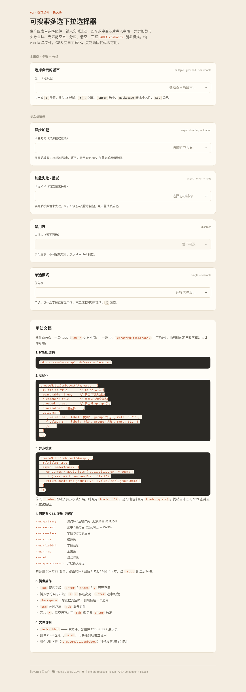

# 可搜索多选下拉选择器 · Multi-Select Searchable Combobox

> V3 交互组件 / 输入类 · 2026-08-19

## 简介

生产级表单选择组件：表单字段内键入实时过滤选项，回车选中变为芯片弹入字段，支持异步加载选项、加载失败重试、无匹配空态、分组展示、一键清空、单选/多选可配。完整 WAI-ARIA combobox + listbox 多选键盘模式。纯 vanilla 单文件，CSS 变量主题化，复制两段代码即可用。

## 妙搭预览

[https://dcniaqwtmoca.feishu.cn/page/NwIimszvadVl8iadLQPcqLANnzg](https://dcniaqwtmoca.feishu.cn/page/NwIimszvadVl8iadLQPcqLANnzg)

## 截图



## 用法文档

### 1. HTML 结构

```html
<div class="mc-wrap" id="my-wrap"></div>
```

### 2. 初始化（同步选项）

```javascript
createMultiCombobox('#my-wrap', {
  multiple: true,      // false = 单选
  searchable: true,    // 是否可键入过滤
  clearable: true,     // 是否显示清空按钮
  grouped: true,       // 是否按 group 分组
  placeholder: '请选择...',
  options: [
    { value:'hz', label:'杭州', group:'华东', meta:'0571' },
    { value:'sh', label:'上海', group:'华东', meta:'021' },
    // ...
  ]
});
```

### 3. 异步模式

```javascript
createMultiCombobox('#wrap', {
  multiple: true,
  async loader(query) {
    const res = await fetch('/api/cities?q=' + query);
    if (!res.ok) throw new Error('fail');
    return await res.json(); // [{value,label,group,meta}]
  }
});
```

传入 `loader` 即进入异步模式：展开时调用 `loader('')`，键入时防抖 320ms 调用 `loader(query)`。抛错自动进入 error 态并显示重试按钮。

### 4. 可配置项

| 参数 | 类型 | 默认 | 说明 |
|------|------|------|------|
| `multiple` | boolean | `true` | 多选模式（false=单选） |
| `searchable` | boolean | `true` | 可键入过滤 |
| `clearable` | boolean | `true` | 显示清空按钮 |
| `grouped` | boolean | `false` | 按 `group` 字段分组渲染 |
| `placeholder` | string | `'请选择...'` | 占位文本 |
| `options` | array | `[]` | 同步选项 `[{value,label,group,meta,disabled}]` |
| `loader` | function | `null` | 异步加载器，返回 Promise |
| `disabled` | boolean | `false` | 禁用态 |

### 5. CSS 变量主题化（节选）

共暴露 **31 个 CSS 变量**，覆盖颜色 / 圆角 / 时长 / 缓动 / 阴影 / 尺寸，改 `:root` 即全局换肤。

| 变量 | 默认 | 说明 |
|------|------|------|
| `--mc-primary` | `#2f5d54` | 焦点环 / 主操作色（墨青） |
| `--mc-accent` | `#c25a36` | 选中 / 高亮色（陶土赭） |
| `--mc-surface` | `#fffdf7` | 字段与浮层表面色 |
| `--mc-line` | `#e4dac8` | 描边色 |
| `--mc-field-h` | `44px` | 字段高度 |
| `--mc-r-md` | `10px` | 主圆角 |
| `--mc-d` | `200ms` | 过渡时长 |
| `--mc-panel-max-h` | `280px` | 浮层最大高度 |

### 6. 键盘操作

- `Tab` 聚焦字段；`Enter` / `Space` / `↓` 展开浮层
- 键入字符实时过滤；`↑` `↓` 移动高亮；`Enter` 选中/取消
- `Backspace`（搜索框为空时）删除最后一个芯片
- `Esc` 关闭浮层；`Tab` 离开组件
- 芯片 `X`、清空按钮均可 `Tab` 聚焦并 `Enter` 触发

### 7. 公开 API

```javascript
var combo = createMultiCombobox('#wrap', { ... });
combo.getValue();    // 多选返回数组，单选返回单个对象或 null
combo.setValue([...]);  // 程序化设值
combo.clear();       // 清空选择
combo.open();        // 打开浮层
combo.close();       // 关闭浮层
combo.destroy();     // 销毁实例，清理 DOM 和定时器
```

## 文件说明

| 文件 | 说明 |
|------|------|
| `index.html` | 单文件，含组件 CSS + JS + 展示页（922 行） |
| `设计规范.md` | 从源码提取的真实色值、字体、动效系统 |
| `preview.png` | 桌面端默认状态截图 |
| `README.md` | 本文件 |

组件 CSS 区段（`.mc-*`）可整段剪切独立使用；组件 JS 区段（`createMultiCombobox`）可整段剪切独立使用。

## 状态机（9 态）

`closed` → `hover-field` → `focus` → `open` → `loading` / `error` / `empty` / `selected-pop`；另有 `disabled` 全局态。每态有独立视觉处理。

## 技术栈

纯 vanilla HTML + CSS + JS，零依赖，无 React / Babel / CDN。WAI-ARIA combobox + listbox 多选模式。支持 `prefers-reduced-motion` 降级。
