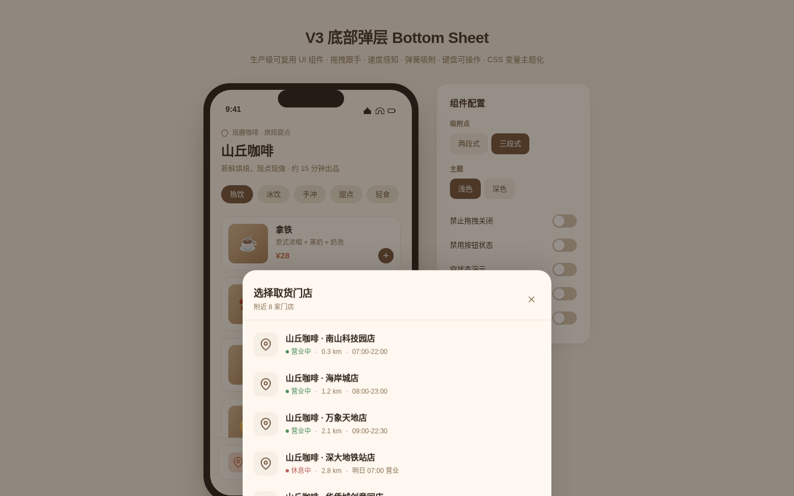

# 底部弹层 Bottom Sheet · 可复用 UI 组件

> 2026-08-19 · Art 设计实验室 V3 · 覆盖层类 · 一次产出一件



**妙搭在线预览**：https://dcniaqwtmoca.feishu.cn/page/P2v5mpgtqdswJwaCLjYcVNggnFR

## 简介

一个生产级移动端底部弹层（Bottom Sheet）组件。从底部滑出、可中途停靠在多个吸附点、可拖拽跟手、可速度感知 flick、松手阻尼弹簧吸附、向下滑出或点遮罩或按 Esc 关闭，并带焦点管理与背景滚动锁。目标是开发者把它 copy-paste 到自己的项目里立刻用起来——不是物理演示玩具，是工程可用的界面积木。

演示场景为「山丘咖啡」点单 App 的「选择取货门店」流程：点底部按钮打开弹层，拖拽在不同停靠高度切换，选中门店后弹层关闭、吸底栏更新，并弹出确认提示。右侧配置面板可切换吸附点预设、浅色/深色主题、关闭/禁用开关与空/加载/错误三态，用以证明可配置与可换肤。

## 组件能力

- **拖拽跟手**：Pointer Events 统一鼠标/触屏，拖动过程直接写 `transform` 不走 transition，逐帧跟随
- **速度感知 flick**：快速上滑吸附到更高停靠点 / 快速下滑直接关闭；慢速按位置阈值吸附
- **阻尼弹簧吸附**：`cubic-bezier(0.34, 1.3, 0.64, 1)` 350ms，带轻微过冲
- **完整状态机**：closed / opening / peek / dragging / settling / full / dismissing + loading / error / empty / disabled（11 态）
- **键盘可操作**：Tab 焦点循环、Esc 关闭、↑↓ 列表导航、Enter/Space 选中，焦点环可见，`role=dialog` + `aria-modal`
- **背景滚动锁 + 遮罩点击关闭**（可配置关闭）
- **CSS 变量主题化**：17 个 `--sheet-*` 变量，浅色/深色实时切换
- **JS 配置化**：snapPoints / initialSnap / dismissThreshold / flickVelocity / dismissible / onSnapChange 回调
- **prefers-reduced-motion 降级**

## 用法

1. 复制本文件中 `/* === BottomSheet 组件 开始 === */` 到 `/* === BottomSheet 组件 结束 === */` 之间的 CSS 与 JS 到你的项目。
2. 准备一个弹层容器（内含 `.bs-handle`、`.bs-header`、`.bs-body` 等）。
3. 初始化：

```js
const sheet = new BottomSheet(document.querySelector('.bottom-sheet'), {
  snapPoints: [0.25, 0.6, 0.92],   // peek / half / full（相对视口高度）
  initialSnap: 0,                  // 初始停靠索引
  dismissThreshold: 0.15,          // 拖到视口 15% 以下且无更高吸附点 → 关闭
  flickVelocity: 0.5,              // px/ms，超过即按方向吸附/关闭
  dismissible: true,               // 是否允许下滑/遮罩/Esc 关闭
  onSnapChange: (idx, point) => console.log('停靠到', idx, point)
});
// 打开
sheet.open();
// 关闭
sheet.close();
```

适配自己项目通常只需改 3 处：容器选择器、CSS 变量（换肤）、`snapPoints` 配置。

## 可配置项

| 配置项 | 类型 | 默认 | 说明 |
|---|---|---|---|
| `snapPoints` | number[] | `[0.25, 0.6, 0.92]` | 吸附点（视口高度比例，0=收起） |
| `initialSnap` | number | 0 | 初始停靠索引 |
| `dismissThreshold` | number | 0.15 | 拖到该比例以下且无更高点 → 关闭 |
| `flickVelocity` | number | 0.5 | 速度阈值 px/ms，超过即 flick |
| `dismissible` | boolean | true | 是否允许下滑/遮罩/Esc 关闭 |
| `onSnapChange` | function | — | 停靠点变化回调 |

## 主题定制（CSS 变量）

```css
:root {
  --sheet-bg: #F5EFE6;            /* 弹层背景 */
  --sheet-radius: 20px;           /* 顶部圆角 */
  --sheet-handle-color: #D4C4AE;  /* 拖拽手柄 */
  --sheet-handle-size: 40px;      /* 手柄宽度 */
  --sheet-backdrop: rgba(0,0,0,.4);/* 遮罩 */
  --sheet-spring-duration: 350ms; /* 弹簧吸附时长 */
  --sheet-spring-easing: cubic-bezier(0.34, 1.3, 0.64, 1);
  --sheet-max-width: 480px;       /* 桌面端最大宽度 */
  --sheet-primary: #6F4E37;       /* 主色 */
  --sheet-accent: #C96F4A;        /* 强调色 */
  --sheet-text: #3D2B1F;          /* 正文 */
  --sheet-text-muted: #8B7355;    /* 弱文字 */
  --sheet-divider: #EDE4D6;       /* 分隔线 */
  --sheet-border-color: #EDE4D6;
  --sheet-shadow: 0 -8px 32px rgba(0,0,0,.12);
  --sheet-item-hover: rgba(111,78,55,.08);
  --sheet-ripple: rgba(111,78,55,.12);
}
```

## 文件说明

- `index.html` — 单文件实现（HTML + CSS + JS，纯 vanilla，无 React/Babel/CDN）
- `preview.png` — 组件运行截图（弹层打开态）
- `设计规范.md` — 配色/字体/动效/状态机/可访问性规范
- `README.md` — 本文件

## 技术栈

纯原生 HTML / CSS / JavaScript（Pointer Events、CSS Custom Properties、CSS Transitions、ResizeObserver）。无任何外部依赖。

## 注意事项

- 组件本身使用系统光标（handle 处 `cursor: grab / grabbing`），不依赖自定义光标
- 拖拽使用 `setPointerCapture` 保证移出元素仍持续跟踪
- RAF 在弹层关闭时取消，`visibilitychange` 留有扩展点，快速连续开关不叠加动画
- 删除全部装饰动效后，弹层仍可正常打开/停靠/选中/关闭（功能不依赖动画）
