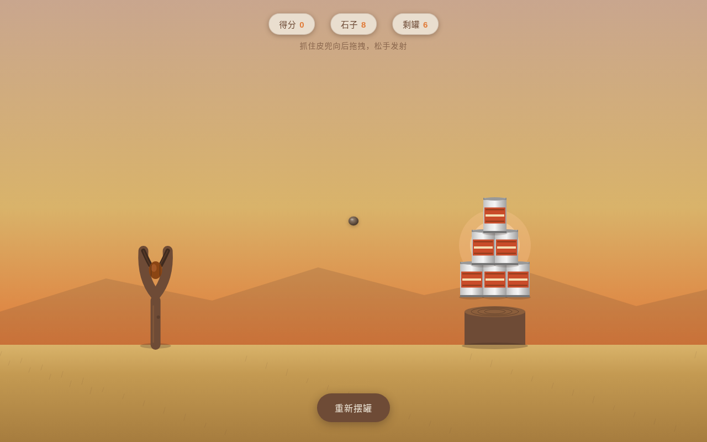

# 弹弓打靶 · 拉伸释放物理实验室

**类别**：交互组件　**日期**：2026-08-19

## 简介
黄昏打谷场上一枚 Y 形木杈弹弓——抓住皮兜向后下方拖拽拉伸皮筋，瞄准远处木桩上的易拉罐塔，松手弹射石子。核心机制=「拉伸储能 → 瞄准 → 释放飞行 → 命中坍塌」五段式操作闭环。与近期所有组件（纯拉 / 旋转 / 推拉 / 按压）正交。

## 截图

## 妙搭预览
https://dcniaqwtmoca.feishu.cn/page/DJqNmxLbcdAgwAaoPhhcWzaVnAf

## 文件说明
| 文件 | 说明 |
|---|---|
| index.html | 纯 vanilla 单文件实现（HTML + 内联 CSS/JS，34.7KB，无 React/Babel/CDN） |
| 设计规范.md | 物理模型、双段皮筋几何、五层反馈、可玩性闭环、技术边界 |
| preview.png | Browser QA 截图（1280×800） |
| thumbnail.png | 平台缩略图 |

## 技术栈
- 纯 vanilla 单文件 HTML（无框架 / 无 CDN / 无 Babel）
- Canvas 渲染弹弓 + 罐塔 + 物理仿真
- requestAnimationFrame 主循环 + visibilitychange 暂停 + cancelAnimationFrame 卸载取消
- 高频 mousemove 直接操作 DOM
- prefers-reduced-motion：简化颤振与粒子、保留核心物理
- 零 Console Error

## 核心交互
- 按住皮兜拖拽（拉伸方向与瞄准方向相反，真实弹弓逻辑）
- 松手发射：皮筋阻尼振荡 + 石子重力抛物线 + 自旋
- 罐子受击：角动量倾倒 + 阻尼摇摆 + 堆叠连锁坍塌

## 五层反馈
pre-contact（皮兜微亮/皮筋轻颤）→ contact（咬合感）→ continuous（力度表+瞄准弧+手部颤抖）→ threshold（极限拉伸警告震颤）→ release/decay（皮筋振荡+石子飞行+罐倒余摆+尘土）

## 自定义光标
小石子——开页屏幕正中央、高对比、层级最高，三态变形（普通/抓取/瞄准）。

## 可玩性闭环
得分（一箭多罐加成）/ 剩余石子数（8 发）/ 剩罐计数 / 「重新摆罐」按钮。每发结果有真实方差。

## 设计要点
- 机制全库首次：拉伸-瞄准-释放-飞行-命中五段闭环
- 真实物理模型（胡克非线性阻力 / 阻尼弹簧 / 重力抛物线 / 碰撞角动量），非缓动函数堆砌
- 双段皮筋汇聚几何实时形变
- 禁蓝紫渐变；暮打谷场六色（晚霞珊瑚橙/干草金/原木棕/皮筋深褐/石灰白/远天灰粉）
