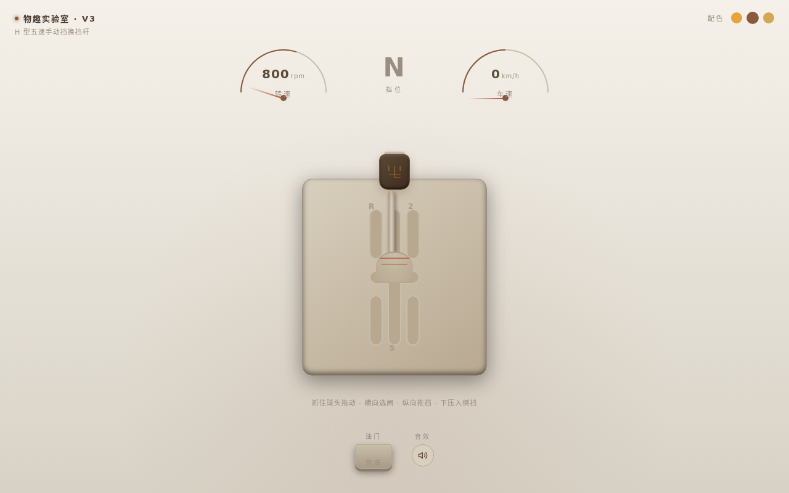

# 手动挡换挡杆 H-PATTERN · 拟物交互组件

> 日期：2026-08-19　|　类别：Component Mock（交互组件）　|　Art Orchestrator batch12

## 简介
一支真实手感的 H 型五速（+倒挡）手动挡换挡杆：捏住球头，在 H 型闸口里选闸、推挡，感受每一挡的卡入。整页只此一件，做到可反复把玩。这是二维路径拖拽——横向选闸道、纵向推入挡位。

## 设计观点
历史上所有组件都是一维路径（拖/转/拉单自由度）；H 型换挡是二维路径，空挡松旷摆动、挡位吸入、倒挡下压机关都是天然的五层反馈素材。

## 截图

## 妙搭预览
https://dcniaqwtmoca.feishu.cn/page/LRY6m5T8HdhE3Zarngvcwzf5nNc

## 交互机制
- H 闸二维路径钳制：横向仅空挡排可移，纵向仅当前闸道可推/拉，走斜线被闸壁挡住
- 空挡松旷自由摆动
- 推挡过中点 detent 吸入 + WebAudio 金属咔哒（可静音）
- 倒挡需先下压再推入（防误挂）
- 转速/车速表随挡位 + 油门联动

## 五层反馈
预接触（球头微光+呼吸）→ 接触（下沉+光标握紧）→ 持续（闸道阻尼+摩擦）→ 阈值（吸入+咔哒+挡位灯）→ 释放/衰减（阻尼弹簧余震归零）

## 文件说明
- `index.html` — 纯 vanilla 单文件（HTML+CSS+JS，零依赖）
- `设计规范.md` — 色值/字体/动效系统
- `preview.png` — 1280×800 截图

## 技术栈
纯 vanilla 单文件，无 React/Babel/CDN。RAF 物理循环随可见性暂停、卸载取消；高频 mousemove 直接写 DOM；prefers-reduced-motion 降级；自定义光标开页居中、层级最高。

## 自查
单一组件（非合集）；H 闸二维路径钳制成立（非点击按钮切换）；detent 吸入+余震手感到位；纯 vanilla 无白屏风险。已知偏离：默认主题为暖棕米色新拟态，契约指定的曜石黑座舱为可切换主题之一。
