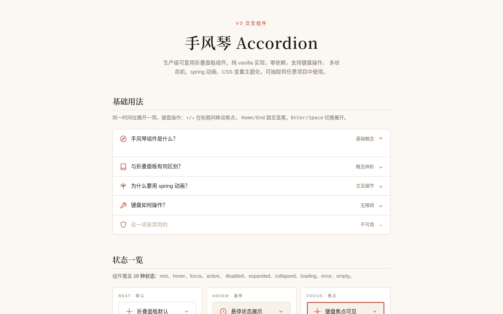

# 手风琴折叠面板 Accordion · V3 交互组件

> Art 设计实验室 · 2026-08-19 · 实用可复用 UI 组件（导航类）

一个生产级折叠面板组件，开发者复制 CSS + JS 两段代码到任意项目、改不超过 3 处 CSS 变量即可使用。纯 vanilla 单文件实现，零依赖。



🔗 **在线预览**：https://dcniaqwtmoca.feishu.cn/page/FeAZmOHYldLihGalBDRcXvadnle

---

## 主题与简介

设计母题「技术说明书活页」：垂直堆叠的可折叠面板，标题行锚定作索引，内容区以高度 spring 展开，箭头旋转，内容浮现。视觉取工程说明书——细线框、条款编号、等宽标注、克制的朱砂红强调。

配色为**墨·朱砂**主题（宣纸米白底 `#fbf8f3` + 墨色文字 `#1f1b16` + 朱砂红强调 `#b83a2a` + 赭石错误 `#a0522d`），不含蓝紫渐变，内置深色模式。组件本身中性可换肤。

解决的真实界面问题：FAQ、设置面板、订单/物流详情、导航菜单、条款说明等高频折叠场景。

---

## 核心特性

- **完整状态机 10 态**：rest / hover / focus / active / disabled / expanded / collapsed / loading（异步加载）/ error（可重试）/ empty
- **WAI-ARIA 手风琴键盘模式**：`Tab` 进入、`↑`/`↓` 循环导航（跳过禁用项）、`Home`/`End` 跳首尾、`Enter`/`Space` 切换，焦点环可见
- **Spring 高度动画**：`scrollHeight` 真实测量 + `cubic-bezier(0.34,1.56,0.64,1)` 回弹，禁止 `display:none` 硬切
- **CSS 变量主题化**：24 个 `--acc-*` 令牌，`:root` 覆盖即换肤
- **JS 配置化**：`items / multiple / defaultExpanded / duration / variant / headingLevel` + 方法 API
- **健壮性**：`prefers-reduced-motion` 降级、`visibilitychange` 暂停 rAF、`destroy()` 清理、快速操作不叠加定时器
- **可独立抽取**：CSS / JS 可分离，零依赖（无 React / Babel / CDN）

---

## 用法文档（摘录）

页面底部「用法」章节含完整文档，要点如下：

**引入**：将 `<style id="accordion-styles">` 与 `<script id="accordion-script">` 两块复制到项目，零依赖。

**快速使用**：
```js
const acc = new Accordion('#my-accordion', {
  items: [
    { title: '什么是手风琴组件？', content: '一组垂直堆叠的可折叠面板…' },
    { title: '第二项', content: '第二项内容' }
  ],
  multiple: false,      // 是否允许多个同时展开
  defaultExpanded: 0,   // 默认展开项索引（多选模式可传数组）
  duration: 320         // 动画时长（毫秒）
});
```

**配置项**：`items`(Array) / `multiple`(Boolean, 默认 false) / `defaultExpanded`(Number|Array, 默认 -1) / `duration`(Number, 默认 320) / `variant`('default'|'bordered'|'filled') / `headingLevel`(Number, 默认 3)

**方法**：`expand(i)` / `collapse(i)` / `toggle(i)` / `expandAll()` / `collapseAll()` / `setLoading(i,bool)` / `setError(i,bool,msg)` / `destroy()`

**items 每项**：`title` / `content` / 可选 `icon`(SVG) / `meta`(右侧元信息) / `disabled` / `load`(返回 Promise 的异步加载函数)

---

## 可配置项 / 定制方法

1. **换品牌色**：覆盖 `--acc-accent` / `--acc-accent-hover` / `--acc-accent-soft` 三色
2. **调动画手感**：改 `--acc-duration`（时长）与 `--acc-ease`（曲线）
3. **改视觉变体**：初始化传 `variant: 'bordered' | 'filled'`
4. **深色模式**：组件自动跟随 `prefers-color-scheme`，无需手动处理

---

## 文件说明

| 文件 | 说明 |
| --- | --- |
| `index.html` | 单文件源码，含 `<style id="accordion-styles">`（可抽取 CSS）与 `<script id="accordion-script">`（可抽取 JS）及展示页与用法文档 |
| `设计规范.md` | 色彩/字体/动效/状态机/无障碍/可复用性规范 |
| `preview.png` | 桌面端 1440×900 首屏截图 |
| `README.md` | 本文件 |

---

## 技术栈

纯 HTML + CSS + JavaScript（vanilla），零依赖、零框架、零 CDN。CSS 与 JS 各以带 `id` 的块组织，可整块抽取为独立 `.css` / `.js` 文件。

---

## 自查结论

- 删掉全部动画后功能仍完整（状态切换、键盘、加载/错误均可用） ✓
- 抽到别的项目改不超过 3 处 CSS 变量即可用 ✓
- 浏览器实测：无 console error、无白屏、展开/收起/键盘均生效、桌面无横向溢出 ✓
- 移动端 390px：组件本体正常，「用法」文档区的代码块与表格横向滚动（属文档区，非组件本体）— 可接受

**等待协调者检查后提交 GitHub。**
