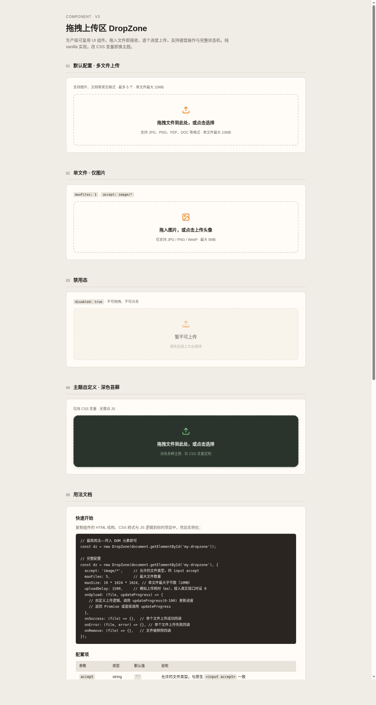

# 拖拽上传区 DropZone · V3 交互组件

> 生产级可复用 UI 组件。拖入文件即接收，逐个进度上传，支持键盘操作与完整状态机。纯 vanilla 实现，改 CSS 变量即换主题。



## 妙搭预览
https://dcniaqwtmoca.feishu.cn/page/Vp69msPxodm1ckag1kCcehzmn0g

## 简介
拖拽上传区是一个解决真实项目文件上传需求的生产级 UI 组件。开发者将其 copy-paste 到项目中，改不超过 3 处（accept 类型 / maxSize / onUpload 回调）即可使用。支持拖放与点击两种上传方式，10 个状态的完整状态机，14 个 CSS 主题变量，完整键盘操作。

### 展示变体
1. **默认配置** — 多文件上传，最多 5 个，单文件 10MB
2. **单文件图片** — `maxFiles: 1`，`accept: image/*`，头像上传场景
3. **禁用态** — `disabled: true`，不可拖拽不可点击
4. **深色苔藓主题** — 仅改 CSS 变量，无需动 JS

## 快速开始

```html
<!-- HTML 结构 -->
<div id="my-dropzone" class="dz" role="button" tabindex="0" aria-label="拖拽文件上传">
  <div class="dz__icon"><!-- 上传图标 SVG --></div>
  <div class="dz__title">拖拽文件到此处，或点击选择</div>
  <div class="dz__hint">支持 JPG、PNG、PDF · 最大 10MB</div>
  <div class="dz__error-msg" role="alert"></div>
  <div class="dz__list" role="list"></div>
  <input type="file" multiple aria-hidden="true" tabindex="-1">
</div>
```

```javascript
// JS 初始化
const dz = new DropZone(document.getElementById('my-dropzone'), {
  accept: '',              // 允许的文件类型
  maxFiles: 5,             // 最大文件数
  maxSize: 10 * 1024 * 1024, // 单文件最大字节数
  uploadDelay: 1500,       // 模拟上传耗时(ms)，接入真实接口时设 0
  onUpload: (file, updateProgress) => {
    // 自定义上传逻辑，调用 updateProgress(0-100) 更新进度
  },
  onSuccess: (file) => {},
  onError: (file, error) => {},
  onRemove: (file) => {},
});
```

## 可配置项

| 参数 | 类型 | 默认值 | 说明 |
|------|------|--------|------|
| `accept` | string | `''` | 允许的文件类型，同原生 `<input accept>` |
| `maxFiles` | number | `5` | 最大同时上传文件数 |
| `maxSize` | number | `10485760` | 单文件最大字节数（10MB） |
| `uploadDelay` | number | `1500` | 模拟上传耗时(ms)，真实接口设 0 |
| `disabled` | boolean | `false` | 是否禁用 |
| `onUpload` | Function | — | 自定义上传逻辑 `(file, updateProgress) => Promise` |
| `onSuccess` | Function | — | 单文件上传成功回调 |
| `onError` | Function | — | 单文件上传失败回调 |
| `onRemove` | Function | — | 文件被移除回调 |

### API 方法

| 方法 | 说明 |
|------|------|
| `dz.addFiles(fileList)` | 手动添加文件 |
| `dz.removeFile(id)` | 移除指定 ID 的文件 |
| `dz.clear()` | 清空所有文件 |
| `dz.setDisabled(bool)` | 设置禁用状态 |
| `dz.getFiles()` | 获取当前文件列表 |
| `dz.destroy()` | 销毁实例，解绑所有事件 |

## 主题定制

修改 CSS 变量即可切换主题，无需改 JS：

```css
.my-theme .dz {
  --dz-bg: #2A342C;
  --dz-accent: #7BC67F;
  --dz-success: #7BC67F;
  --dz-error: #E87D6F;
  --dz-text: #E8EDE8;
  --dz-radius: 16px;
}
```

完整变量列表见[设计规范.md](设计规范.md)。

## 键盘操作

| 按键 | 操作 |
|------|------|
| `Tab` / `Shift+Tab` | 在上传区与文件列表项间移动焦点 |
| `Enter` / `Space` | 聚焦上传区时打开文件选择器 |
| `Delete` / `Backspace` | 聚焦列表项时移除该文件 |

## 状态机

`idle` → `hover/focus` → `drag-over` → `dropping` → `uploading` → `success` / `error`；另有 `disabled`、`empty` 独立状态。共 10 态，每态视觉可区分。

## 文件说明

| 文件 | 说明 |
|------|------|
| `index.html` | 单文件实现（HTML + CSS + JS），纯 vanilla 零依赖 |
| `设计规范.md` | 色值、字体、动效系统、状态机详细规范 |
| `preview.png` | 完整页面截图 |
| `README.md` | 本文件 |

## 技术栈
- 纯 HTML + CSS + JavaScript（vanilla，无框架/无 CDN/无外部依赖）
- CSS 自定义属性（Custom Properties）主题化
- `requestAnimationFrame` 进度动画，`visibilitychange` 暂停/恢复
- `prefers-reduced-motion` 无障碍降级
- 命名空间：CSS `.dz-` 前缀，JS IIFE 封闭 + `window.DropZone` 暴露

## 设计契约核查
- [x] 10 态完整状态机（idle/hover/focus/drag-over/dropping/uploading/success/error/disabled/empty）
- [x] 五层体验（Pre-contact/Contact/Continuous/Threshold/Release）
- [x] 14 个 CSS 变量主题化
- [x] JS 参数化（accept/maxFiles/maxSize/uploadDelay + 4 回调）
- [x] 键盘可操作（Tab/Enter/Space/Delete/Backspace + 焦点环）
- [x] 错误处理（超 size/超数量/类型不符/上传失败）
- [x] 纯 vanilla 单文件，无 React/Babel/CDN
- [x] 删掉所有动画后功能仍完整可用
- [x] 无蓝紫渐变配色
