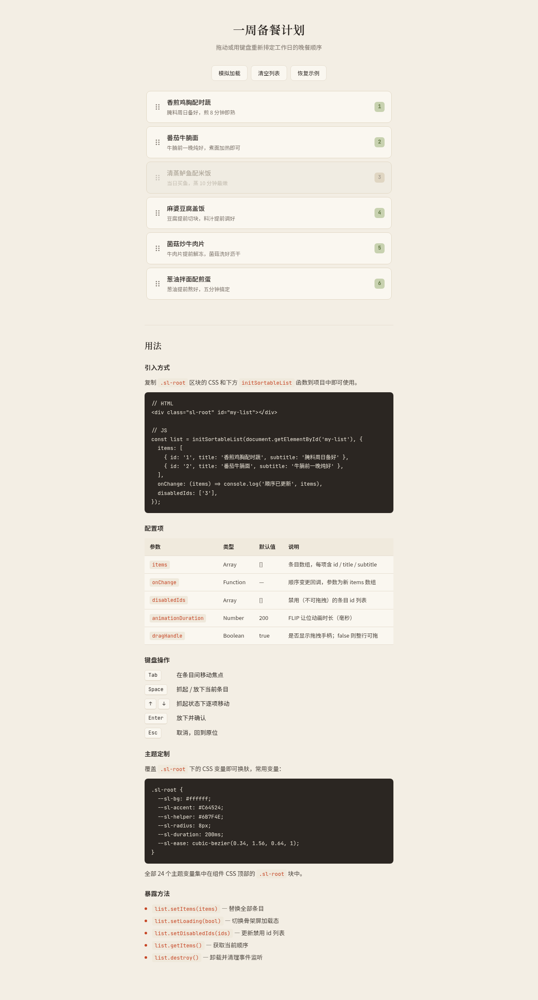

# 拖拽排序列表 · 一周备餐计划

> 生产级可复用 UI 组件 — 鼠标/触屏拖拽 + 完整键盘重排 + FLIP 平滑让位 + 8 态状态机 + CSS 变量主题化。纯 vanilla 单文件，自包含可抽取。



## 主题与简介

实用可复用「拖拽排序列表 Sortable List」组件，目的是方便开发者搬到自己项目里立刻用起来，不是物理演示装置。

内容场景选用**一周备餐计划清单**——为工作日的晚餐排定烹饪顺序，顺序本身有真实意义（先做哪道、后做哪道影响出餐节奏）。属于生活方式场景，非 B 端管理模板。

支持鼠标拖拽手柄重排、触屏拖拽，以及**完整的键盘重排**（Space 抓取、↑↓ 方向键移动、Enter/Space 放下、Esc 取消），全程中文语音播报。兄弟条目用 FLIP 动画平滑让位，而非瞬移。

- 妙搭在线预览：<https://dcniaqwtmoca.feishu.cn/page/MdkBm9EQGde3iea6coQcN5C7nEc>
- 设计规范详见 [`设计规范.md`](./设计规范.md)

## 截图


> 首次加载即显示全部 6 条备餐条目，第 3 条「清蒸鲈鱼配米饭」为禁用态（灰化、不可拖）。

## 用法文档

### 引入方式

复制 `.sl-root` 区块的 CSS 和下方 `initSortableList` 函数到项目中即可使用。

```html
<!-- HTML -->
<div class="sl-root" id="my-list"></div>
```

```js
// JS
const list = initSortableList(document.getElementById('my-list'), {
  items: [
    { id: '1', title: '香煎鸡胸配时蔬', subtitle: '腌料周日备好' },
    // ...
  ],
  disabledIds: ['3'],      // 禁用项 id
  animationDuration: 200,  // 动画时长 ms
  dragHandle: true,        // 是否启用拖拽手柄
  onChange: function (items) {
    // 顺序变化回调，items 为新顺序数组
    console.log('新顺序', items.map(i => i.title));
  },
});
```

### 可配置项（options）

| 参数 | 类型 | 默认 | 说明 |
|------|------|------|------|
| `items` | `Array<{id,title,subtitle?}>` | `[]` | 列表条目数据 |
| `disabledIds` | `string[]` | `[]` | 禁用条目 id（不可拖、灰化、tabindex=-1） |
| `animationDuration` | `number` | `200` | 动画时长（ms） |
| `dragHandle` | `boolean` | `true` | 是否启用拖拽手柄 |
| `onChange` | `function(items)` | `null` | 顺序变化回调 |

### 实例 API

| 方法 | 说明 |
|------|------|
| `setItems(newItems)` | 替换全部条目（清空传 `[]` → 空状态） |
| `setLoading(val)` | 切换加载态（骨架屏 5 条） |
| `setDisabledIds(ids)` | 更新禁用项 |
| `getItems()` | 获取当前顺序数组 |
| `destroy()` | 卸载监听、清空 DOM |

### 键盘操作

| 按键 | 动作 |
|------|------|
| `Tab` | 聚焦列表条目（焦点环可见） |
| `Space` | 抓起 / 放下当前条目 |
| `↑` / `↓` | 上移 / 下移一位（抓起态下） |
| `Enter` | 放下条目 |
| `Esc` | 取消抓取，还原原顺序 |

全程 `aria-live` 中文播报：「已抓起 XX，当前第 N 位…」「第 N 位」等。

## 主题定制

26 个 CSS 变量集中在 `.sl-root` 作用域，换主题改不超过 3 处即可：

```css
.sl-root {
  --sl-accent: #C64524;  /* 强调色（焦点环/序号/抓取） */
  --sl-bg: #FAF7F0;      /* 组件底色 */
  --sl-text: #2B2622;    /* 主文字 */
  /* 其余 23 个变量按需覆盖，见 设计规范.md */
}
```

默认暖纸感配色：米白底 `#FAF7F0`、炭黑文字 `#2B2622`、番茄红强调 `#C64524`、橄榄绿辅助 `#6B7F4E`（禁蓝紫渐变）。

## 文件说明

```
2026-08-19_拖拽排序列表_sortable-list/
├── index.html      # 单文件组件（HTML+CSS+JS 内联，零外部依赖）
├── 设计规范.md      # 真实色值/字体/动效/状态机/CSS 变量清单
├── preview.png     # 预览截图
└── README.md       # 本文件
```

组件代码与展示页逻辑在 `index.html` 内用注释块明确分隔：
- `【组件区开始】…【组件区结束】`：`.sl-` 前缀 CSS + `initSortableList` 工厂
- `展示页逻辑（非组件代码，演示用）`：`defaultItems`、演示按钮、用法文档

## 技术栈

- 纯 HTML + CSS + JavaScript，零外部依赖（无 React / Babel / CDN）
- Pointer Events 统一鼠标/触屏拖拽
- FLIP（First-Last-Invert-Play）兄弟元素让位动画
- 健壮性：RAF/定时器随 `visibilitychange` 暂停且卸载取消；高频 `pointermove` 直接操作 DOM；快速操作不叠加定时器；零未定义引用；`prefers-reduced-motion` 降级
- 可访问性：`role=list/listitem`、`aria-grabbed`、`aria-live` 中文播报、焦点环可见、全键盘可操作

## 自查结论

- 删掉所有动画后重排功能仍完整可用（键盘与拖拽逻辑独立于动画）✅
- 抽到别的项目改 CSS 变量 ≤3 处即可换主题 ✅
- 键盘用户全程可完成重排并听到中文播报 ✅
- Console 0 Error、0 pageError、无横向溢出 ✅
- 妙搭应用分享权限需用户在飞书客户端手动设为「链接可阅读」（API/CLI 无法修改，已知限制）
