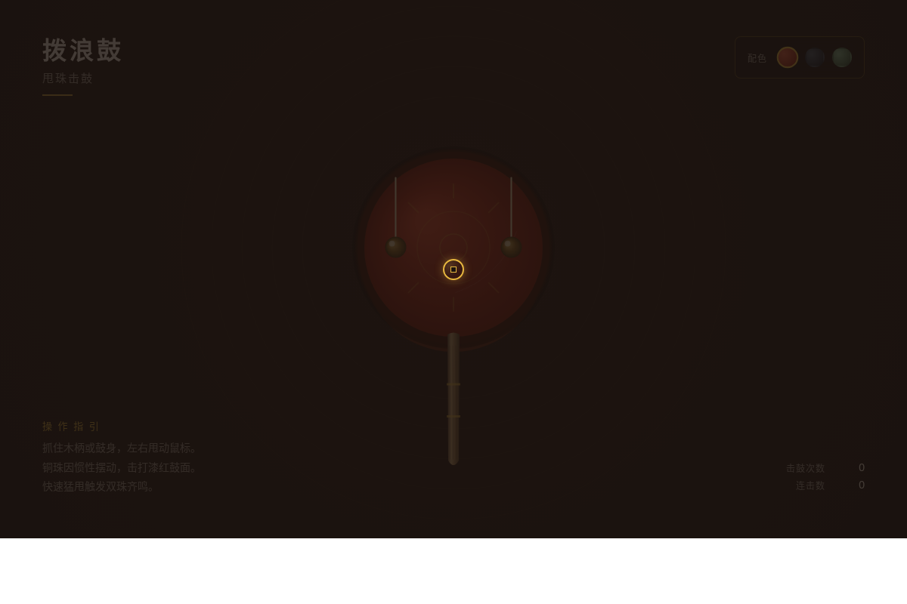

# 拨浪鼓·甩珠击鼓

## 主题

拨浪鼓交互组件实验室 — 以传统拨浪鼓为原型，光标拖拽鼓身产生角加速度，两颗珠子受摆锤物理驱动甩击鼓面，触发声效与视觉反馈。

## 简介

一个光标驱动的拟物化小组件动画实验室。用户拖拽拨浪鼓鼓身旋转，两颗珠子作为摆锤受重力与阻尼驱动摆动，当珠子角度进入鼓面扇区时触发冲击：鼓面弹性形变、涟漪扩散、WebAudio 合成鼓声、屏幕震动。探索惯性、阻尼、冲击力与声效的物理映射。纯 vanilla 单文件实现，无外部依赖。

## 截图展示

## 妙搭预览链接

https://dcniaqwtmoca.feishu.cn/page/MEjJmuuNHdHqx2ajuXyce5TtnQf

## 文件说明

| 文件 | 说明 |
|------|------|
| `index.html` | 完整源码（纯 vanilla 单文件，~39KB） |
| `preview.png` | 1200×800 桌面端截图 |
| `设计规范.md` | 色彩/字体/动效系统规范 |

## 技术栈

- 纯 vanilla HTML/CSS/JS 单文件
- Canvas 2D 绘制拨浪鼓
- requestAnimationFrame 物理积分
- WebAudio API 合成鼓声
- Pointer Events 拖拽
- prefers-reduced-motion 降级
