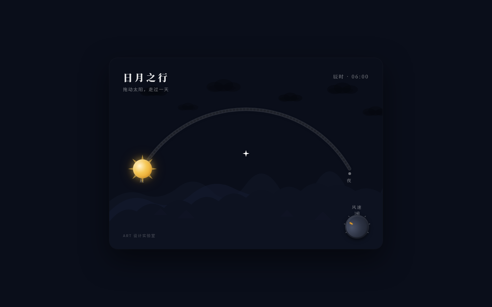

# 日月之行 · 拟物化滑动开关实验室

## 项目简介
「日月之行」是 Art 设计实验室 V3 交互组件作品。一只大型拟物化滑轨开关：滑块是太阳圆盘，沿弧形轨道从晨（左）滑向夜（右）；拖动全程天空连续经历黎明→正午→黄昏→星夜，星辰、云、山脊剪影、远处窗灯随滑块位置实时变化。过中点阈值磁力吸附到位，伴随咔嗒；松手阻尼弹簧余震。辅助组件「风速旋钮」控制云漂移速度。一天在指尖滑动。

## 截图

## 妙搭预览
https://dcniaqwtmoca.feishu.cn/page/SFnQmCnITdkYPWaz5LSczcIUnic

## 文件说明
- `index.html` — 纯 vanilla 单文件实现（HTML+CSS+JS 内联，场景全部 SVG/CSS 绘制）
- `设计规范.md` — 色值、物理模型、五层反馈、场景细节
- `preview.png` — 黎明起点截图

## 技术栈
纯 vanilla 单文件，无 React/Babel/CDN（仅字体 CDN），场景全部 SVG/CSS 绘制。RAF 主循环 + visibilitychange 暂停、卸载取消；高频 pointermove 直接操作 DOM；零未定义引用；Console 零 Error。

## 设计要点
- 核心机制：滑块位置连续映射天色（非二态切换）
- 五层反馈：预接触 / 接触 / 持续 / 阈值吸附 / 释放余震
- 物理模型：弹簧 0.08 + 阻尼 0.88 + 端点磁力吸附，禁 linear/ease
- 80 颗星夜段逐颗亮起、6 朵云受风速旋钮控制、12 盏窗灯入夜逐一点亮
- 太阳→月亮过渡（光芒收起变月晕）
- 自定义星形光标开页居中、高对比、层级最高
- 配色：夜空墨蓝 × 日出金 × 珊瑚橙 × 星白（非蓝紫渐变）
- 文案以中文为主

## 自查结论
Browser QA（1440/1024）：零 Console Error、零 pageerror、零失败资源、零横向溢出，截图非空白。拖动交互无异常报错。删动画静态结构成立，可玩性成立。不做键盘按键交互、不做物理公式演示。
