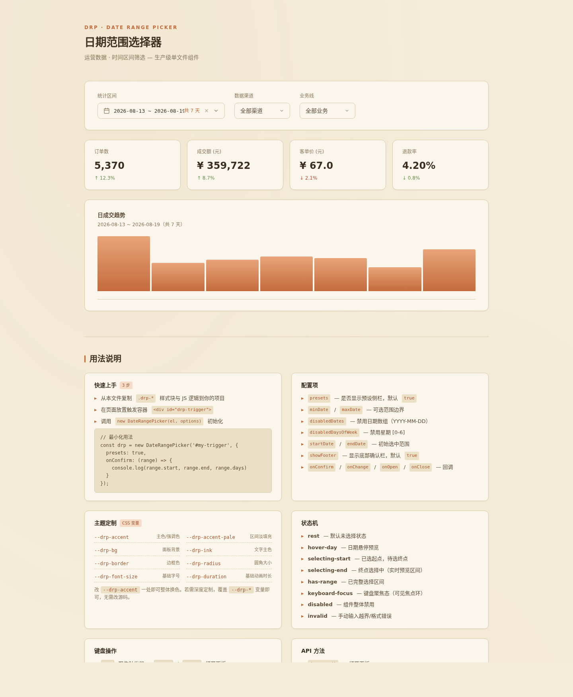

# 日期范围选择器 · Date Range Picker

> 生产级单文件 UI 组件 — 运营数据时间区间筛选场景

## 预览



**妙搭在线预览**：https://dcniaqwtmoca.feishu.cn/page/YPMKmalm7dxXYkagrG7cGLuWnld

## 简介

一个面向运营后台的日期范围选择器组件。触发器内嵌可编辑输入框，支持日历点选、手动键入、预设快捷三种选方式。面板包含预设侧栏 + 月历网格 + 底部操作栏，支持范围预览、自动翻转、禁用日期、边界钳制。置于真实的运营数据筛选场景中演示：选择区间后联动更新订单量、营收、客单价、退款率及趋势柱状图。

**组件类型**：覆盖层类 · Overlay

## 核心特性

- **9 态状态机**：rest / hover / focus / open / selecting-start / selecting-end / has-range / disabled / error
- **三种输入方式**：日历点选、手动键入 `YYYY-MM-DD ~ YYYY-MM-DD`、预设快捷
- **范围逻辑**：鼠标悬停预览、自动翻转（第二次点击早于起始日则交换）、起止同日
- **禁用约束**：minDate/maxDate 边界钳制、指定日期禁用（维护日）、指定星期禁用
- **手动输入校验**：格式错误 / 超出边界 / 包含禁用日期 → error 态 + 提示
- **键盘完整可操作**：方向键移动焦点日、Enter 选择、Esc 关闭、Tab 循环、ArrowDown 打开
- **CSS 变量主题化**：全部 `--drp-*` 前缀（基底/墨色/强调/状态/边框/阴影/字体/动效），改色值即换肤
- **prefers-reduced-motion**：动画时长归零，功能不降级
- **纯 vanilla 单文件**：无 React / Babel / CDN 依赖，ES5 兼容

## 用法文档

### 初始化

```html
<!-- 触发器 DOM（组件自动生成面板） -->
<div id="my-trigger" class="drp-trigger" role="combobox" aria-haspopup="dialog" aria-expanded="false" tabindex="0">
  <input class="drp-trigger-input" type="text" tabindex="-1" placeholder="请选择日期范围" spellcheck="false" />
  <svg class="drp-trigger-caret" viewBox="0 0 24 24"><!-- 箭头 --></svg>
</div>

<script>
const drp = new DateRangePicker('#my-trigger', {
  presets: true,        // 显示预设侧栏
  showFooter: true,     // 显示底部确认栏
  minDate: '2026-01-01', // 可选最早日期
  maxDate: '2026-08-19', // 可选最晚日期
  disabledDates: ['2026-08-10', '2026-08-11'], // 禁用日期
  disabledDaysOfWeek: [0, 6], // 禁用周日(0)和周六(6)
  startDate: '2026-08-13', // 初始起始日
  endDate: '2026-08-19',   // 初始结束日
  onConfirm: function(range) { console.log('确认', range); },
  onChange:  function(range) { console.log('变化', range); },
  onOpen:    function() { console.log('打开'); },
  onClose:   function() { console.log('关闭'); }
});
</script>
```

### 配置项

| 选项 | 类型 | 默认值 | 说明 |
|------|------|--------|------|
| `presets` | `Boolean` | `true` | 是否显示预设快捷侧栏 |
| `showFooter` | `Boolean` | `true` | 是否显示底部确认栏（false 时选完即确认） |
| `minDate` | `String\|Date` | `null` | 可选最早日期 |
| `maxDate` | `String\|Date` | `null` | 可选最晚日期 |
| `disabledDates` | `Array<String>` | `[]` | 禁用日期列表（YYYY-MM-DD） |
| `disabledDaysOfWeek` | `Array<Number>` | `[]` | 禁用星期（0=周日 … 6=周六） |
| `startDate` | `String` | `null` | 初始起始日 |
| `endDate` | `String` | `null` | 初始结束日 |
| `onConfirm` | `Function` | `null` | 确认回调，参数 `{start, end, days}` |
| `onChange` | `Function` | `null` | 范围变化回调 |
| `onOpen` | `Function` | `null` | 面板打开回调 |
| `onClose` | `Function` | `null` | 面板关闭回调 |

### 公共方法

| 方法 | 返回值 | 说明 |
|------|--------|------|
| `drp.open()` | — | 打开面板 |
| `drp.close()` | — | 关闭面板 |
| `drp.getRange()` | `{start, end, days}` | 获取当前范围 |
| `drp.setRange(start, end)` | — | 编程式设置范围 |
| `drp.clear()` | — | 清空范围 |
| `drp.disable()` | — | 禁用组件 |
| `drp.enable()` | — | 启用组件 |
| `drp.destroy()` | — | 销毁实例，移除所有监听器和 DOM |

### 返回值结构

```js
// getRange() 返回
{ start: '2026-08-13', end: '2026-08-19', days: 7 }

// 无选择时返回
{ start: null, end: null, days: 0 }
```

### 键盘操作

| 按键 | 行为 |
|------|------|
| `Tab` | 焦点进入触发器 / 面板内循环 |
| `Enter` / `Space` | 打开面板（触发器聚焦时） |
| `ArrowDown` | 打开面板（输入框聚焦时） |
| `←` `→` `↑` `↓` | 面板内移动焦点日 |
| `Enter` | 选中焦点日 |
| `Esc` | 关闭面板 / 恢复输入框值 |
| `Tab` | 预设项 → 日期 → 底部按钮循环 |

## 可配置项（CSS 变量定制）

所有视觉变量以 `--drp-*` 或全局 `:root` 变量暴露。换肤只需覆盖以下核心变量：

```css
:root {
  /* 换肤三步：改这三个即可适配新项目 */
  --accent: #c46b3c;        /* 主强调色 */
  --bg-paper: #f4ecd8;      /* 页面底色 */
  --bg-card: #faf6eb;       /* 卡片底色 */

  /* 进阶：墨色阶/状态色/边框/阴影/字体/动效均可覆盖 */
  --ink-900: #3a2e1f;
  --error: #b34d3a;
  --border: #d9caa8;
  --dur-base: 200ms;
  --ease: cubic-bezier(0.4, 0, 0.2, 1);
  /* ...完整列表见设计规范.md */
}
```

## 文件说明

| 文件 | 说明 |
|------|------|
| `index.html` | 组件源码（HTML + CSS + JS 单文件，76KB） |
| `设计规范.md` | 色值/字体/动效系统提取文档 |
| `preview.png` | 1440×1750 截图 |
| `README.md` | 本文件 |

## 定制方法

1. **换肤**：覆盖 `:root` 中的 `--accent` / `--bg-paper` / `--bg-card` 三个变量即可适配大多数项目
2. **增减预设**：修改 `presetsList` 数组，每项 `{ key, label, get: () => [startDate, endDate] }`
3. **调整日历尺寸**：修改 `.drp-cal-grid` 的 `grid-template-columns` 和 `grid-auto-rows`（默认 38px）
4. **面板宽度**：修改 `.drp-panel` 的 `min-width`（默认 620px）
5. **禁用逻辑扩展**：在 `_isDisabled(date)` 中添加自定义判断

## 抽取到其他项目

组件完全自包含，无外部依赖。抽取步骤：

1. 复制全部 `.drp-*` 前缀的 CSS 规则
2. 复制 `DateRangePicker` 类（位于脚本 IIFE 内）
3. 替换触发器 DOM 结构（或让 `new DateRangePicker()` 自动生成面板）
4. 覆盖 `--accent` / `--bg-paper` / `--bg-card` 三个 CSS 变量适配新主题

改不超过 3 处即可在任意 vanilla 项目中使用。

## 技术栈

- **HTML5** + **CSS3**（Grid / Flexbox / CSS Custom Properties / keyframes）
- **原生 JavaScript**（ES5 兼容，IIFE 封装，原型链类模式）
- **无依赖**：无 React / Vue / Babel / Tailwind / 任何 CDN
- **无障碍**：ARIA combobox / dialog / grid / gridcell / aria-selected / aria-disabled / aria-expanded / aria-haspopup
- **性能**：高频鼠标事件直接操作 DOM（不触发重渲染），RAF/定时器随 visibilitychange 暂停且卸载取消
