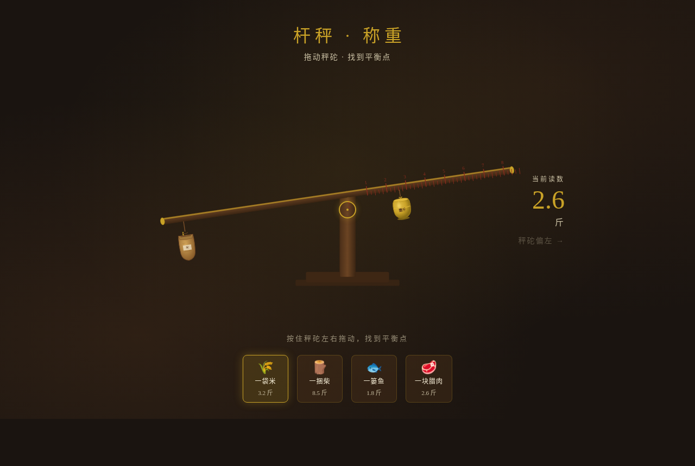

# 杆秤·移动秤砣称重

> 类别：交互组件（V3）　日期：2026-08-19　主题：老式杆秤拖秤砣找力矩平衡点称重

## 简介

「杆秤·移动秤砣称重」是 Art 设计实验室 V3 交互组件作品。一个可拖动秤砣的老式杆秤——拖砣沿秤杆水平移动，秤杆随（物重×物端杆长 vs 砣重×砣距）力矩实时倾斜，过平衡点吸附 + 回弹余震，秤星刻度随砣位置读取重量（斤两）。机制为"移动重物找力矩平衡"，区别于同日双盘天平的配平。可换 4 件待称物（一袋米 3.2 斤 / 一捆柴 8.5 斤 / 一篓鱼 1.8 斤 / 一块腊肉 2.6 斤），称准后显示"已称准 ✓"，replay value 高。

## 截图

## 妙搭预览链接

https://dcniaqwtmoca.feishu.cn/page/L323m86SVdK6dvawfUAcvaj1n8g

## 文件说明

- `index.html` — 单文件源码（HTML+CSS+JS，约 42KB）
- `preview.png` — 浏览器渲染截图
- `thumbnail.png` — 妙搭自动缩略图
- `设计规范.md` — 色值 / 字体 / 物理手感 / 动效系统

## 技术栈

纯 vanilla 单文件 HTML+CSS+JS（无 React/Babel/CDN），物理模拟用 `requestAnimationFrame` + 弹簧-阻尼积分（禁 linear/ease）。自定义光标开页居中（z-index 9999），`visibilitychange` 暂停 RAF、卸载取消，鼠标事件直接操作 transform 无重渲染，支持 `prefers-reduced-motion`。配色：黄铜金 / 老木褐 / 暗朱红秤星 / 墨黑 / 米白（禁蓝紫渐变）。

## 设计要点

- 核心交互：拖秤砣 → 秤杆力矩倾斜 → 平衡点吸附 → 读数 → 换物件再称
- 五层体验：pre-contact（高光暗示）→ contact（咬合反冲）→ continuous（实时倾斜）→ threshold（吸附+定星高亮）→ release/decay（过冲回摆衰减）
- 物理手感：重量 / 阻力 / 弹性 / 吸附 / 惯性 / 摩擦，非线性力矩驱动
- 签名瞬间：秤杆水平平衡时定盘星高亮 + 秤星刻度对齐
- ≥12 组件级动效，符合杆秤物理逻辑
