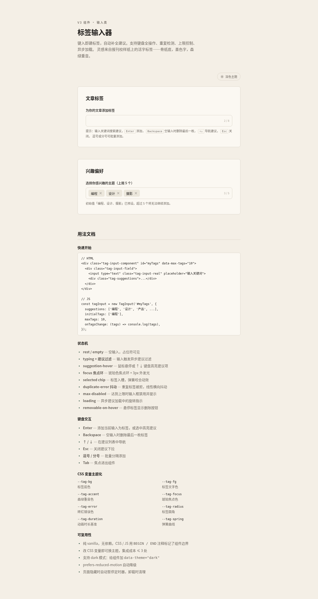

# 标签输入器 Tag Input · V3 交互组件

> 键入即建标签，异步自动补全。支持键盘全操作、重复检测、上限控制、异步加载。
> 视觉灵感来自报刊校样纸上的活字标签——骨纸底，墨色字，森绿重音。



**在线预览**：https://dcniaqwtmoca.feishu.cn/page/Pz4EmWL16dFbouaL2olcyqj6nNh

---

## 简介

一个可直接搬到真实项目里使用的「标签输入器」UI 组件。用户在输入框键入关键词，下拉异步过滤建议；按 Enter 或点击建议把文本变成一枚入槽的标签 chip；Backspace 在空输入时删除最后一枚；重复标签与超过上限时被拒绝并抖动。

解决的真实界面问题：表单里的多值输入（文章标签、兴趣偏好、收件人、技能标签等）。比原生 `<input>` + 逗号分隔更可控：有限额、去重、自动补全、可删除、键盘可达。

## 截图展示

上方 `preview.png` 为浅色主题全页效果（含两个 Demo 实例与用法文档）。组件支持深色主题切换，演示 CSS 变量主题化。

## 用法文档

### 快速开始

```html
<!-- HTML 结构 -->
<div class="tag-input-component" id="myTags" data-max-tags="10">
  <div class="tag-input-field">
    <input type="text" class="tag-input-real" placeholder="输入关键词，回车添加"
           aria-autocomplete="list" aria-expanded="false" autocomplete="off" spellcheck="false">
    <div class="tag-suggestions" role="listbox">
      <div class="tag-suggestions-loading" style="display:none">
        <div class="tag-spinner" aria-hidden="true"></div><span>正在检索…</span>
      </div>
      <ul class="tag-suggestions-list" role="presentation"></ul>
      <div class="tag-suggestions-empty" style="display:none">未找到匹配的标签</div>
    </div>
  </div>
  <span class="tag-input-counter" aria-live="polite">0 / 10</span>
</div>
```

```js
// JS 初始化
const tagInput = new TagInput('#myTags', {
  suggestions: [          // 建议词库，每项 { name, count?, icon? }
    { name: '编程', count: 234, icon: '⌨' },
    { name: '设计', count: 267, icon: '✎' },
    // ...
  ],
  initialTags: ['编程'],  // 预设标签
  maxTags: 10,            // 上限（也可用 data-max-tags 属性）
  debounceMs: 280,        // 输入防抖
  asyncDelayMs: 320,      // 模拟异步延迟
  caseSensitive: false,   // 大小写敏感
  trim: true,             // 自动去空格
  onTagsChange: (tags) => console.log(tags),
});
```

> 真实项目接入异步建议：把 `suggestions` 换成你的数据源，或在 `_filterSuggestions` 处接后端接口（替换 `setTimeout` 模拟段为 `fetch`）。组件核心不依赖任何后端。

### 键盘交互

| 按键 | 行为 |
|---|---|
| `Enter` | 添加当前输入为标签；建议打开时选中高亮项 |
| `Backspace` | 空输入时删除最后一枚标签 |
| `↑` / `↓` | 在建议列表中导航 |
| `Esc` | 关闭建议下拉 |
| `,` `;` `，` `；` | 批量分隔添加 |
| `Tab` | 焦点进出组件（关闭建议） |

### 状态机（9 个）

`rest/empty` · `typing+建议过滤` · `suggestion-hover` · `focus 焦点环` · `selected chip 入槽` · `duplicate-error 抖动` · `max-disabled 超限` · `loading 异步加载` · `removable-on-hover`

## 可配置项

### CSS 变量（主题化）

改这几个变量即可换肤，集成成本 ≤ 3 处：

```css
.tag-input-component {
  --tag-bg: #ECE7DC;        /* 标签底色 */
  --tag-fg: #1A1816;        /* 标签字色 */
  --tag-accent: #1B4332;    /* 重音/已选色 */
  --tag-focus: #B8860B;     /* 焦点色 */
  --tag-error: #B23A2E;     /* 错误色 */
  --tag-radius: 6px;        /* 标签圆角 */
  --tag-duration: 220ms;    /* 动画时长基准 */
  --tag-spring: cubic-bezier(0.34, 1.56, 0.64, 1); /* 弹簧曲线 */
}
```

深色模式：给组件加 `data-theme="dark"` 即可（组件内置深色变量集）。

### JS 参数

| 参数 | 默认 | 说明 |
|---|---|---|
| `suggestions` | 内置 30 词 | 建议词库 `[{name, count?, icon?}]` |
| `initialTags` | `[]` | 预设标签 |
| `maxTags` | `10`（或 `data-max-tags`） | 标签上限 |
| `debounceMs` | `280` | 输入防抖 |
| `asyncDelayMs` | `320` | 异步模拟延迟 |
| `caseSensitive` | `false` | 大小写敏感 |
| `trim` | `true` | 自动去空格 |
| `onTagsChange` | `null` | 标签变化回调 |

### 公开 API

```js
tagInput.getTags();        // ['编程', '设计']
tagInput.addTag('音乐');   // 程序式添加
tagInput.removeTag('设计');
tagInput.clear();
tagInput.setMax(8);
tagInput.setSuggestions([...]);
tagInput.destroy();        // 卸载清理（定时器/监听）
```

## 定制方法

1. **换主题**：覆盖 `.tag-input-component` 上的 CSS 变量即可，无需改结构。
2. **换建议源**：传 `suggestions`，或继承 `TagInput` 重写 `_filterSuggestions` 接后端。
3. **去计数器**：删除 `.tag-input-counter` 元素，并把 `.tag-input-field` 的 `padding-right` 改回 `10px`。
4. **改上限**：`data-max-tags` 属性或 `maxTags` 参数。

## 文件说明

| 文件 | 说明 |
|---|---|
| `index.html` | 单文件实现（HTML+CSS+JS），组件代码用 `BEGIN / END` 注释标记边界，可独立抽取 |
| `设计规范.md` | 色值/字体/动效系统/状态机/可访问性规范 |
| `preview.png` | 浅色主题全页预览截图 |

## 技术栈

纯 vanilla（HTML + CSS + JS），无 React / Babel / CDN / 外部字体 / 外部图片，零网络请求。组件 CSS 与 JS 用 `/* BEGIN/END: tag-input */` 边界注释标记，copy-paste 到其他项目即可使用。

## 自查结论

- [x] 9 个状态全部可演示且键盘可达（实测：添加/重复抖动/上限禁用/Backspace 删尾/建议导航/Esc 关闭）
- [x] 重复/超限触发抖动且不实际添加
- [x] 焦点环可见，Tab 顺序合理，aria-* 正确
- [x] 删除 CSS 变量后组件仍可用（仅换色）
- [x] 浏览器渲染无白屏、0 Console Error，截图非空白（std 18.56）
- [x] `prefers-reduced-motion` 降级、`visibilitychange` 暂停定时器、`destroy()` 清理
- [x] 工程修复 #1：计数器定位锚点缺失已修复（`.tag-input-component` 加 `position:relative` + field 预留右侧 padding）
