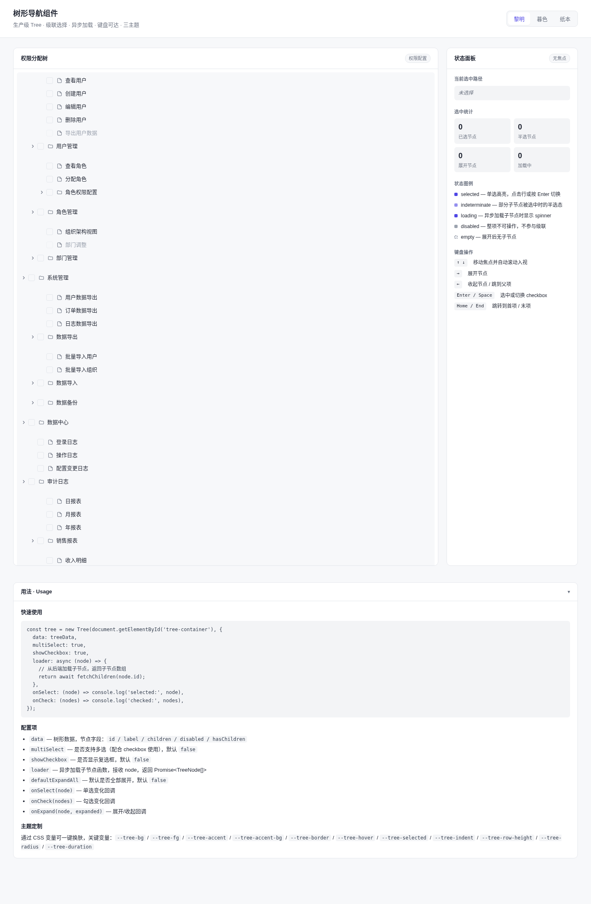

# 树形导航组件 · Tree Navigator

> Art 设计实验室 · V3 实用可复用 UI 组件 · 2026-08-19
> 类别：导航类 · 生产级 Tree，可直接 copy 到真实项目



## 简介

一个可展开收起的层级导航与多选控件。把开发者最常踩坑的三件事做对：**checkbox 级联半选、异步加载子节点、完整键盘导航**。视觉走冷石板专业基调，像代码编辑器文件树 / 权限树。展示示例为「权限分配树」（系统管理 / 用户管理 / 角色管理 / 数据中心 / 审计日志 …，含 disabled 项与异步子节点）。

**妙搭预览**：https://dcniaqwtmoca.feishu.cn/page/BRYGmCUMKdOmwpaxoNWcTsednPe

## 核心能力

- **9+ 状态完整**：折叠 / 展开 / hover / focus 焦点环 / selected / loading / indeterminate 半选 / checked-unchecked / disabled / empty 空态
- **级联选择**：父子双向级联，disabled 不参与；checkbox 弹簧微弹，半选水平线填充
- **异步加载**：`hasChildren` 未加载时展开触发 loading → 延迟填充，`loader` 可配置为真实 fetch
- **全键盘可达**：Tab / ↑↓ / ←→ / Enter / Space / Home / End
- **三主题一键切换**：黎明（冷石板·靛蓝）/ 暮色（近黑·浅靛）/ 纸本（暖米·墨棕）
- **健壮性**：RAF/定时器随可见性暂停、卸载取消；支持 `prefers-reduced-motion`；零外部依赖

## 用法

```html
<div id="tree"></div>
<script>
  // 组件代码（Tree 类）内联或抽取引入后：
  var tree = new Tree(document.getElementById('tree'), {
    data: [
      { id: 'sys', label: '系统管理', children: [
        { id: 'user', label: '用户管理', children: [
          { id: 'u1', label: '查看用户' },
          { id: 'u2', label: '创建用户' }
        ]}
      ]}
    ],
    showCheckbox: true,      // 显示 checkbox（级联多选）
    multiSelect: true,
    defaultExpandAll: false,
    loader: function(node) {  // 异步加载子节点（可选）
      return new Promise(function(resolve) {
        setTimeout(function() {
          resolve([{ id: node.id + '_c', label: '动态子节点' }]);
        }, 1000);
      });
    }
  });

  // 监听选择变化
  tree.on('check', function(checkedNodes) {
    console.log('已选', checkedNodes.length, '项');
  });
</script>
```

## 可配置项

| 选项 | 类型 | 默认 | 说明 |
|---|---|---|---|
| `data` | `Array` | `[]` | 初始树数据，每项 `{id,label,children?,hasChildren?,disabled?}` |
| `loader` | `Function(node):Promise` | — | 异步加载子节点，返回 Promise<Array> |
| `showCheckbox` | `Boolean` | `false` | 显示 checkbox（启用级联多选） |
| `multiSelect` | `Boolean` | `false` | 多选模式 |
| `defaultExpandAll` | `Boolean` | `false` | 默认全部展开 |

## 主题定制（CSS 变量）

改这几个变量即可适配你的项目（抽走改不超过 3 处）：

```css
:root {
  --tree-bg: #F7F8FA;        /* 树背景 */
  --tree-fg: #1E2330;        /* 主文字 */
  --tree-accent: #4F46E5;    /* 重音（选中/勾选） */
  --tree-accent-bg: #EEF2FF; /* 重音底 */
  --tree-border: #E4E7EC;    /* 分隔线 */
  --tree-hover: #F0F2F5;     /* 悬停底 */
  --tree-selected: #EEF2FF;  /* 选中底 */
  --tree-radius: 6px;
  --tree-indent: 22px;
  --tree-row-height: 32px;
  --tree-duration: 180ms;
}
/* 切换主题：在容器上设 data-theme="dusk" | "paper" */
```

完整 17 个变量见 `设计规范.md`。

## 文件说明

| 文件 | 说明 |
|---|---|
| `index.html` | 单文件实现（HTML+CSS+JS），浏览器直接打开即可运行 |
| `设计规范.md` | 配色系统、字体、动效、状态机、键盘规范 |
| `preview.png` | 无头浏览器渲染截图（1440×2200） |
| `README.md` | 本文件（用法、配置项、定制方法） |

## 抽取到别的项目

1. 从 `index.html` 中提取 `/* === TREE COMPONENT === */` 标注的 CSS 块与 JS 块（`Tree` 类）。
2. 放入你的项目，`new Tree(el, { data, ... })` 初始化。
3. 按需覆盖 `--tree-*` CSS 变量匹配品牌色——改不超过 3 处即可用。

## 技术栈

纯 vanilla 单文件，无 React / Babel / CDN / 外部字体 / 外部图片，相对路径，可独立抽取复用。组件适应系统光标（不依赖自定义光标）。

## 自查结论

- [x] 9+ 状态全部可演示且键盘可达
- [x] 级联半选逻辑正确（含 disabled 不参与）
- [x] 异步加载 loading → 填充真实
- [x] 三主题切换可换肤，删 accent 变量后组件仍可用
- [x] 焦点环可见，Tab/方向键顺序合理
- [x] 浏览器渲染无白屏无 Console Error，截图非空白（std 18.21）
- [x] 删装饰动画后功能完整
- [x] 纯 vanilla 单文件，可独立抽取

**Quality Gate：PASS**（Utility 18/20 · State 18/20 · Interaction 13/15 · Reusability 13/15 · Technical 9/10，CRITICAL=0，全部过门槛）

> 等待协调者检查后提交 GitHub。
