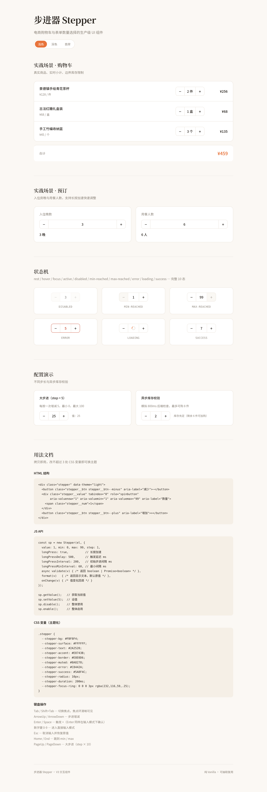

# 步进器 Stepper · 生产级 UI 组件

## 简介
生产级数量步进器（Stepper），解决电商购物车、预订表单、设置面板中的数量选择需求。支持 +/- 按钮步进、长按加速、直接输入校验、边界阻力反馈、异步库存校验，覆盖完整 10 态状态机。

## 截图


## 妙搭预览
https://dcniaqwtmoca.feishu.cn/page/B899maTQbdkEcDazT6WcQOOHnRc

## 核心特性
- **10 态状态机**：rest / hover / focus / active / disabled / min-reached / max-reached / error / loading / success
- **长按加速**：按住 500ms 触发自动步进，间隔从 200ms 递减到 60ms，松手即停
- **直接输入**：点击数字进入编辑模式，Enter 确认 / Esc 取消 / 失焦自动提交
- **边界阻力**：到 min/max 时按钮 disabled，继续触发数字区 shake + 错误提示
- **键盘全可操作**：Tab / ArrowUp/Down / PageUp/Down / Home/End / 数字键 / Enter / Esc
- **CSS 变量主题化**：暖橙浅色 / 暖炭深色 / 翡翠三套主题，改 ≤3 处变量即可换主题
- **异步校验**：validate() 支持 Promise，loading 态 spinner + success 闪烁
- **prefers-reduced-motion**：降级为即时值更新，保留状态视觉

## 用法

### HTML 结构
```html
<div class="stepper" data-theme="light">
  <button class="stepper__btn stepper__btn--minus" aria-label="减少">−</button>
  <div class="stepper__value" tabindex="0" role="spinbutton"
       aria-valuenow="1" aria-valuemin="1" aria-valuemax="99" aria-label="数量">
    <span class="stepper__num">1</span>
  </div>
  <button class="stepper__btn stepper__btn--plus" aria-label="增加">+</button>
</div>
```

### JS API
```js
const sp = new Stepper(el, {
  value: 1,           // 初始值
  min: 0,             // 最小值
  max: 99,            // 最大值
  step: 1,            // 步长
  longPress: true,    // 长按加速
  longPressDelay: 500,       // 长按触发延迟（ms）
  longPressInterval: 200,    // 初始步进间隔（ms）
  longPressMinInterval: 60,  // 最小步进间隔（ms）
  validate(v) { return true; },  // 异步校验，返回 boolean 或 Promise<boolean>
  format(v) { return v + ' 件'; }, // 显示格式化
  onChange(v, prev) { /* 值变化回调 */ }
});

sp.getValue();   // 获取当前值
sp.setValue(5);  // 设置值
sp.disable();    // 禁用
sp.enable();     // 启用
sp.destroy();    // 销毁（清理所有定时器/RAF）
```

### CSS 变量（换主题只需改这些）
```css
.stepper {
  --stepper-bg: #FBF8F4;
  --stepper-accent: #E8743B;
  --stepper-text: #2A2520;
  --stepper-border: #E8E0D6;
  --stepper-radius: 10px;
  --stepper-duration: 200ms;
  /* ...完整变量见设计规范.md */
}
```

## 可配置项
| 配置 | 类型 | 默认值 | 说明 |
|------|------|--------|------|
| value | number | 1 | 初始值 |
| min | number | 0 | 最小值 |
| max | number | 99 | 最大值 |
| step | number | 1 | 步长 |
| longPress | boolean | true | 是否启用长按加速 |
| longPressDelay | number | 500 | 长按触发延迟 |
| longPressInterval | number | 200 | 初始步进间隔 |
| longPressMinInterval | number | 60 | 最小步进间隔 |
| validate | function | null | 异步校验函数 |
| format | function | null | 显示格式化函数 |
| onChange | function | null | 值变化回调 |

## 定制方法
1. **换主题**：修改 .stepper 上的 CSS 变量，或设置 `data-theme="dark"/"emerald"`
2. **改尺寸**：修改 .stepper 的 height 和 .stepper__btn 的 width
3. **改步长**：实例化时传 step 参数（如 step: 5）
4. **异步校验**：传 validate 函数，返回 Promise<boolean>，自动显示 loading/success/error

## 文件说明
| 文件 | 说明 |
|------|------|
| index.html | 单文件应用（含组件 CSS/JS + 展示页） |
| preview.png | 全页截图 |
| 设计规范.md | 配色/字体/动效/状态机/键盘详细规范 |
| README.md | 本文档 |

## 技术栈
- 纯 vanilla HTML + CSS + JS（无 React / Babel / CDN）
- 组件 CSS 用 .stepper 命名空间，可独立抽取
- 组件 JS 用 Stepper 类（IIFE），可独立抽取
- 展示页字体（Noto Serif/Sans SC）为可选渐进增强，组件本身零外部依赖
- RAF/定时器随 visibilitychange 暂停，destroy() 全量清理
- 支持 prefers-reduced-motion

## 抽取复用指南
1. 复制 `.stepper` 相关 CSS（注释标注「步进器组件样式」段落）
2. 复制 `Stepper` 类 JS（注释标注「步进器组件」段落）
3. 在 HTML 中写出 .stepper DOM 结构
4. `new Stepper(el, options)` 初始化
5. 改 ≤3 处 CSS 变量即可适配你的项目主题
