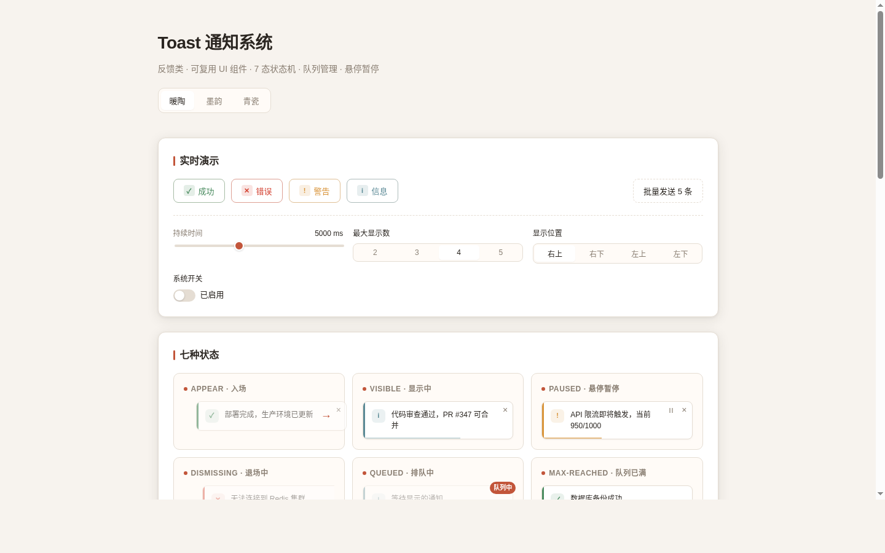

# Toast 通知系统 · V3 交互组件

> 反馈类 · 可复用 UI 组件 · 7 态状态机 · 队列管理 · 悬停暂停 · 滑动关闭 · CSS 变量主题化



## 主题与简介

生产级 Toast 通知组件——开发者调用 `Toast.success/error/warning/info()` 即可显示通知，支持消息队列管理、自动消失倒计时进度条、悬停暂停、滑动/点击关闭、四种严重级别。纯 vanilla 单文件实现，CSS/JS 可独立抽取，通过 CSS 变量主题化，抽到别的项目改不超过 3 处即可使用。

这是 V3「实用可复用 UI 组件」方向——目的是方便利用到别的项目开发中，不是物理演示装置。配色为暖陶 `#C2553A`（陶土红）+ `#F7F3EE`（暖白底），非蓝紫渐变。

- 妙搭在线预览：<https://dcniaqwtmoca.feishu.cn/page/RHYamJFd0d5s1VaBImIcQGDKnQN>
- 设计规范详见 [`设计规范.md`](./设计规范.md)

## 截图


> 首次加载即显示完整展示页：页头 + 主题切换 + 实时演示区（四种类型按钮 + 持续时间滑块 + 最大显示数 + 位置选择 + 系统开关）+ 七种状态快照 + 用法文档（三步接入 + 配置表 + API 列表）。

## 签名交互

点击「成功」按钮 → 通知从右侧弹簧滑入（400ms 过冲）→ 底部进度条匀速递减 → 鼠标悬停时进度条冻结 + 显示暂停图标 → 移开恢复 → 到时间向右滑出消失。向右拖动通知超过 80px 阈值则关闭，否则弹簧回弹。

## 组件状态（7 态）

appear（入场）· visible（显示中）· paused（悬停暂停）· dismissing（退场中）· queued（排队中）· max-reached（队列已满）· disabled（已禁用）

## 键盘交互

- `Tab` 聚焦到关闭按钮（×）
- `Enter` / `Space` 关闭当前通知
- 关闭按钮有 `:focus-visible` 焦点环
- `aria-label="关闭通知"` + `role="alert"` + `aria-live="polite"`

## 四种严重级别

| 类型 | 图标 | 色值 | 左侧色条 |
|------|------|------|----------|
| success | ✓ | `#4A8B5F` | 鼠尾草绿 |
| error | ✕ | `#D44535` | 暖红 |
| warning | ! | `#D9943A` | 琥珀 |
| info | i | `#5B8A96` | 青灰 |

## 三套主题

通过 `data-toast-theme` 属性在 `<body>` 或 `.toast-container` 上切换：

- **暖陶**（默认）：暖白底 + 陶土红强调
- **墨韵**（深色）：炭黑底 + 暗金强调
- **青瓷**（浅色绿调）：柔绿底 + 青瓷绿强调

## 用法文档

### 三步接入

1. **HTML 结构**：在 `<body>` 中放置容器 `<div class="toast-container" data-position="top-right"></div>`
2. **CSS 变量**：复制所有 `.toast-` 前缀样式，通过覆盖 CSS 变量自定义主题与尺寸
3. **JS API**：引入脚本后调用 `Toast.success('消息内容')`

### 可配置项

| 参数 | 类型 | 默认值 | 说明 |
|------|------|--------|------|
| `duration` | number | 5000 | 自动消失时长（毫秒） |
| `maxVisible` | number | 4 | 同时显示的最大数量 |
| `position` | string | `"top-right"` | 显示位置：top-right / bottom-right / top-left / bottom-left |
| `theme` | string | `"warm-terracotta"` | 主题名：warm-terracotta / ink-elegance / celadon |

### JS API

| 方法 | 说明 |
|------|------|
| `Toast.success(msg, opts)` | 显示成功通知，opts 可覆盖 duration 等配置 |
| `Toast.error(msg, opts)` | 显示错误通知 |
| `Toast.warning(msg, opts)` | 显示警告通知 |
| `Toast.info(msg, opts)` | 显示信息通知 |
| `Toast.dismiss(id)` | 按 ID 关闭指定通知 |
| `Toast.clear()` | 立即清除所有通知与队列 |
| `Toast.disable()` | 禁用通知系统，清空现有通知并拒绝新通知 |
| `Toast.enable()` | 重新启用通知系统 |
| `Toast.configure(opts)` | 更新全局配置 |

### 代码示例

```javascript
// 基本用法
Toast.success('部署完成，生产环境已更新至 v2.4.1');
Toast.error('支付回调验签失败，订单 #2026081914 已标记异常');

// 自定义时长
Toast.warning('存储空间不足', { duration: 8000 });

// 全局配置
Toast.configure({ duration: 3000, maxVisible: 3, position: 'bottom-right' });

// 禁用 / 启用
Toast.disable();
Toast.enable();
```

## 文件说明

| 文件 | 说明 |
|------|------|
| `index.html` | 完整单文件（HTML + CSS + JS），组件代码与展示页代码用注释分隔 |
| `preview.png` | 1440×900 桌面截图 |
| `设计规范.md` | 色值、字体、动效系统、状态机、尺寸规格 |
| `README.md` | 本文件 |

## 技术栈

- 纯 vanilla HTML + CSS + JS（无 React / Babel / CDN / 外部字体）
- Pointer Events API（滑动关闭）
- CSS Custom Properties（主题化）
- requestAnimationFrame（进度条驱动）
- visibilitychange（页面不可见时暂停）
- prefers-reduced-motion 降级
- ARIA 无障碍（role / aria-live / aria-label）

## 自查结论

- [x] 7 个状态均可演示且视觉区分清晰
- [x] 四种严重级别各有独立视觉（色条 + 图标 + 进度条色）
- [x] 键盘可操作（Tab 聚焦、Enter/Space 关闭）
- [x] 删掉所有动画后通知功能仍完整可用
- [x] CSS/JS 可独立抽取，改不超过 3 处即可使用
- [x] Console 无 Error（puppeteer 实测验证）
- [x] 截图非空白（pixel std = 17.21）
- [x] 纯 vanilla 单文件，无外部依赖
- [x] 支持 prefers-reduced-motion
- [x] UI 文案以中文为主
- [x] 内容真实可信，无 Lorem Ipsum
