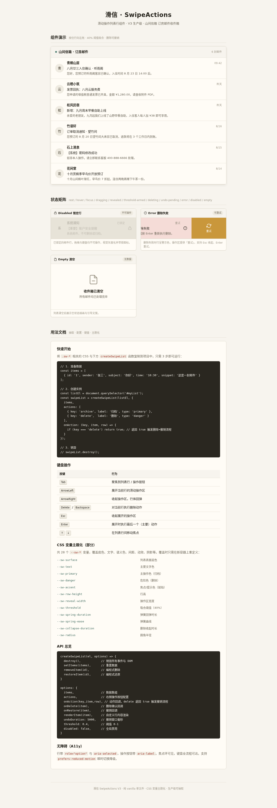

# 滑信 SwipeActions · 滑动操作列表组件

> V3 实用可复用 UI 组件 · 操作类
> Art 设计实验室 · 2026-08-19

## 主题

「山间信箱」——民宿主人的订房邮件收件箱。按住邮件行向左拖，揭示归档/删除操作；越过阈值松手自动吸合，删除走「信笺抽走 + 5 秒撤销」流程。

## 简介

这是一个生产级「滑动操作列表行（Swipe Actions）」UI 组件，目的是方便开发者直接搬到自己的项目里使用，而不是物理演示装置。覆盖邮箱、待办、购物车、消息列表等真实场景。

核心能力：
- 指针 1:1 跟手拖拽（Pointer Events 统一鼠标 + 触屏），拖拽期无过渡
- 40% 阈值吸合：过阈值松手吸到全开并锁定，否则弹簧回弹归零
- 删除流程：行像信笺被抽走（高度收起 + 透明度）→ 顶部撤销条 5 秒倒计时 → 撤销完整还原
- 完整 11 态状态机：rest / hover / focus / dragging / revealed / threshold-armed / deleting / undo-pending / error / disabled / empty
- 全键盘可操作：Tab / ↑↓ / ArrowLeft 展开 / ArrowRight 收起 / Delete 删除 / Enter 执行 / Esc 收起
- 44 个 `--sw-*` CSS 变量主题化 + 工厂函数 `createSwipeList` + `destroy()`
- 纯 vanilla 单文件，`prefers-reduced-motion` 降级，RAF/定时器随 `visibilitychange` 暂停且卸载取消

## 截图展示



## 妙搭预览链接

https://dcniaqwtmoca.feishu.cn/page/AxZumn5fHdh0ZTauKfqcjOqUnKh

## 用法文档

### 快速开始

```html
<link rel="stylesheet" href="./index.html"> <!-- 内含 sw-* 样式段，可抽取 -->
<ol id="mail-list" role="listbox" aria-label="邮件列表"></ol>
<script>
  const api = createSwipeList(document.getElementById('mail-list'), {
    actions: [
      { id: 'archive', label: '归档', kind: 'primary', onAction: (row) => { /* … */ } },
      { id: 'delete',  label: '删除', kind: 'danger',  onAction: (row) => { /* … */ } }
    ],
    threshold: 0.4,      // 吸合阈值（行宽比例）
    undoDuration: 5000   // 撤销倒计时（ms）
  });
  // 销毁
  api.destroy();
</script>
```

抽走组件代码（`sw-*` 段 CSS + `createSwipeList` 段 JS）改 ≤3 处即可在新页面运行。

### 键盘操作

| 按键 | 行为 |
|------|------|
| `Tab` / `↑` `↓` | 行间移动焦点 |
| `ArrowLeft` | 展开当前行操作 |
| `ArrowRight` | 收起当前行操作 |
| `Delete` | 删除当前行（触发撤销流程） |
| `Enter` | 执行高亮动作 |
| `Esc` | 收起操作 |

## 可配置项（CSS 变量节选）

| 变量 | 默认 | 说明 |
|------|------|------|
| `--sw-primary` | `#4A7C6F` | 归档/主色（青瓷绿） |
| `--sw-danger` | `#C0392B` | 删除/危险（柿红） |
| `--sw-focus-ring` | `#C9973B` | 焦点环/提示（琥珀） |
| `--sw-surface` | `#FFFCF6` | 行体表面 |
| `--sw-text` | `#232019` | 主文字 |
| `--sw-threshold` | `0.4` | 吸合阈值 |
| `--sw-spring-duration` | `260ms` | 释放弹簧时长 |
| `--sw-spring-ease` | `cubic-bezier(0.34,1.4,0.64,1)` | 弹簧曲线 |
| `--sw-reveal-width` | `160px` | 操作区揭示宽 |

完整 44 个变量见源码 `:root`。JS 侧 `options` 支持 `actions` / `threshold` / `undoDuration` / `data` 等。

## 文件说明

```
2026-08-19_滑动操作列表_swipe-actions/
├── index.html       组件单文件（HTML + CSS + JS，可抽取 sw-* 段）
├── preview.png      整页截图
├── 设计规范.md      色彩/字体/动效/状态机规范
├── thumbnail.png    妙搭缩略图
└── README.md        本文件
```

## 技术栈

纯 vanilla HTML / CSS / JS，无 React / Babel / CDN。Pointer Events 统一输入，`touch-action: pan-y` 不阻塞纵向滚动。支持 `prefers-reduced-motion`。浏览器实测：无 Console Error、无横向溢出、拖拽与键盘交互均正常。

## 自查结论

- 删掉弹簧动效后功能仍完整可用（reduced-motion 已验证）
- 仅用键盘可完成 展开操作 → 删除 → 撤销 全流程
- 抽走 `sw-*` 段代码改 ≤3 处可在新页面运行
- 无 console error、无资源 404、无横向溢出
- 色彩与近期作品不雷同（青瓷绿 + 柿红 + 琥珀 + 宣纸暖白，无蓝紫渐变）

**等待协调者检查后提交 GitHub。**
