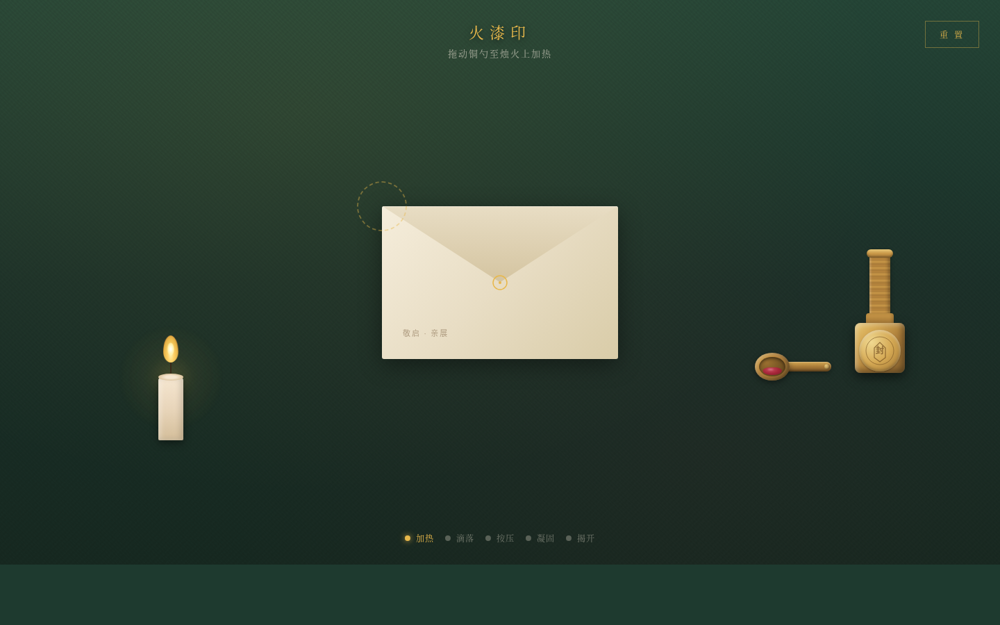

# 火漆印 · Wax Seal

**类别**：交互组件（UX Lab）　**日期**：2026-08-19

## 主题
一个完整的「蜡封仪式」可把玩交互组件——加热蜡粒、滴落堆积、垂直按压摊开、等待凝固、垂直揭开成印。蜡的材质（液态/固态）是全库首次引入，垂直按压机制与近期所有拖拽/旋转/推拉机制正交，「等待凝固」引入时间维度手感。

## 设计观点
近期组件已做过拉绳吊灯、黄铜天平、收音机旋钮、日月滑轨、拨号盘、钢卷尺、刀闸开关，机制集中在拖拽/旋转/推拉。本版用蜡的融化→冷却相变 + 垂直按压 + 失败态，制造「第一次没等凝固就揭开而失败，主动再玩一次」的体验闭环。

## 预览

妙搭在线预览：https://dcniaqwtmoca.feishu.cn/page/P724mR5E4dXzgfaja9qcr4NTn4c

## 核心交互
- 五部曲：加热→滴落→按压→凝固→揭开
- 蜡量/力度/冷却三变量影响成品
- 失败态（提前揭开残缺/粘印章）
- 自定义光标四形态（开页居中）

## 文件说明
- `index.html` —— 纯 vanilla 单文件应用
- `设计规范.md` —— 完整设计规范
- `preview.png` —— 1440×900 截图

## 技术栈
纯 vanilla 单文件 HTML+CSS+JS，无任何外部依赖。RAF 随可见性暂停，支持 prefers-reduced-motion，Console 零 Error。
