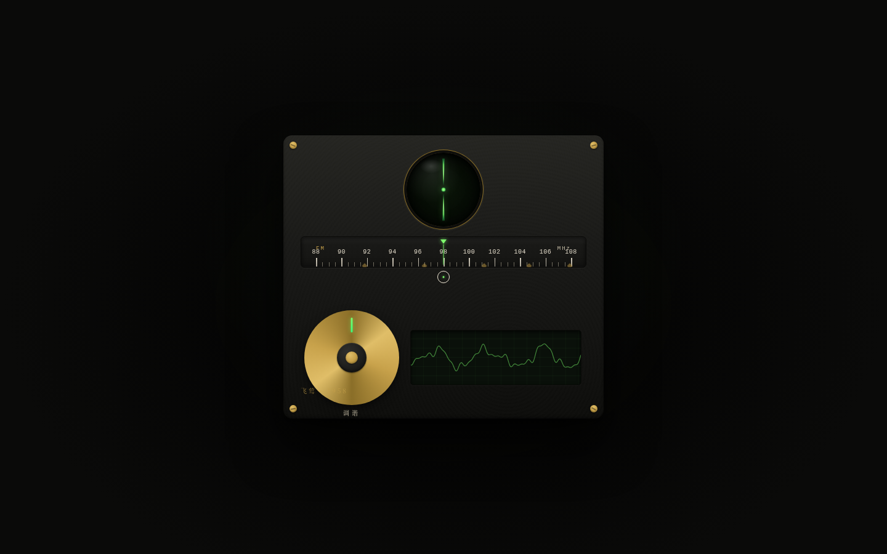

# 电波调谐 · 猫眼收音机

> 抓住旋钮旋转扫频——越接近电台信号越清晰，「猫眼」电子管的绿色荧光随信号张开，对准台位被吸附锁定。

## 主题
光标驱动的拟物化小组件 · 交互组件实验室（Component Mock）

## 简介
一台 1950 年代电子管收音机（铭牌「飞莺 · 1958」）的调谐系统。只做这一个组件，做到极致：拖拽中央旋钮旋转扫频，刻度盘指针实时跟随，下方 Canvas 示波器波形随信噪比从杂乱噪声连续归正为清晰正弦，「猫眼」电子管的绿色荧光瓣随信号强度从细缝张开到满月。五个虚拟电台（城市之声 / 夜航电台 / 旧时光金曲 / 山林民乐 / 午夜故事会），进入台位窗口时被磁吸锁定、显示台名与节目。松手后旋钮带惯性滑停、阻尼弹簧微振荡。闭眼拖动能凭阻力变化感知台位。

## 截图

## 妙搭预览链接
https://dcniaqwtmoca.feishu.cn/page/KLbAmwF7Wd7HhPak46IcHXgEnbf

## 五层反馈
pre-contact 旋钮呼吸微光 → contact 抓取阻尼咬紧 → continuous 指针+猫眼+波形三重实时跟随 → threshold 台位磁吸锁定+猫眼全开 → release/decay 惯性滑停+阻尼弹簧微振荡。

## 物理手感
角速度积分 · 环形角度追踪拖拽 · 快速甩动惯性 · 摩擦阻尼 · 台位磁吸 · 阈值前后阻尼不同。

## 文件说明
| 文件 | 说明 |
| --- | --- |
| `index.html` | 纯 vanilla 单文件完整实现（HTML+CSS+JS 内联，零外部依赖） |
| `设计规范.md` | 色彩 / 字体 / 材质 / 五层反馈 / 物理手感规范 |
| `preview.png` | 页面截图 |
| `thumbnail.png` | 应用缩略图 |

## 技术栈
纯 HTML + CSS + JS（**纯 vanilla 单文件，零外部 JS/CSS/图片/字体依赖**，无 React/Babel/CDN）· Canvas 波形 · 单一 RAF 物理循环 · 支持 prefers-reduced-motion。

## 配色
炭黑胶木 `#1A1A18` + 荧光绿猫眼 `#7CFF6B` + 奶白刻度 `#F2EAD8` + 黄铜 `#C8A24B`（无蓝紫渐变）。
