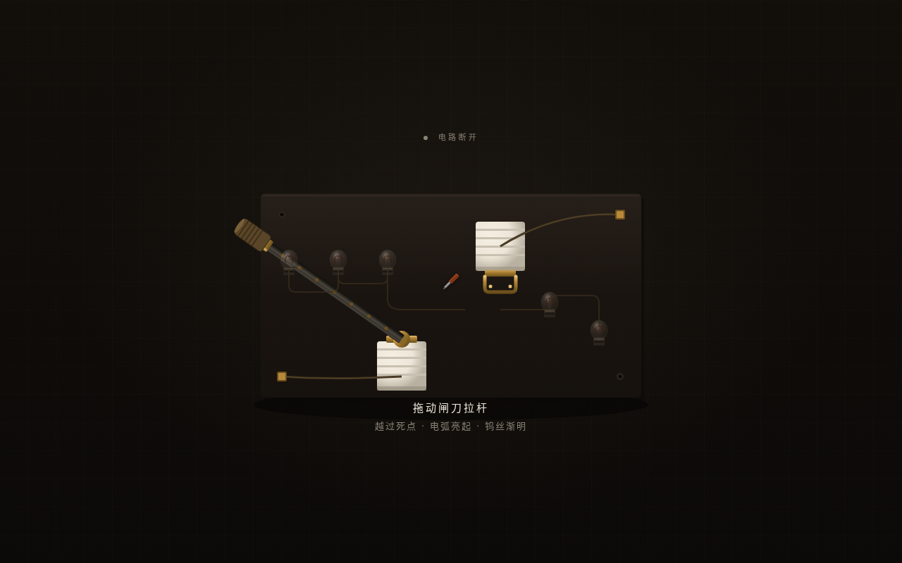

# 老式电闸刀拉闸开关

> 日期：2026-08-19　|　类别：交互组件　|　Art Orchestrator batch14

## 简介
一个可反复把玩的拟物化交互组件：拖动老式电闸刀拉杆越过死点 snap 接通电路，产生电弧火花，联动一排钨丝灯泡渐次亮起；断开反向。体验"拉闸通电"的重量感与仪式感——咬合、snap、火花、灯亮。

## 设计观点
机制取自老式电气闸刀（旋转支点 + 接触死点 + 电气负载），与近期组件（鞭陀螺 cord-pull / 风箱灶 push-pull / 手动挡 2D-H-gate）均不同。反馈层次天然丰富：咬合 → snap → 电弧 → 灯丝热惯性渐亮。纯物理模型驱动手感，非普通按钮加 glow。

## 截图

## 妙搭预览
https://dcniaqwtmoca.feishu.cn/page/OYPgmIvnddONgzaC5TMcSCVXngh

## 文件说明
- `index.html` — 纯 vanilla 单文件（HTML+CSS+JS，无 React/Babel/CDN/外部图片，全 SVG/Canvas/CSS 绘制）
- `preview.png` — 1280×800 截图
- `设计规范.md` — 机制/物理模型/五层反馈/色值/材质

## 技术栈
纯 HTML + CSS + Vanilla JS，SVG + Canvas（电弧粒子），requestAnimationFrame 驱动，prefers-reduced-motion 降级。无任何外部依赖。

## 核心交互
- 拖动闸刀拉杆（连续角度输入）→ 过死点 snap → 电弧 + 灯泡渐亮
- 五层反馈：pre-contact 颤动 → contact 咬合 → continuous 联动 → threshold snap 火花 → release 余震
- 自定义螺丝刀光标
- 空格键也可切换接通/断开

## 自查
- [x] 删动画后静态结构（闸刀/触点/灯泡/底板）仍成立可读
- [x] 非普通按钮加 glow、非只有入场动画、有连续输入响应
- [x] 手感有重量/阻力/snap/余震
- [x] Browser QA：无 console error，截图非空白（pixelStd 20.18）
- [x] 机制与近期 component 不重复
