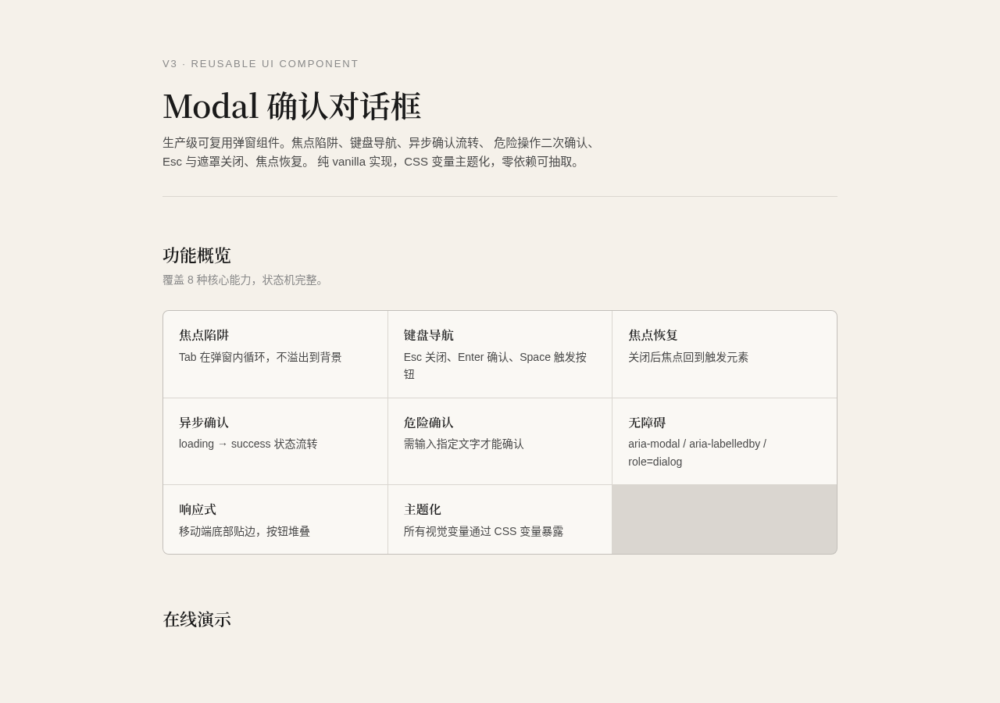

# Modal 确认对话框

> V3 交互组件 · 覆盖层类 · 2026-08-19

## 简介

一个生产级确认对话框组件，覆盖日常开发中最常见的"确认操作"场景：基础确认、危险操作（需关键词输入解锁）、异步提交（loading→success→自动关闭）、信息提示、长文本展示。

纯 vanilla 单文件实现，零依赖，CSS/JS 可独立抽取。支持 CSS 变量主题化、暗模式自适应、焦点陷阱、键盘全操作、`prefers-reduced-motion` 降级。

## 妙搭预览

[https://dcniaqwtmoca.feishu.cn/page/KZsjm2JwwdNvWJaCRGkcz9JXnuh](https://dcniaqwtmoca.feishu.cn/page/KZsjm2JwwdNvWJaCRGkcz9JXnuh)

## 截图



## 核心特性

- **8 态状态机**：rest / hover / focus / active / disabled / loading / success / error
- **危险确认**：输入指定关键词才解锁确认按钮，防误操作
- **异步流程**：`onConfirm` 返回 Promise → 自动 loading → 成功面板 → 自动关闭
- **焦点陷阱**：Tab/Shift+Tab 在对话框内循环，不逃逸到背景
- **焦点恢复**：关闭后自动恢复打开前的焦点元素
- **键盘全操作**：Esc 关闭、Enter 确认、Tab 循环
- **CSS 变量主题化**：30+ 变量覆盖颜色/尺寸/动效
- **暗模式**：添加 `.modal-theme-auto` 自动适配
- **移动端**：≤480px 变为底部弹出 bottom sheet
- **prefers-reduced-motion**：动画时长归零

## 用法

### 基础确认

```js
const ok = await Modal.confirm({
  title: '删除文件',
  content: '删除后无法恢复，确认继续？',
  confirmText: '删除',
  variant: 'warn'
});
if (ok) { /* 用户点了确认 */ }
```

### 危险操作（关键词解锁）

```js
const ok = await Modal.confirm({
  title: '注销账户',
  content: '此操作将永久删除你的账户和所有数据，无法恢复。',
  variant: 'danger',
  confirmText: '永久注销',
  confirmType: 'danger',
  requireKeyword: '注销账户',
  keywordHint: '请输入「注销账户」以确认'
});
```

### 异步提交

```js
await Modal.confirm({
  title: '提交申请',
  content: '确认提交请假申请？',
  confirmText: '提交',
  variant: 'info',
  onConfirm: async () => {
    const res = await fetch('/api/leave', { method: 'POST', body: '...' });
    if (!res.ok) throw new Error('网络异常，请重试');
  },
  successTitle: '提交成功',
  successDesc: '你的申请已提交，等待审批',
  successDuration: 1200
});
```

### 实例化使用（更多控制）

```js
const modal = new Modal({
  title: '保存草稿',
  content: '是否保存当前编辑内容？',
  confirmText: '保存',
  variant: 'success',
  closable: true,
  closeOnBackdrop: true,
  onConfirm: function() { /* 同步或异步 */ },
  onCancel: function() { /* 取消回调 */ }
});
modal.open();
// 后续可手动关闭或销毁
// modal.close(true);
// modal.destroy();
```

## 可配置项

| 参数 | 类型 | 默认值 | 说明 |
|------|------|--------|------|
| `title` | string | `'确认操作'` | 对话框标题 |
| `content` | string \| HTMLElement | `''` | 正文内容 |
| `variant` | string | `'warn'` | 图标变体：`warn` / `danger` / `info` / `success` / `none` |
| `confirmText` | string | `'确认'` | 确认按钮文字 |
| `cancelText` | string | `'取消'` | 取消按钮文字 |
| `confirmType` | string | `'primary'` | 确认按钮类型：`primary` / `danger` / `default`（danger 变体自动设为 danger） |
| `size` | string | `'md'` | 尺寸：`sm`(360px) / `md`(440px) / `lg`(600px) |
| `closable` | boolean | `true` | 是否显示右上角关闭按钮 |
| `closeOnBackdrop` | boolean | `true` | 点击遮罩是否关闭 |
| `onConfirm` | function | `null` | 确认回调，可返回 Promise 触发异步流程 |
| `onCancel` | function | `null` | 取消回调 |
| `requireKeyword` | string \| null | `null` | 危险确认关键词，设置后需输入匹配才解锁确认按钮 |
| `keywordHint` | string | `''` | 输入框 placeholder 覆盖 |
| `successTitle` | string | `'操作成功'` | 成功面板标题 |
| `successDesc` | string | `''` | 成功面板描述 |
| `successDuration` | number | `900` | 成功面板展示时长(ms)后自动关闭 |

## 定制方法

### 主题色定制

修改 CSS 变量即可，无需改 JS：

```css
:root {
  --modal-primary: #2563eb;        /* 主色改为蓝色 */
  --modal-primary-hover: #1d4ed8;
  --modal-primary-active: #1e40af;
  --modal-radius: 4px;              /* 更小圆角 */
  --modal-duration: 240ms;          /* 更慢过渡 */
}
```

### 暗模式

在 `:root` 或 `html` 上添加 `modal-theme-auto` 类即可自动适配暗色：

```html
<html class="modal-theme-auto">
```

### 抽取到其他项目

1. 复制 `index.html` 中 `<!-- Modal 组件样式 -->` 到 `<!-- Modal 组件样式结束 -->` 之间的 CSS 到项目样式表
2. 复制 `<!-- Modal 组件脚本 -->` 到 `<!-- Modal 组件脚本结束 -->` 之间的 JS 到项目脚本
3. 调用 `Modal.confirm({...})` 或 `new Modal({...})` 即可
4. 如需自定义主题，覆盖 `--modal-*` 变量

## 文件说明

| 文件 | 说明 |
|------|------|
| `index.html` | 单文件实现，包含展示页 + 组件源码（CSS + JS 内联） |
| `设计规范.md` | 从源码提取的精确色值、字体、动效系统、状态机定义 |
| `preview.png` | 1280×900 无头浏览器截图 |
| `README.md` | 本文档 |

## 技术栈

- HTML / CSS / Vanilla JavaScript（ES5 兼容写法）
- 零依赖、零外部 CDN（展示页字体来自飞书字体服务，组件本身不依赖）
- CSS Custom Properties 主题化
- `prefers-reduced-motion` / `prefers-color-scheme` 媒体查询

## 状态机图解

```
         ┌──────────┐
         │  closed  │
         └────┬─────┘
              │ open()
              ▼
    ┌─────────────────┐
    │     opened      │◄──────────────────────┐
    │  (rest/hover/   │                       │
    │   focus/active) │                       │
    └──┬──────┬───┬───┘                       │
       │      │   │                           │
   requireKeyword  confirm()                  │
   not matched     │   │ onConfirm            │
       │      │   │   returns Promise         │
       ▼      │   ▼                           │
    ┌──────┐  │  ┌─────────┐                  │
    │error │  │  │ loading │                  │
    └──┬───┘  │  └────┬────┘                  │
       │      │    resolve│reject             │
       │      │       │   │                   │
       │      │       ▼   ▼                   │
       │      │  ┌────────┐ ┌──────┐          │
       │      │  │success │ │error │          │
       │      │  └───┬────┘ └──┬───┘          │
       │      │      │         │              │
       │      │    successDuration             │
       │      │      │         │              │
       │      ▼      ▼         │              │
       │  ┌──────────────┐    │              │
       └─►│   closing    │◄───┘              │
          └──────┬───────┘                   │
                 │ transition end             │
                 ▼                           │
          ┌──────────┐                       │
          │  closed  │───────────────────────┘
          └──────────┘ (focus restored)
```
