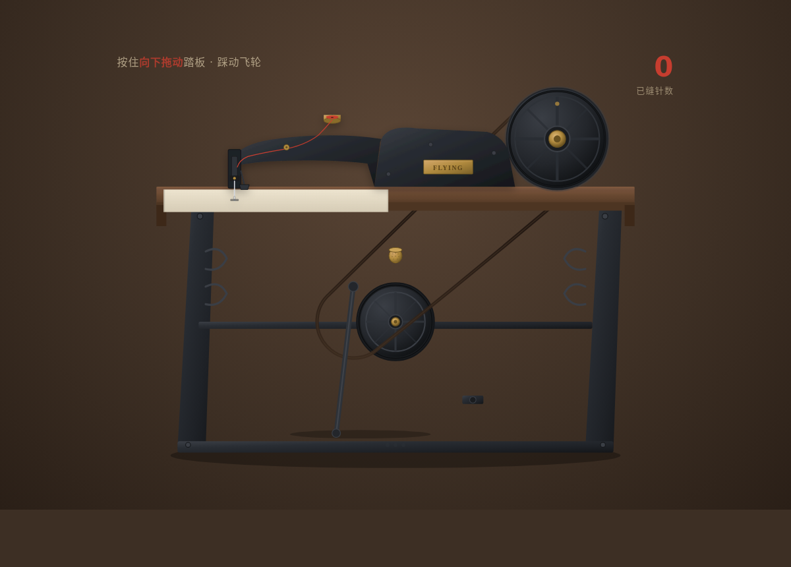

# 老式缝纫机踏板

> Art 设计实验室 · V3 交互组件 · 2026-08-19

## 主题
光标驱动拟物化单一核心组件——老式缝纫机踏板。踩动踏板经曲柄连杆驱动飞轮蓄能，带动机头针杆上下穿刺并走线，连续踩踏缝出一段朱红针迹，松手飞轮滑停。

## 简介
物理模型 `crank_slider_flywheel_inertia_friction_decay`：踏板输入→曲柄连杆→飞轮角速度增量→飞轮转动惯量+摩擦阻尼滑停→曲柄滑块带动针杆→线迹累加。五层反馈齐全（预接触/接触/持续/阈值/释放衰减）。操作：按住并向下拖动踏板，试着把飞轮踩得飞快、看朱红针迹越缝越长。

## 截图

## 妙搭预览链接
https://dcniaqwtmoca.feishu.cn/page/TeVBmMFaCd9jg4aYdbkcVVPDnRb

## 文件说明
- `index.html` — 单文件应用（纯 vanilla，HTML+CSS+JS）
- `设计规范.md` — 物理模型 / 五层反馈 / 配色 / 动效 / 光标
- `preview.png` — 浏览器渲染截图（1200×860）
- `thumbnail.png` — 妙搭平台缩略图

## 技术栈
纯 vanilla 单 HTML 文件，无 React/Babel/CDN。requestAnimationFrame 物理积分（dt 归一），pointermove 直接操作 DOM，visibilitychange 暂停，prefers-reduced-motion 降级。

## 自检结论
- 删动效机械结构仍成立（铸铁机架+飞轮+连杆+针杆因果链清晰）
- 松手滑停自然（飞轮惯性+摩擦衰减）
- 与弹弓/弹珠台（单发弹簧释放）、拨号盘、旋钮机制明显不同
- Browser QA：0 Console Error / 0 资源失败 / 截图非空白
