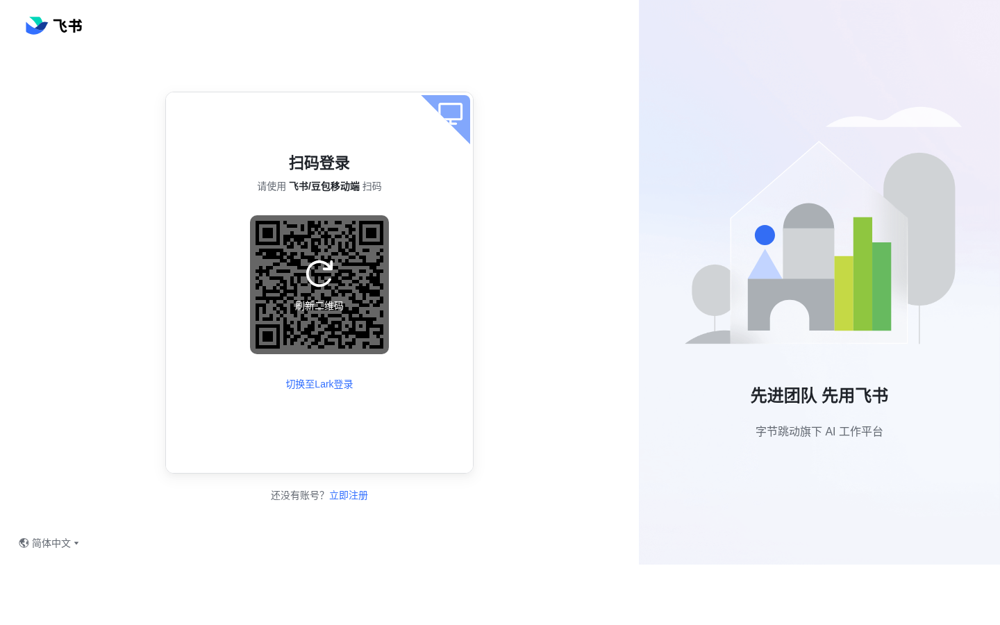

# 老算盘·拟物化拨珠

> 形态：交互组件（Component Lab）

一把可以上手把玩的老式中式算盘。按住一颗算珠沿竹档拨动——它有重量、有摩擦、撞到邻珠会把对方顶开、越过梁会"嗒"一声吸附卡入、松手还带着阻尼余震轻晃两下才停稳。读数随拨珠实时变化，口诀面板会告诉你这一手对应的是"一下五去四"还是"逢五进一"。可以随手拨，也可以让它出题考你珠算加法；一键清盘，算珠从左到右级联瀑布般归位。

## 截图

## 在线预览（妙搭）

https://dcniaqwtmoca.feishu.cn/page/XVwSmsiLadlpYoaTkqgcloOEn7b

## 手感五层
预接触微亮 → 按下吸附 → 拖动跟手（碰撞传递）→ 越梁吸附卡入 + 嗒声 → 松手阻尼余震 + 连锁衰减。全部 RAF 真实物理积分。

## 玩法
- 自由拨珠：实时读数 + 珠算口诀（八类真实口诀）
- 出题模式：随机加法题，拨对盖朱砂"对"印章
- 清盘：级联瀑布式归位

## 文件说明
- `index.html` — 单文件完整实现（纯 vanilla）
- `设计规范.md` — 物理模型 / 五层反馈 / 色彩 / 字体
- `preview.png` — 渲染截图（1440×900）

## 技术栈
纯 HTML + CSS + JavaScript 单文件，无框架、无 CDN。RAF 弹簧-阻尼-碰撞物理；WebAudio 合成木质"嗒"声；`visibilitychange` 暂停、`prefers-reduced-motion` 降级；自定义算珠光标三态。

## 设计观点
组件的价值不在炫技，而在"这颗珠子摸起来像真的"——让用户想再拨一下。
