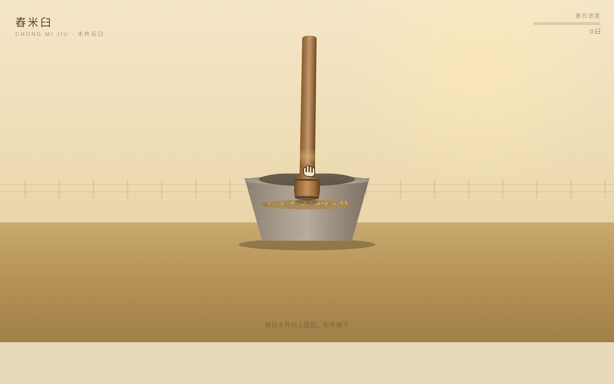

# 舂米臼 — 交互组件 Mock

> 抓住木杵往上提，提得越高越沉手；松手砸进石臼，谷壳裂开，米粒溅起。

## 预览

**妙搭在线预览**：https://dcniaqwtmoca.feishu.cn/page/EMCsmy3D3dKPqEaEIdecbSm8nSb

## 项目信息

- **类别**：V3 交互组件（组件/）
- **主题**：农家舂米——木杵与石臼的体力活
- **核心创意**：把「舂」的坠手感翻译成拖拽阻力 + 冲击反馈：提得越高越沉，松手落体砸臼，臼跳米溅，壳裂计数
- **风格**：米白 `#f5e6c8` / 谷壳金 `#d4a84a` / 原木 `#a67c4e` / 青灰石 `#7a7064`

## 把玩方式

1. 光标靠近木杵握柄，握痕亮起——可以抓了
2. 按住往上提：越高越沉，杵身微颤，阻力真实递增
3. 提过裂壳线，谷壳裂纹预告出现
4. 松手：木杵自由落体砸进石臼，臼体下沉回弹，米粒四溅，尘雾弥散
5. 反复舂击，计数器累积，谷粒逐步脱壳成米

## 文件说明

| 文件 | 说明 |
|------|------|
| `index.html` | 完整单文件实现（41KB，纯 vanilla，零外部依赖） |
| `设计规范.md` | 五层反馈机制 / 色彩 / 动效系统详解 |
| `preview.png` | 组件截图 |
| `README.md` | 本文件 |

## 技术栈

- 纯 vanilla HTML/CSS/JS 单文件，无 React / Babel / CDN（从根上规避白屏）
- Canvas 2D + 自绘物理模型（重力 / 速度 / 弹跳 / 阻尼）
- RAF 主循环随页面可见性暂停，`prefers-reduced-motion` 降级
- 自定义光标：开页居中、握合形变、层级最高

## 质量记录

- Browser QA：2 个宽度零 Console Error、零 404、截图像素 std 37.1
- 深度交互验证：拖拽木杵提升松手 → 舂击计数 +1
- Quality Gate：PASS（Contract Fidelity = FULL）

---

*Art Director 决策：batch11 / 2026-08-19*
