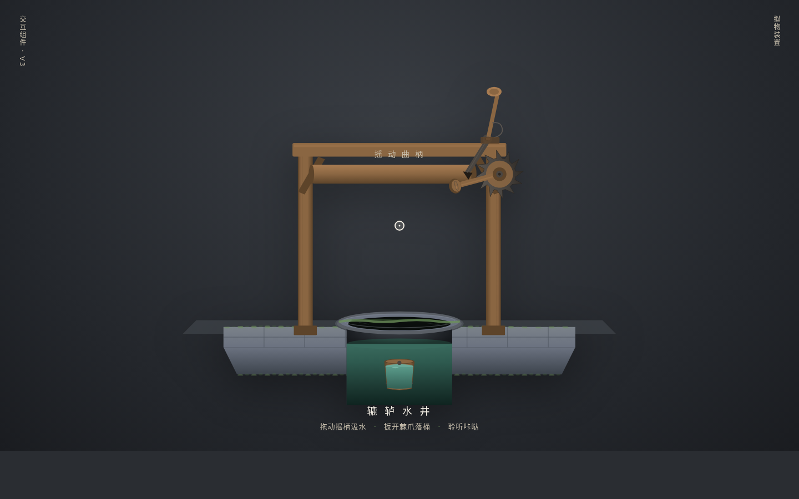

# 辘轳水井 · 拟物化机械组件实验室

**类别**：组件/交互实验室　**日期**：2026-08-19

## 主题
一口老井上的木制辘轳——摇动曲柄把水桶从井底摇上来，扳开棘爪它就掉回井底。整页只此一件装置，做到极致。

## 简介
拖拽曲柄旋转（角速度跟手，松手惯性衰减），绳在轴上可见缠绕/松脱，桶随绳长升降；棘轮每过一齿「咔哒」一档，棘爪防倒转；扳开棘爪杆，桶自由落体坠落、曲柄被绳带着倒转飞旋、落井闷响水花溅起。桶内水体随加速度单摆晃动，桶到井口时水微微晃出。光标驱动，非键盘操作。

## 截图

## 妙搭预览链接
https://dcniaqwtmoca.feishu.cn/page/CUDbmMAX8daUzYaTmC2ctWTZnhb

## 文件说明
- `index.html`：纯 vanilla 单文件（HTML+CSS+JS+SVG，无 React/Babel/CDN/外部图片）
- `设计规范.md`：色值/字体/物理动效系统/五层反馈链
- `preview.png`：1440×900 截图

## 技术栈
纯 vanilla 单文件，SVG 绘制装置，requestAnimationFrame 物理主循环（角速度+摩擦/棘轮档位/阻尼弹簧/水体单摆），无 CSS keyframe。页面不可见暂停 RAF、卸载取消；快速操作不叠加定时器；`prefers-reduced-motion` 降级；自定义光标三态开页居中高对比。Browser QA：1440/800 渲染正常、无 console 严重错误。17+ 组件级特效。

## 设计要点
- 五层反馈：pre-contact（柄头发光/光标变手型）→ contact（阻尼吸附）→ continuous（跟手/绳缠绕/棘轮咔哒）→ threshold（井口溢流/扳爪逆转）→ release/decay（坠落惯性/水花涟漪渐隐）。
- Signature Moment：摇到井口后扳开棘爪，桶带绳呼啸坠回井底、闷响水花。
- 物理模型绝不 linear；水花粒子仅坠落瞬间产生，与输入有因果。
- 青砖灰 + 木棕 + 井水青绿中式老井配色，禁蓝紫；中文标签为主。
