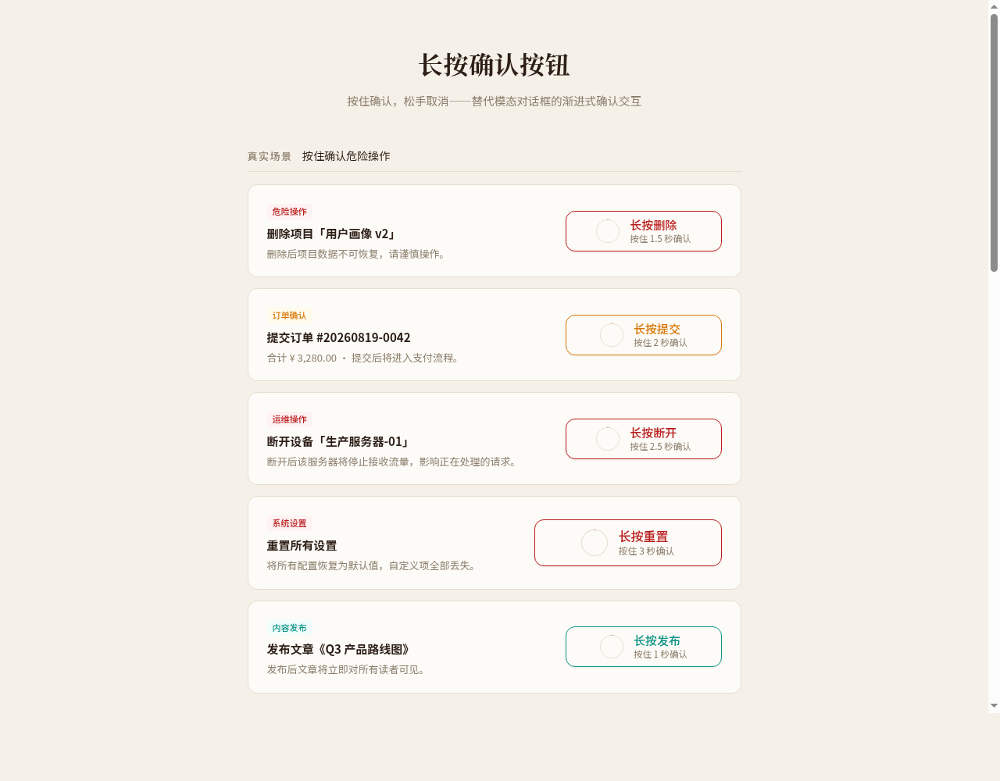

# 长按确认按钮（Long-Press Confirm Button）

生产级长按确认 UI 组件。按住按钮触发危险操作，SVG 进度环实时反馈进度，松手弹簧回弹取消，完成后进入成功态。完整键盘支持、9 态状态机、CSS 变量主题化、三种语义变体。纯 vanilla 单文件，无依赖。



**在线预览**：https://dcniaqwtmoca.feishu.cn/page/SBbtm0BWTdEKKeaDOFXcMM2LnEb

## 简介

长按确认按钮是一种渐进式确认交互组件，用按住-填充-释放的手势替代模态对话框，适用于删除、提交、断开连接等不可逆操作。用户按住按钮时 SVG 圆形进度环从顶部顺时针填充，达到 100% 阈值时触发确认（snap 闭合+成功勾画），提前松手则进度环弹簧回弹取消。

## 功能特性

- 指针 + 触屏 + 键盘全交互支持（Pointer Events 统一）
- SVG 圆形进度环，RAF 按真实经过时间 1:1 跟踪
- 弹簧回弹取消：松手时进度环以 `cubic-bezier(0.34, 1.56, 0.64, 1)` 300ms 弹回零
- 9 种状态：rest / hover / focus / pressing / progressing / confirmed / disabled / loading / error
- 三种语义变体：danger（红）/ warning（琥珀）/ info（青绿），驱动进度环色
- 三套内置主题：暖陶 / 冷石 / 暗夜，CSS 变量驱动
- 时长可配置（1s ~ 3s），展示页含时长切换器
- `lp:confirm` / `lp:cancel` 自定义事件
- 完整公开 API：reset / setError / setLoading / setDisabled / setDuration / getState
- 支持 `prefers-reduced-motion` 降级
- 页面切后台自动取消，卸载清理全部事件和定时器

## 快速使用

### 1. 引入 CSS

复制 `index.html` 中 `<style id="lp-component-styles">` 内的所有内容，或保存为 `lp-button.css`。

```html
<link rel="stylesheet" href="lp-button.css">
```

### 2. 引入 JS

复制 `<script id="lp-component-script">` 内的所有内容，或保存为 `lp-button.js`。

```html
<script src="lp-button.js"></script>
```

### 3. HTML 结构

最简结构：

```html
<button class="lp-btn lp-btn--danger" data-lp
        data-label="长按删除" data-success-label="已删除"
        data-hold-duration="1500"
        role="button" tabindex="0"
        aria-label="长按删除项目">
  <svg class="lp-ring" viewBox="0 0 100 100" aria-hidden="true">
    <circle class="lp-ring-track" cx="50" cy="50" r="46" fill="none" stroke-width="3" />
    <circle class="lp-ring-progress" cx="50" cy="50" r="46" fill="none" stroke-width="3"
            stroke-linecap="round" transform="rotate(-90 50 50)" />
  </svg>
  <span class="lp-content">
    <span class="lp-label">长按删除</span>
    <span class="lp-hint">按住 1.5 秒确认</span>
  </span>
  <svg class="lp-check" viewBox="0 0 24 24" aria-hidden="true">
    <polyline points="5,12 10,17 19,7" fill="none" stroke-width="2.5"
              stroke-linecap="round" stroke-linejoin="round" />
  </svg>
</button>
```

### 4. 初始化

JS 会自动查找所有 `[data-lp]` 元素并初始化。也可以手动调用：

```js
// 单个
initLongPress('#my-btn', {
  duration: 1500,
  onConfirm: function(btn) {
    console.log('确认！', btn);
  }
});

// 批量（默认选择器 '[data-lp]'）
initLongPress();
```

## API

### HTML 属性

| 属性 | 类型 | 默认 | 说明 |
|------|------|------|------|
| `data-label` | string | `"长按确认"` | 按钮显示文案 |
| `data-success-label` | string | — | 成功后显示的文案 |
| `data-hold-duration` | number | `1500` | 长按完成所需毫秒数 |
| `data-auto-reset` | number/string | `2000` | 成功后自动恢复的毫秒数，设为 `"false"` 禁用 |

### JS 方法

初始化后，按钮上挂载 `.lp` 对象，可调用：

```js
var btn = document.querySelector('.lp-btn');

btn.lp.reset();            // 重置到 rest 状态
btn.lp.setError();         // 设置错误态（红色边框，1.5s 后恢复）
btn.lp.setLoading('正在删除...');  // 设置加载态（spinner + 自定义文案）
btn.lp.setDisabled(true);  // 禁用 / 启用
btn.lp.setDuration(2000);  // 动态修改长按时长
btn.lp.getState();         // 获取当前状态字符串

btn.__lpDestroy();         // 卸载清理（移除所有事件监听和定时器）
```

### 事件

| 事件名 | 触发时机 | `event.detail` |
|--------|----------|----------------|
| `lp:confirm` | 长按完成、进入成功态时 | `{ button: HTMLElement }` |
| `lp:cancel` | 中途松开 / 取消时 | `{ button: HTMLElement }` |

```js
btn.addEventListener('lp:confirm', function(e) {
  // 执行实际删除操作
  fetch('/api/delete', { method: 'POST' });
});
```

## 变体

### 语义变体

通过 class 控制按钮的语义色，驱动进度环颜色、边框和 hover 浅底：

| 变体 | class | 进度环色 | 适用场景 |
|------|-------|---------|---------|
| 危险 | `.lp-btn--danger` | 红色 | 删除、断开、注销 |
| 警告 | `.lp-btn--warning` | 琥珀色 | 付款、提交订单 |
| 信息 | `.lp-btn--info` | 青绿色 | 发布、重置 |

```html
<button class="lp-btn lp-btn--danger" data-lp data-label="长按删除">
  <!-- 内部结构同上 -->
</button>
```

### 大号

加 `lp-btn--lg` class，进度环更大、字号更大。

```html
<button class="lp-btn lp-btn--danger lp-btn--lg" data-lp data-label="长按删除">
  <!-- 内部结构同上 -->
</button>
```

## 主题切换

通过 `<html>` 根元素的 `data-theme` 属性切换：

```html
<html data-theme="warm">   <!-- 暖陶（默认） -->
<html data-theme="cool">   <!-- 冷石 -->
<html data-theme="dark">   <!-- 暗夜 -->
```

也可以直接覆盖 CSS 变量自定义主题：

```css
:root {
  --lp-variant-color: #6366F1;
  --lp-danger: #DC2626;
  --lp-warning: #F59E0B;
  --lp-info: #0891B2;
  --lp-success: #16A34A;
  --lp-bg: #FAFAFA;
  --lp-text: #111827;
  --lp-radius: 8px;
  --lp-hold-duration: 1500ms;
}
```

## 键盘操作

| 按键 | 功能 |
|------|------|
| `Tab` | 聚焦按钮 |
| `Space` | 按住开始计时，松开取消 |
| `Enter` | 按住开始计时，松开取消 |
| `Esc` | 按下中立即取消（震动反馈） |

## 无障碍（A11y）

- `role="button"` + `tabindex="0"` 确保键盘可达
- `aria-pressed` / `aria-busy` / `aria-valuenow` 实时更新
- `:focus-visible` 焦点环可见
- `aria-label` 支持屏幕阅读器
- `prefers-reduced-motion` 降级为瞬时操作

## 浏览器支持

- Chrome / Edge 60+
- Firefox 59+
- Safari 13+
- 移动端：iOS Safari 13+，Chrome Android

依赖特性：Pointer Events、SVG、CSS 变量、requestAnimationFrame、CustomEvent。

## 文件说明

| 文件 | 说明 |
|------|------|
| `index.html` | 完整组件 + 展示页（单文件，CSS/JS 内联，可独立抽取） |
| `preview.png` | 组件截图 |
| `设计规范.md` | 色彩/字体/动效系统设计规范 |
| `README.md` | 本文档（用法、API、定制方法） |

## 技术栈

- 纯 vanilla HTML + CSS + JS（无 React / Babel / CDN 框架）
- SVG 进度环（stroke-dasharray / stroke-dashoffset，viewBox 100×100，r=46）
- Pointer Events 统一鼠标/触屏 + setPointerCapture
- CSS 自定义属性（--lp-* 变量）主题化
- requestAnimationFrame 按真实经过时间驱动进度
- 弹簧回弹：取消时 .lp-spring-back 类启用 300ms cubic-bezier 过渡
- 字体：Noto Sans SC / Noto Serif SC（miaoda 字体镜像）

## 可配置项

| 配置 | 方式 | 默认值 | 说明 |
|------|------|--------|------|
| 长按时长 | `data-hold-duration="1500"` | 1500ms | 达到此时长触发确认 |
| 按钮文案 | `data-label="长按删除"` | "长按确认" | 按钮显示文字 |
| 成功文案 | `data-success-label="已删除"` | — | 确认后显示文字 |
| 自动重置 | `data-auto-reset="2000"` | 2000ms | 成功后自动恢复，设 "false" 禁用 |
| 语义变体 | class: `lp-btn--danger` / `--warning` / `--info` | danger | 驱动进度环色 |
| 尺寸 | class: `lp-btn--lg` | 默认 | 大号 |
| 主题 | `<html data-theme="warm|cool|dark">` | warm | 三套内置主题 |
| 变体色 | `--lp-variant-color` CSS 变量 | #C2410C | 覆盖即可自定义 |

## 定制方法

1. **换变体色**：覆盖 `--lp-danger` / `--lp-warning` / `--lp-info` 或 `--lp-variant-color`
2. **换时长**：设置 `data-hold-duration` 属性或调用 `btn.lp.setDuration(ms)`
3. **换尺寸**：加 `lp-btn--lg` class 或自行覆盖 `.lp-btn` 的 height/padding
4. **换圆角**：覆盖 `--lp-radius`
5. **集成到项目**：复制 `<style id="lp-component-styles">` + `<script id="lp-component-script">` 两段代码到项目中，HTML 结构照搬即可，改不超过 3 处（变体色变量 / 按钮文案 / 确认回调）
