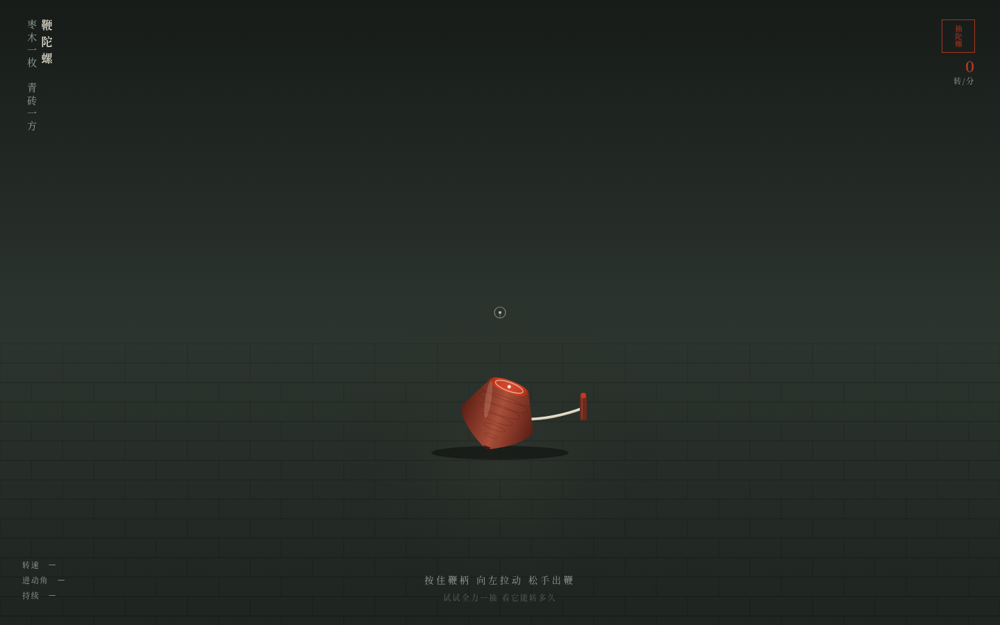

# 鞭陀螺 · 抽陀螺物理组件

**类别**：Component Mock　**日期**：2026-08-19

青砖地上的一枚枣木陀螺。按住鞭柄向左猛拉——绳圈逐圈解开、张力渐增；绳尽脱手，陀螺带着你给的全部力气飞旋：高速残影、进动摇晃、十余秒的优雅衰减，最后失稳倒下。拉得越狠，转得越久。右下角 ↺，再抽一次。

## 妙搭在线预览
https://dcniaqwtmoca.feishu.cn/page/ZbwumJIDqdc96NaJPz8cStWjnWc

## 核心体验
- 完整操作闭环：缠绕 → 拉鞭 → 释放 → 旋转 → 失稳 → 倒下
- 五层反馈：预接触微晃 / 抓握咬合 / 拉动连续响应 / 绳尽脱手 / 惯性长衰减
- 真实物理：角速度指数衰减 + 进动角随转速降低增大 + 末段章动失稳 + 重力弹跳
- 实时读数：转速 rpm、进动角、持续时间
- 16 个组件级特效，纯 vanilla 单文件实现

## 文件说明
- `index.html` — 完整实现（纯 vanilla HTML/CSS/JS，无 React / Babel / CDN）
- `设计规范.md` — 色彩 / 物理模型 / 反馈层次
- `preview.png` — 首页截图（1440px）
- `thumbnail.png` — 应用缩略图

## 技术栈
纯 vanilla 单文件；高频鼠标事件直接操作 DOM + requestAnimationFrame；RAF 随可见性暂停、卸载取消；快速操作不叠加定时器；支持 prefers-reduced-motion；自定义鞭梢光标。
