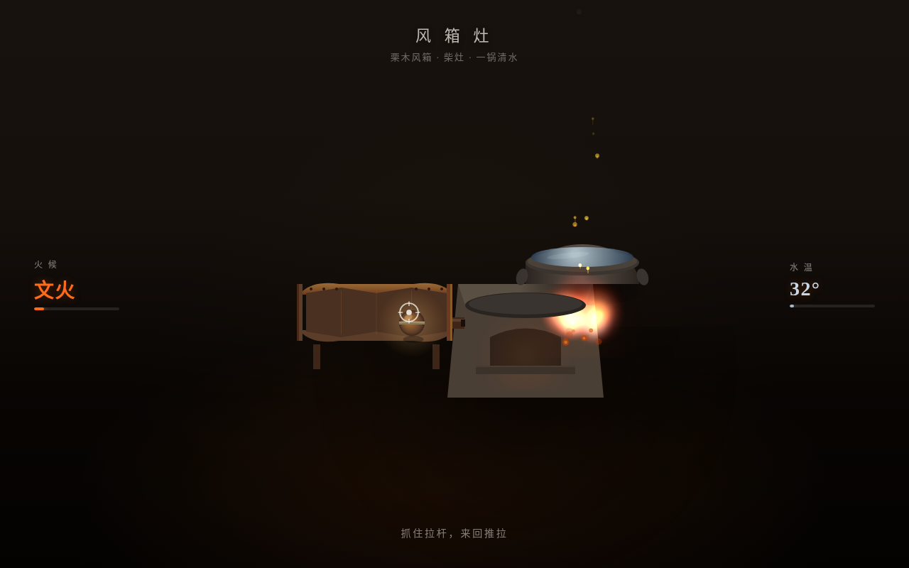

# 风箱灶 · Bellows Hearth

**类别**：组件 / 交互实验室（V3）　**日期**：2026-08-19

## 主题
拟物化交互组件：老式栗木风箱对着灶膛。抓住拉杆水平来回推拉，气流吹旺灶火；推得稳火越旺，越过阈值爆燃火星飞溅；停手火慢慢落回文火，锅底随累计风量升温至沸腾。

## 简介
单一核心组件做到极致，非组件库/展示页。设计母题：连续线性往返输入 → 累积态 → 自然衰减。反馈五层齐全——预接触（把手呼吸暖光）→ 接触咬合（拉杆微沉、皮革形变）→ 连续映射（气流速度实时映射火焰形态，皮革褶皱从 4 道增至 8 道）→ 阈值爆燃（火星瀑冲上锅底、锅体震动）→ 释放衰减（阻尼回位、火焰惯性摇摆、余烬明灭）。物理手感：弹簧-阻尼-质量模型 + 皮革非线性摩擦，无 linear 默认缓动。

签名时刻：连续匀速推拉后火焰越过阈值的那次爆燃——火星冲上锅底、水开始翻滚。

## 妙搭预览
https://dcniaqwtmoca.feishu.cn/page/IhiWmtLZxdqXnfaXDH3cf5ZsnJc

## 文件说明
- `index.html` —— 纯 vanilla 单文件（HTML+CSS+JS，无 React/Babel/CDN）
- `设计规范.md` —— 配色、物理参数、反馈五层、动效系统
- `preview.png` —— 1280×800 截图

## 技术栈
- 纯 vanilla 单文件，零外部依赖
- Canvas 粒子系统（火焰/火星/余烬/气流/气泡对象池复用）+ DOM 形变
- RAF 随可见性暂停、beforeunload 取消；高频事件直接操作 DOM；prefers-reduced-motion 降级
- 零未定义引用，Console 无错误

## 设计要点
- 唯一主操作：抓拉杆水平往返推拉（drag）
- 气流速度→火焰形态实时映射，无"触发即播放"动画
- 配色：灶膛炭黑 + 火焰橙红金 + 栗木棕 + 石灰白，无蓝紫渐变
- 中文状态文字（文火/中火/武火/爆燃、水温）
- 自定义十字准星光标，开页居中，三态形变
