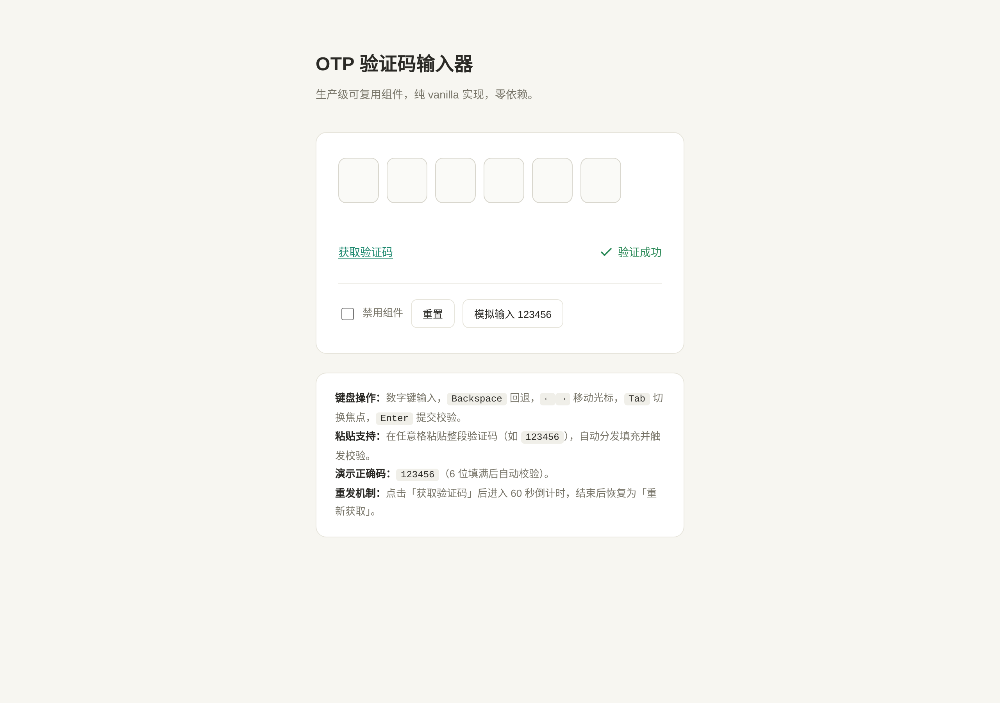

# OTP 验证码输入器 · 生产级可复用 UI 组件

> V3 交互组件 ｜ 2026-08-19 ｜ 输入类
> 形态：实用可复用 UI 组件（非拟物物理演示）

## 简介

一个开箱即用的 6 位验证码（OTP）输入组件。解决真实产品中「登录 / 支付 / 二次验证」场景的分格输入需求：自动跳格、退格回跳、粘贴整段分发、倒计时重发、完整状态机、全键盘可操作、CSS 变量主题化。开发者 copy-paste 到项目即可用，改 CSS 变量与配置项即可适配任意主题。

**设计取向**：中性文档风（暖白底 + 墨黑文字 + 青绿聚焦 + 朱红错误 + 苔绿成功），无蓝紫渐变，与拟物化物理装置风格彻底区分。展示页克制——组件是唯一主角。

## 预览

- 妙搭在线预览：https://dcniaqwtmoca.feishu.cn/page/SKMSmFfNBdFgQ0ao1AUcs6dVnbc



## 核心能力

- **分格输入**：6 位（可配），输入当前格自动跳下一格，填满自动校验。
- **退格回跳**：当前格有值清空当前格；当前格为空回跳上一格并清空。
- **粘贴分发**：在任意格粘贴整段验证码，自动分发到各格并触发校验。
- **键盘完整**：数字键输入、`Backspace` 回退、`←` `→` 移动光标、`Home`/`End` 跳首尾、`Tab`/`Shift+Tab` 切换、`Enter` 提交。
- **倒计时重发**：点击「获取验证码」后 60 秒倒计时（可配），按钮禁用并显示剩余秒数，结束后恢复为「重新获取」；页面隐藏时暂停、可见时恢复。
- **7 态状态机**：empty / focusing / filled / verifying / error（420ms 阻尼抖动并清空）/ success（对勾）/ disabled。
- **可访问性**：`role="group"` + `aria-label` + `aria-live`，roving tabindex，焦点环可见，`inputMode=numeric` 触屏，`autocomplete=one-time-code`，`prefers-reduced-motion` 动效降级。

## 用法

### 1. 引入

单文件 `index.html` 内含组件 HTML 结构、CSS、JS。复制组件本体（源码中 `<!-- OTP 组件本体（从这里开始复制） -->` 到 `<!-- 到这里结束 -->` 之间的 `.otp` 容器）到你的页面，并带走 `<style>` 中 `.otp` 相关样式与 `<script>` 中的 `OTPInput` 构造函数。

### 2. HTML 结构

```html
<div class="otp" id="otpDemo" role="group" aria-label="验证码输入">
  <div class="otp__cells" role="presentation"></div>
  <div class="otp__status" aria-live="polite"></div>
  <div class="otp__actions">
    <button type="button" class="otp__resend">获取验证码</button>
    <span class="otp__success-badge" hidden>验证成功</span>
  </div>
</div>
```

### 3. 初始化

```js
var otp = new OTPInput('#otpDemo', {
  length: 6,            // 位数，默认 6，可改 4 / 5 等
  correctCode: '123456',// 正确验证码（演示用；真实场景接后端校验）
  countdown: 60,        // 重发倒计时秒数
  onComplete: function (code) { /* 填满时回调 */ },
  onSuccess: function (code) { /* 校验成功回调，code 为输入值 */ },
  onError:   function (code) { /* 校验失败回调 */ }
});
```

### 4. 对外 API

| 方法 | 说明 |
|---|---|
| `otp.setValue(code)` | 程序化填入（填满自动校验） |
| `otp.getValue()` | 取当前输入值 |
| `otp.clear()` | 清空并重置到初始态、聚焦第一格 |
| `otp.setDisabled(bool)` | 禁用 / 启用整个组件 |
| `otp.destroy()` | 清理定时器，销毁实例 |

## 可配置项

### JS 配置（构造参数）

`length`（位数）、`correctCode`（正确码）、`countdown`（倒计时秒数）、三个回调。

### CSS 变量主题化（20 个，改这些即可适配项目主题）

在 `.otp` 作用域覆盖即可，无需改组件源码：

```css
.otp {
  --otp-primary: #1f8a70;      /* 主色 / 聚焦 */
  --otp-bg: #fafaf7;           /* 格背景 */
  --otp-border: #d9d7ce;       /* 默认描边 */
  --otp-focus: #1f8a70;        /* 聚焦描边 */
  --otp-error: #d64b3c;        /* 错误色 */
  --otp-success: #2e8b5a;      /* 成功色 */
  --otp-text: #2b2a26;         /* 文本色 */
  --otp-radius: 10px;          /* 圆角 */
  --otp-cell-w: 52px;          /* 单格宽 */
  --otp-cell-h: 58px;          /* 单格高 */
  --otp-font-size: 22px;       /* 数字字号 */
  --otp-anim-duration: 240ms;  /* 过渡时长 */
  /* …共 20 个，详见设计规范.md */
}
```

**集成成本**：抽到别的项目，改不超过 3 处即可用——① 改 CSS 变量适配主题；② 改 `correctCode` / 接后端校验；③ 改 `length` / `countdown` 配置。

## 文件说明

| 文件 | 说明 |
|---|---|
| `index.html` | 组件完整源码（HTML + CSS + JS 单文件），含展示页 |
| `设计规范.md` | 真实色值 / 字体 / 动效系统 / 状态机 / 可访问性规范 |
| `preview.png` | 组件渲染截图 |
| `README.md` | 本文件（用法 / 配置 / 定制方法） |

## 技术栈

- 纯 vanilla：HTML + CSS + JavaScript（ES5 兼容），无 React / Babel / CDN / 外部依赖。
- 零未定义引用、零运行时崩溃、Console 无错误。
- 定时器随页面可见性暂停与恢复，`destroy()` 统一清理。
- `prefers-reduced-motion` 动效降级。

## 演示

- 演示正确码：`123456`（6 位填满后自动校验，成功显示对勾；输入其他 6 位数字会触发错误抖动并清空）。
- 展示页提供「禁用组件」开关、「重置」、「模拟输入 123456」按钮，便于查看各状态。
- 在任意格粘贴整段数字会自动分发填充。

## 自查结论

- [x] 状态机 7 态全覆盖（empty/focusing/filled/verifying/error/success/disabled）
- [x] 键盘全可操作，焦点环可见，aria-* 正确
- [x] CSS 变量 20 个（≥12 要求），位数 / 倒计时 / 正确码均可配
- [x] 纯 vanilla 单文件，零依赖，Console 无错误
- [x] `prefers-reduced-motion` 动效降级
- [x] Browser QA 实测：6 格渲染、无白屏、无 Console Error、截图非空白（147.9KB）
- [x] 交互实测：正确码→成功、错误码→抖动清空、粘贴分发→成功（setValue 修复后自动校验）
- [x] 删除装饰动效后功能仍完整
- [x] 抽到别的项目改不超过 3 处可用

等待协调者检查后提交 GitHub。
