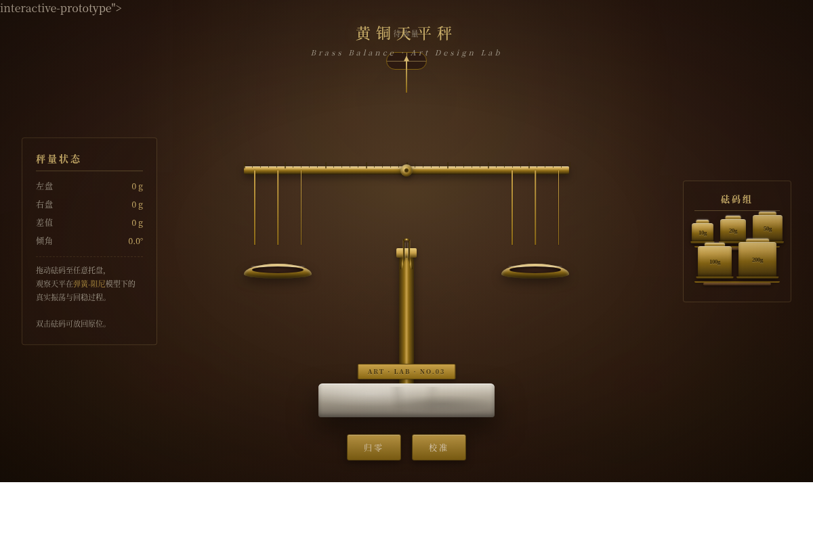

# 黄铜天平秤 · V3 交互组件

**日期**：2026-08-19
**方向**：V3 交互组件
**主题**：黄铜天平秤 — 可拖拽砝码的物理力矩平衡交互组件

## 简介

一台可操作的黄铜天平秤。用户从旁边的砝码架拖拽不同重量的砝码（10g/20g/50g/100g/200g）放到左右托盘上，横梁根据力矩（重量×臂长）实时倾斜，平衡时指示灯亮起，释放后经历 2-3 次阻尼衰减振荡后稳定。

## 截图展示

## 动效亮点

- 弹簧-阻尼物理模型（非 linear/ease）：横梁释放后 2-3 次衰减振荡
- 磁吸平衡点：接近水平时吸附力增强
- 五层反馈：预接触（托盘微晃）→接触（抓取）→持续（横梁实时倾斜）→阈值（平衡指示灯）→释放（阻尼振荡+余震）
- 砝码拖拽发光 + 落尘粒子 + 堆叠排列
- 指针放大摆动 + 吊架保持垂直 + 绳索微张变形
- 环境光呼吸 + 大理石底座纹理 + 铭牌雕刻质感
- 自定义光标（黄铜镊子形态，抓取时张开）
- 归零/校准按钮 + 可见性暂停 + 倾角反弹

## 交互说明

| 操作 | 效果 |
|------|------|
| 拖拽砝码到托盘 | 砝码放置，横梁根据力矩倾斜 |
| 双击托盘上的砝码 | 砝码飞回砝码架 |
| 点击"归零" | 清空所有砝码，横梁回水平 |
| 点击"校准" | 横梁微调至精确水平 |
| 悬停托盘 | 托盘微晃（预接触反馈） |

## 妙搭预览链接

https://dcniaqwtmoca.feishu.cn/page/Tj0lmk7Asd5Ka4a92XZcTgGZnEg

## 文件说明

| 文件 | 说明 |
|------|------|
| index.html | 完整源码（纯 vanilla 单文件） |
| 设计规范.md | 设计规范文档 |
| preview.png | 1200×800 桌面端截图 |
| thumbnail.png | 妙搭自动生成缩略图 |

## 技术栈

- 纯 HTML/CSS/JS（vanilla，无 React/Babel/CDN）
- JS requestAnimationFrame 驱动物理引擎（弹簧-阻尼系统）
- Georgia + Songti SC 衬线字体
- 支持 prefers-reduced-motion
- 自定义光标系统（黄铜镊子）
