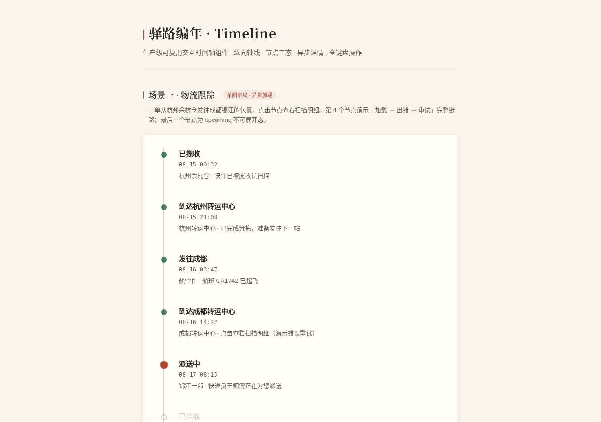
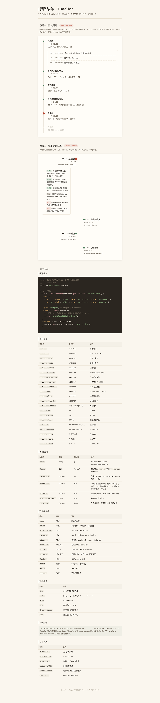

# 驿路编年 · 交互时间轴组件 V3

> 生产级可复用交互时间轴 UI 组件 · 2026-08-20 · 数据展示类

## 简介
一个可以直接 copy-paste 到真实项目里使用的时间轴组件。纵向轴线是空间主轴，节点沿轴分布，点击或键盘展开节点详情时**轴段向下「生长」、详情从轴线上长出**。覆盖物流跟踪、版本日志、项目里程碑、审批流转等高频场景。

核心特性：
- **12 态完整状态机**：节点 rest/hover/focus/expanded/disabled + 语义 completed/current/upcoming + 详情 loading/error/empty/success
- **全键盘可操作**：roving tabindex，↑↓/Home/End/Enter/Space/Esc，焦点环可见
- **CSS 变量主题化**：22 个 `--tl-*` 变量，改主题不动逻辑
- **JS 配置化 + 公开 API**：`new Timeline(el, opts)`，含 `expand/collapse/toggle/collapseAll/update/destroy`
- **异步详情**：`loadDetail` 回调，内置 token 去重防止快速点击叠加请求，loading→error→重试→empty 全链路可演示
- **纯 vanilla 单文件**：零外部依赖，CSS/JS 用注释边界标记可整块抽取
- **可访问性**：完整 ARIA 语义，`prefers-reduced-motion` 降级，`visibilitychange` 暂停动画

## 截图预览





## 妙搭在线预览
https://dcniaqwtmoca.feishu.cn/page/EP8PmrBUCdGOxqa1zxpcbEuBnPg

## 用法文档

### 快速接入
```html
<!-- 1. 容器 -->
<div id="tl"></div>

<!-- 2. 引入组件 CSS/JS（从本文件 BEGIN/END 标记间抽取） -->

<!-- 3. 初始化 -->
<script>
  const tl = new Timeline(document.getElementById('tl'), {
    items: [
      { id:'s1', title:'已揽收', meta:'08-15 09:32', state:'completed', detail:'杭州余杭仓·快件已被揽收员扫描' },
      { id:'s2', title:'派送中', meta:'08-17 08:15', state:'current' },
      { id:'s3', title:'已签收', meta:'待送达', state:'upcoming' }
    ],
    layout: 'single',          // 'single' | 'alternate'
    expandable: true,
    loadDetail: async (item) => {   // 可选：异步加载详情
      const res = await fetch('/api/scan?id='+item.id);
      if(!res.ok) throw new Error('加载失败'); // 触发 error 态
      const data = await res.json();
      if(!data.records.length) return '';      // 触发 empty 态
      return data.records.map(r=>`<p>${r.time} ${r.desc}</p>`).join('');
    },
    onChange: (id, expanded) => console.log(id, expanded),
    initialExpandedId: 's1'
  });
  // 公开 API
  tl.expand('s2'); tl.collapseAll(); tl.update(newItems); tl.destroy();
</script>
```

### CSS 变量（主题化）
| 变量 | 默认值 | 说明 |
|---|---|---|
| `--tl-bg` | `#FAF6EE` | 页面/容器底色 |
| `--tl-text` | `#2B2620` | 主文字色 |
| `--tl-axis-color` | `#D8CFC0` | 轴线色 |
| `--tl-node-done` | `#4A7C59` | 已完成节点 |
| `--tl-node-current` | `#B4432F` | 当前节点 |
| `--tl-node-pending` | `#A39B8B` | 待完成节点 |
| `--tl-accent` | `#8C6A2F` | 强调/链接 |
| `--tl-radius` | `10px` | 圆角 |
| `--tl-duration` | `300ms` | 过渡时长 |
| `--tl-easing` | `cubic-bezier(0.22,0.61,0.36,1)` | 缓动 |
| `--tl-font-title` | `serif` | 标题字体栈 |
| `--tl-font-mono` | `monospace` | 日期数字字体栈 |

（共 22 个，详见源码 `:root` 块）

### JS 配置项
| 配置项 | 类型 | 默认 | 说明 |
|---|---|---|---|
| `items` | Array | `[]` | 节点数据，每项含 `id/title/meta/state/detail` |
| `layout` | String | `single` | `single` 单侧 / `alternate` 左右交替 |
| `expandable` | Boolean | `true` | 是否可展开 |
| `loadDetail` | Function | `null` | 异步加载详情，返回 HTML/DOM；抛错→error；返回空→empty |
| `onChange` | Function | `null` | 展开/收起回调 `(id, expanded)` |
| `accordion` | Boolean | `false` | 手风琴模式（同时只展开一项） |
| `initialExpandedId` | String | `null` | 初始展开节点 |

### 节点状态机
| 状态 | 触发 | 视觉 |
|---|---|---|
| rest | 默认 | 灰底节点 |
| hover | 鼠标悬停 | 节点上浮+底色加深 |
| focus | 键盘聚焦 | 焦点环可见 |
| expanded | 展开 | 节点填实+详情区展开 |
| disabled | 不可操作 | opacity 0.5 + not-allowed |
| completed | 语义态 | 竹青实心 |
| current | 语义态 | 赭红实心+呼吸脉冲 |
| upcoming | 语义态 | 灰空心，不可展开 |
| loading | 详情加载中 | 骨架 shimmer |
| error | 详情加载失败 | 错误图标+重试按钮 |
| empty | 详情无数据 | 「暂无记录」 |
| success | 详情加载成功 | 正常渲染内容 |

### 键盘操作
`Tab` 进入容器 → `↑/↓` 节点间移动 → `Home/End` 跳首尾 → `Enter/Space` 展开收起 → `Esc` 收起。

### 可访问性
节点 `button[aria-expanded][aria-controls]`，详情 `role="region"`，loading 用 `aria-busy`，禁用 `aria-disabled`；`prefers-reduced-motion` 下全部动画降级为瞬时切换。

## 展示页场景
1. **物流跟踪**（单侧布局 + 异步详情）：杭州→成都 6 节点，第 4 节点演示 loading→error→重试→empty 完整链路，最后 upcoming 不可展开。
2. **版本更新日志**（左右交替 + 静态详情）：拾光笔记 v2.4.0→v2.2.1 四版 changelog。

## 文件说明
- `index.html` — 组件 + 展示页单文件（CSS/JS 用 `BEGIN/END` 注释边界标记，可整块抽取）
- `设计规范.md` — 设计母题、色彩、字体、动效、状态机规范
- `preview_top.png` / `preview_expanded.png` — 截图
- `README.md` — 本文件

## 技术栈
纯 vanilla HTML + CSS + JS，零外部依赖（无 React/Babel/CDN/外链字体图片）。

## 自查结论
- [x] 状态机 12 态全部可见可操作
- [x] 全键盘可完成浏览与展开收起（实测 Tab/方向键/Enter/Esc）
- [x] 删除所有动画后组件功能完整（reduced-motion 降级）
- [x] 抽到别的项目改 CSS 变量 + 传 items 即可用（≤3 处）
- [x] Browser QA：无 Console error、无 404、截图非空白（std>5）
- [x] 禁蓝紫渐变、无毛玻璃、无发光球、无 Lorem Ipsum

## 协作说明
本作品等待协调者（心跳检查）质检通过后统一提交 GitHub，本任务不执行 git add/commit/push。
