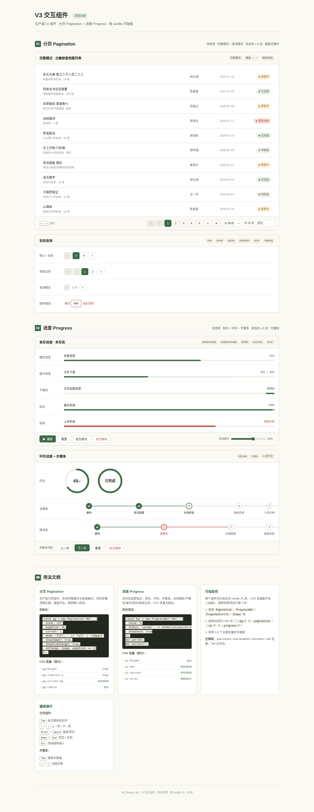

# 苔径 · 分页与进度组件

> Art 设计实验室 V3 · 实用可复用 UI 组件 · 2026-08-20
> 类别：导航类（分页）+ 反馈类（进度）组件对



- **妙搭预览**：https://dcniaqwtmoca.feishu.cn/page/Y9rkmBTRbdXfFTaEiX6cOFCEnSc
- **主题**：苔径——苔绿 `#3E6B48` + 蜜黄 `#E3B23C` + 纸白 `#FBF9F4` + 墨色 `#23281F`，浅色克制、无渐变堆叠。
- **宿主场景**：「古籍修复档案」数据列表（50 条真实书名 / 修复师 / 状态），组件作为列表的脚部导航与状态反馈。

## 简介

两个真实项目高频复用的生产级 UI 组件，以数据列表场景为展示载体并排呈现全部状态变体。每个组件状态机完整、键盘全可操作、CSS 变量主题化、代码可独立抽取，开发者 copy-paste 到自己项目改不超过 3 处即可用。

### 1. 分页 Pagination

- **完整模式**：首页 / 上一页 / 页码折叠省略 / 下一页 / 末页 + 跳转输入 + 每页条数切换 + 总数信息。
- **紧凑模式**：仅前后箭头 + `当前 / 总数`，适合移动端。
- **页码折叠算法**：`1 … c-1 c c+1 … n`，边界不重复不遗漏。
- **状态机**：rest / hover / focus / active / disabled（边界首末页）/ loading（列表骨架 600ms 异步）/ error（跳转非法值抖动 + `aria-invalid`）。
- **键盘**：`←` `→` 翻页、`Home`/`End` 首末页、`Enter` 跳转、`Esc` 清空、`Tab` 全可达；重建后焦点自动恢复到当前页，连续导航不中断。
- **手感**：当前页指示块弹簧滑入 250ms `cubic-bezier(0.34,1.56,0.64,1)`。

### 2. 进度 Progress

- **条形** 5 态：determinate（0-100 可控）/ indeterminate（循环流动）/ buffer（双层 已加载+缓冲）/ success（变绿 + 勾号描边）/ error（变红）。
- **环形**：determinate 带百分比，SVG `stroke-dashoffset`。
- **步骤条** 4 态节点：未完成 / 当前 / 完成 / 错误，连线随状态推进。
- **播放控制**：RAF 驱动模拟真实推进，页面隐藏自动暂停。
- **手感**：determinate `ease-out` 300ms；success 勾号描边收笔 400ms；indeterminate 线性循环 1.2s。

## 用法文档

### 分页

```js
const pg = new Pagination('#pg-root', {
  total: 50,            // 总条数
  pageSize: 10,         // 每页条数
  current: 1,           // 当前页
  mode: 'full',         // 'full' | 'compact'
  showSizeChanger: true,
  pageSizeOptions: [5, 10, 20, 50],
  showJumper: true,
  onChange: (page, size) => { /* 拉取新页数据 */ },
  onShowSizeChange: (page, size) => {}
});
```

### 进度条

```js
const bar = new ProgressBar('#bar', {
  value: 0,             // determinate 0-100
  status: 'determinate',// 'determinate' | 'indeterminate' | 'buffer' | 'success' | 'error'
  buffer: 60,           // buffer 态的缓冲值
  showLabel: true
});
bar.setValue(72);
bar.setStatus('success');
```

### 步骤条

```js
const steps = new Steps('#steps', {
  current: 2,
  steps: ['录入', '初审', '修复', '复审', '归档']
});
```

## 可配置项 / 定制方法

主题换色只需改根变量（≤3 处即可整体换肤）：

```css
:root {
  --color-primary: #3E6B48;   /* 主色 → 换成你的品牌色 */
  --color-accent: #E3B23C;    /* 焦点环强调色 */
  --color-bg: #FBF9F4;        /* 底色 */
}
```

分页专属：`--pg-height` / `--pg-item-min-w` / `--pg-radius` / `--pg-current-bg` / `--pg-focus-ring`。
进度专属：`--pr-height` / `--pr-circle-size` / `--pr-duration` / `--pr-success` / `--pr-error`。

## 文件说明

| 文件 | 说明 |
|---|---|
| `index.html` | 主展示页（单文件，含两组件全部状态变体 + 用法代码示例 + 状态展示柜） |
| `V3-分页+进度-苔径.html` | 组件归档副本（与 index.html 同内容） |
| `preview.png` | 全页截图（1440×3713） |
| `设计规范.md` | 色值 / 字体 / 动效 / 状态机 / 可访问性规范 |
| `README.md` | 本文件 |

## 技术栈

纯 vanilla 单文件（HTML + CSS + JS），无 React / Babel / CDN / 外部字体图片。组件类 `Pagination` / `ProgressBar` / `Steps` 可从文件中整段抽取。`prefers-reduced-motion` 全局降级；RAF / 定时器随 `visibilitychange` 暂停、卸载取消；快速点击 `_loading` 锁防叠加。

## 自查结论

- 浏览器 QA（1440 / 768 / 390px）：零 Console Error、零 PageError、零 404、无横向溢出；截图像素 std 25.31（非空白）。
- 交互：页码点击、跳转非法值 error 态、连续键盘 ←→ / Home / End、焦点恢复、进度 5 态、环形、步骤 4 态均已实测通过。
- 删掉全部动画后两组件功能完整可用；组件代码改 ≤3 处 CSS 变量即可换主题。
- 已修复 1 个 MAJOR（分页重渲染后焦点丢失导致连续键盘导航中断），已重新发布妙搭应用同步修复。

**等待协调者检查后提交 GitHub。**
