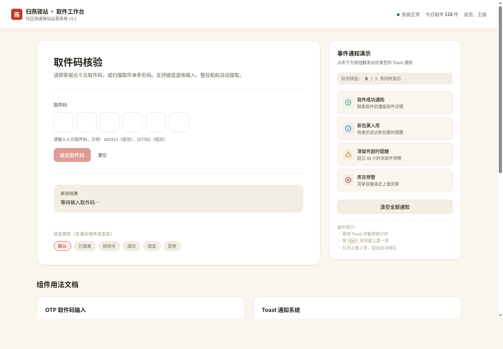

# 归燕驿站 · 取件码输入（OTP）+ Toast 通知系统

> 2026-08-20 · V3 交互组件 · 生产级可复用 UI 组件对
> 纯 vanilla 单文件，无 React / Babel / CDN / 外部字体硬依赖

## 主题

「归燕驿站」社区快递驿站取件工作台。一次产出两个生产级、可直接搬进真实项目的 UI 组件：**OTP 取件码输入**（输入类）与 **Toast 通知系统**（反馈类）。顾客报 6 位取件码 → 店员逐格输入 → 异步校验 → 成功/失败反馈 → Toast 队列播报后续事件。两个组件类别正交、状态机各自完整，在宿主场景自然串联。



**妙搭预览链接**：https://dcniaqwtmoca.feishu.cn/page/QAJAm6IQodMRzlayHv5cMLyDnab

## 简介

- **OTP 取件码输入**：6 格输入框组，自动跳格、退格回退、整段粘贴自动提取数字拆分填充；8 态状态机（rest/hover/focus/filled/loading/success/error/disabled）；全键盘可操作 + ARIA。
- **Toast 通知系统**：成功/信息/警示/错误四类；队列上限 3 条排队；倒计时进度条 hover 暂停；Esc 关闭最上层；role=status/alert + aria-live。

演示码：`482913`、`107562` 成功，其余返回「未查到该取件码，请核对后重试」。

## 用法文档

### OTP 取件码输入

```html
<div class="otp-group" id="otp"></div>
```
```js
const otp = new OTPInput(document.getElementById('otp'), {
  length: 6,
  // onVerify 为异步校验回调，返回 'success' | 'error'
  onVerify: async (code) => {
    const ok = await checkCode(code);
    return ok ? 'success' : 'error';
  }
});
otp.getValue();        // '482913'
otp.clear();           // 清空
otp.setState('disabled'); // 切换演示态
```

键盘操作：数字键输入并自动跳格 · `Backspace` 回退清空 · `← →` 格间移动 · `Home/End` 跳首尾 · `Enter` 提交 · `Tab` 进出组 · `Ctrl+V` 整段粘贴自动提取数字。

### Toast 通知系统

```js
Toast.show({
  type: 'success',          // success | info | warning | error
  title: '取件成功',
  message: '货架 B-12 · 顺丰 · 张女士',
  duration: 4500,           // 停留毫秒，0=不自动关闭
  action: { label: '查看详情', onClick: ()=>{} }  // 可选操作按钮
});
Toast.clearAll();           // 清空全部
```

操作：`hover` 暂停倒计时与进度条，移出续走 · `Esc` 关闭最上层一条 · `Tab` 聚焦操作/关闭按钮。

## 可配置项（CSS 变量，换肤改 ≤3 处即可）

```css
:root{
  --color-primary:#C0392B;   /* 柿红主色 */
  --color-secondary:#2F5D62; /* 靛青辅助 */
  --color-success:#3E7C4F;
  --otp-cell-size:56px;
  --otp-cell-gap:10px;
  --toast-width:360px;
  --duration-toast:4500ms;
  --radius-lg:14px;
  /* …共 30+ 变量，见 设计规范.md */
}
```

## 定制方法

1. 改主色：覆盖 `--color-primary`（OTP 聚焦环 + 核验按钮）与 `--color-secondary`（已填格边框 + 信息 Toast）。
2. 改格尺寸：覆盖 `--otp-cell-size` / `--otp-cell-gap`（移动端已用 `@media(max-width:480px)` 自动缩为 44px）。
3. 改 Toast 宽度/停留：覆盖 `--toast-width` / `--duration-toast`。
4. 抽取到项目：复制 `<style>` 中 `/* OTP */` `/* Toast */` 注释分区与对应 JS 类（`OTPInput` / `Toast`），改容器选择器即可。

## 文件说明

- `index.html` — 单文件实现（HTML + 内联 CSS + 内联 JS，分区注释）
- `设计规范.md` — 从源码提取的真实色值、字体、动效系统、状态机、工程红线
- `preview.png` — 1440×1000 桌面端截图
- `preview_mobile.png` — 390×844 移动端截图
- `README.md` — 本文件

## 技术栈

纯 vanilla HTML + CSS + JS（无构建、无框架、无 CDN）。`OTPInput` / `Toast` 两个类自包含可独立抽取。支持 `prefers-reduced-motion` 降级；定时器随 `visibilitychange` 暂停并随卸载清除。

## 状态机与质检

- OTP 8 态 / Toast 4 态（entering/visible/paused/exiting）均经 puppeteer 实测：输入/退格/方向键/粘贴提取/成功/错误/队列上限/Esc/关闭按钮全部通过。
- 1440 与 390 双尺寸 `scrollWidth === innerWidth`（零横向溢出），Console 零 Error。
- Quality Gate：PASS（Utility 18 / State 17 / Feel 13 / Reuse 13 / Tech 9，CRITICAL=0）。

---
*本组件由 Art 设计实验室 Orchestrator 流水线产出，等待协调者心跳检查后统一提交 GitHub。*
