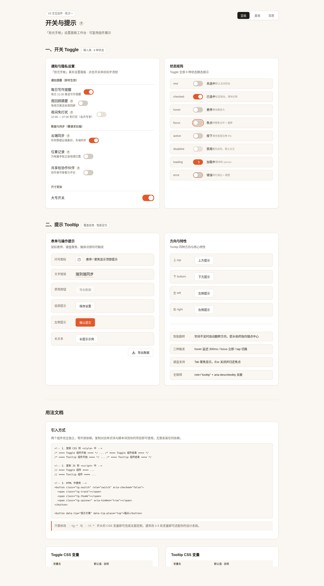

# 开关与提示 · Toggle & Tooltip 组件

> Art 设计实验室 · V3 交互组件 · 2026-08-20
> 类别：输入类（Toggle 开关）+ 覆盖层类（Tooltip 提示）
> 形态：纯 vanilla 单文件 HTML，零外部依赖，CSS / JS 可独立抽取复用

## 简介

一次产出两个真实项目最高频的 UI 积木：

- **Toggle 开关**：设置页布尔开关，支持同步切换与异步保存两种语义。异步场景含 loading 态与失败 error 回滚（自动恢复原值并提示）。8 态完整状态机，弹簧滑块手感。
- **Tooltip 提示**：字段/图标释义浮层。悬停（延迟）/聚焦/触屏三触发，边缘碰撞智能四向翻转 + 箭头跟随锚点，Esc 关闭归焦。

场景化展示页为「拾光手帐」App 的通知与隐私设置面板，含 3 个同步开关 + 3 个异步开关（必成功 / 必失败回滚 / 随机成败）+ 多个 Tooltip 锚点，并附状态矩阵与用法文档。三套主题（宣纸 / 墨夜 / 苔原）一键切换。

## 截图



## 妙搭预览

https://dcniaqwtmoca.feishu.cn/page/UgY2mYFLPdrBaZasiXxcGK7cnNc

## 用法

### 引入（复制即可用）

把 `index.html` 中的两个注释块整段复制到你自己的项目：
1. `<style>` 里的 `==== Toggle 组件 ====` 与 `==== Tooltip 组件 ====` 两段 CSS
2. `<script>` 里的 `PausableTimer` + `Toggle` + `Tooltip` 三段 JS

主题变量放在 `:root` / `[data-theme]`。改主题只需覆盖 CSS 变量，**改不超过 3 处**（`--accent` / `--tt-bg` / `--paper`）即可适配大多数项目。

### Toggle

```html
<button class="tg-switch" role="switch" aria-checked="false">
  <span class="tg-track"></span>
  <span class="tg-thumb"><span class="tg-spinner"></span></span>
</button>
```

```js
// 同步
Toggle.create(el, { checked: false });

// 异步（asyncFn 返回 Promise<boolean>，false 触发回滚）
Toggle.create(el, {
  checked: false,
  async: function(next) {
    return fetch('/api/setting', { method:'POST', body: JSON.stringify({v:next}) })
      .then(r => r.ok);
  }
});

// API
inst.setChecked(true); inst.setDisabled(true); inst.destroy();
```

- 尺寸：标准 44×24；大号加 class `tg-lg`（52×28）。
- 键盘：Tab 聚焦、Space/Enter 切换。

### Tooltip

```html
<!-- 声明式：自动扫描 [data-tip] 实例化 -->
<span data-tip="开启后每天 21:00 提醒写作" data-tip-place="top">每日写作提醒</span>

<!-- 禁用元素：用 wrapper 承接 tooltip -->
<span class="tt-disabled-wrap" data-tip="会员功能">
  <button disabled>夜间免打扰</button>
</span>
```

```js
// 编程式
Tooltip.bind(el, { content: '说明文案', place: 'top', delay: 300, hideDelay: 120 });

// API
inst.show(); inst.hide(); inst.update('新文案'); inst.destroy();
```

- 触发：hover（进入 300ms / 离开 120ms）、focus（立即）、触屏 tap（切换）；Esc 关闭。
- 智能翻转：首选方向空间不足时自动翻转到对侧 / 正交方向 / 最大空间侧。

## 可配置项

### Toggle CSS 变量（`--tg-*`）
`--tg-track-width/height`、`--tg-thumb-size`、`--tg-track-bg-off/on/disabled`、`--tg-track-error-border`、`--tg-thumb-bg/shadow`、`--tg-focus-ring-color/offset`、`--tg-error-color`、`--tg-spinner-stroke`、`--tg-transition-duration/easing`、`--tg-error-shake-duration`、`--tg-lg-*`（大号尺寸）。

### Tooltip CSS 变量（`--tt-*`）
`--tt-bg/fg`、`--tt-font-size/line-height`、`--tt-padding-y/x`、`--tt-radius`、`--tt-max-width`、`--tt-arrow-size`、`--tt-opacity`、`--tt-transition-duration/easing`、`--tt-z-index`、`--tt-offset`、`--tt-shadow`。

### 主题
`<html data-theme="paper|ink|tundra">` 切换；自定义主题只需新建一个 `[data-theme="xxx"]` 块覆盖上述变量。

## 定制方法

- **改强调色**：覆盖 `--accent`（同时联动 `--tg-track-bg-on`、`--tg-focus-ring-color`）。
- **改尺寸**：覆盖 `--tg-track-*` / `--tg-thumb-size`，滑块位移自动按轨道宽度计算。
- **改浮层风格**：覆盖 `--tt-bg` / `--tt-radius` / `--tt-shadow`；箭头随 `data-place` 自动翻转。
- **降级动效**：用户系统开启「减少动态效果」时，`prefers-reduced-motion` 媒体查询自动将所有弹簧/位移退化为 ≤120ms 淡入淡出。

## 文件说明

| 文件 | 说明 |
|---|---|
| `index.html` | 单文件源码（HTML + CSS + JS），含展示页与两组件 |
| `设计规范.md` | 配色、字体、动效系统、状态机、工程规范（从源码提取真实值） |
| `preview.png` | 1440px 桌面截图 |
| `README.md` | 本文件 |

## 技术栈

- 纯 HTML / CSS / JavaScript（ES5 兼容写法，无构建步骤）
- 零外部依赖：无 CDN、无外链字体、无外链图片、无框架
- 无障碍：`role` / `aria-*` 完整、键盘可操作、焦点环可见、`prefers-reduced-motion` 降级
- 响应式：1440 / 1024 / 768 / 390 宽度下不横向溢出、不重叠

## 自查结论

- 删掉所有装饰动画后，两组件功能仍完整可用（滑块位移 / 浮层显隐均依赖状态而非动画）。
- 键盘可完成全部操作（Tab/Space/Enter 切换开关、Tab 聚焦锚点显示 Tooltip、Esc 关闭）。
- Browser QA：1440px 与 390px 实测渲染非空白（像素 std 18.18 / 26.84），Console 无 Error，无横向溢出。
- 等待协调者检查后提交 GitHub。
